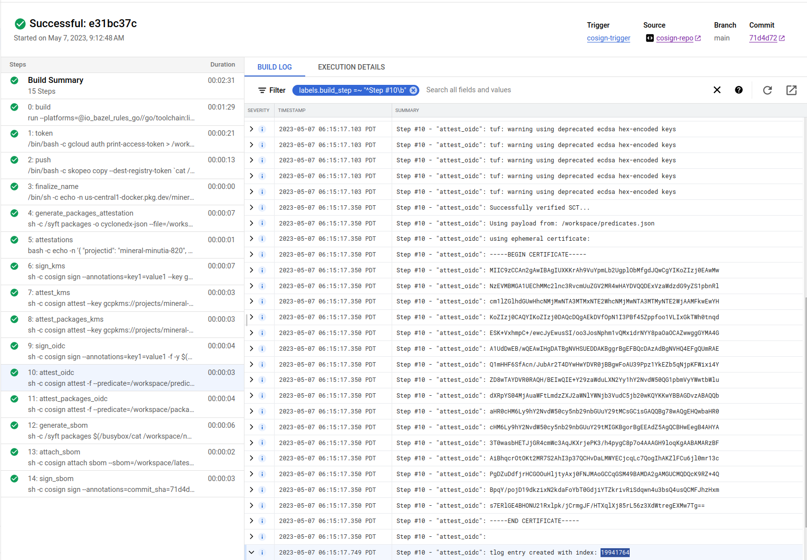
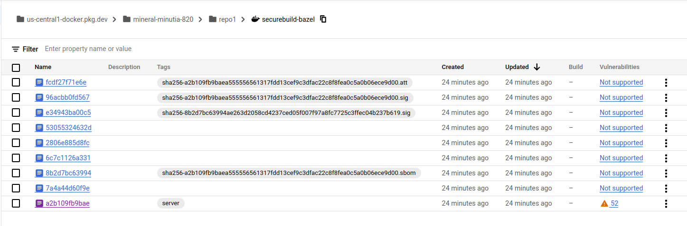

# Deterministic container hashes and container signing using Cosign, Bazel and Google Cloud Build

A simple tutorial that generates consistent container image hashes using `bazel` and then signs provenance records using [cosign](https://github.com/sigstore/cosign) (Container Signing, Verification and Storage in an OCI registry).

In this tutorial, we will:

1. generate a deterministic container image hash using  `bazel`
2. use `cosign` to create provenance records for this image
3. use `syft` to generate the container `sbom`
4. use cosign to sign the container sbom
5. verify attestations and signatures using `KMS` and `OIDC` cross checked with a public transparency log.
6. use `syft` to generate the application `sbom`
7. sign the application `sbom` with cosign

We will use GCP-centric services here such as `Artifact Registry`, `Cloud BUild`, `Cloud Source Repository`.  

Both `KMS` and `OIDC` based signatures are used and for `OIDC`, an entry is submitted to a `transparency log` such that it can get verified by anyone at anytime.

>> **NOTE** Please be aware that if you run this tutorial, the GCP service_accounts _email_ you use to sign the artifacts within cloud build will be submitted to a public transparency log.  I used a disposable GCP project but even if i didn't, its just the email address and projectID in the cert, no big deal to me.  If it is to you, you can use the KMS examples and skip OIDC

>> this repo is not supported by google and employs as much as i know about it on 9/24/22 (with one weeks' experience with this..so take it with a grain of salt)

---

##### References:

* [SigStore](https://docs.sigstore.dev/)
* [cosign](https://github.com/sigstore/cosign)
* [Introducing sigstore: Easy Code Signing & Verification for Supply Chain Integrity](https://security.googleblog.com/2021/03/introducing-sigstore-easy-code-signing.html)
* [Best Practices for Supply Chain Security](https://dlorenc.medium.com/policy-and-attestations-89650fd6f4fa)
* [Building deterministic Docker images with Bazel](https://blog.bazel.build/2015/07/28/docker_build.html#building-deterministic-docker-images-with-bazel)
* [Deterministic builds with go + bazel + grpc + docker](https://github.com/salrashid123/go-grpc-bazel-docker)
* [bazel](https://bazel.build/)
* [in-toto attestation](https://docs.sigstore.dev/cosign/attestation/)
* [Notary V2 and Cosign](https://dlorenc.medium.com/notary-v2-and-cosign-b816658f044d)

### CloudBuild steps

First lets go over the `cloudbuild.yaml` steps:

#### Build image deterministically using bazel:

This is the `bazel` build that guarantees you the code will produce a specific image hash everytime:

* `securebuild@sha256:5ce2d8cd8e366d76ce012edc346daeb15a5643c26b9b24a2b731e97a99c6de52`


#### Push image to registry

This pushes the image to [google artifact registry](https://cloud.google.com/artifact-registry).  This will give the image hash we'd expect

You can optionally push to dockerhub if you want using [KMS based secrets](https://cloud.google.com/build/docs/securing-builds/use-encrypted-credentials#configuring_builds_to_use_encrypted_data) in cloud build 


#### Create attestations attributes

This step will issue a statement that includes attestation attributes users can inject into the pipeline the verifier can use. See [Verify Attestations](https://docs.sigstore.dev/cosign/verify/).

In this case, the attestation verification predicate includes some info from the build like the buildID and even the repo commithash.

Someone who wants to verify any [in-toto attestation](https://docs.sigstore.dev/cosign/attestation/) can use these values. This repo just adds some basic stuff like the `projectID`,  `buildID` and `commitsha` (in our case, its `f83df525d9bdf62d0239032d6ef44e5994ce6c35`):


```json
{ "projectid": "$PROJECT_ID", "buildid": "$BUILD_ID", "foo":"bar", "commitsha": "$COMMIT_SHA", "name_hash": "[full_image_name_hash]" }
```


against commit


#### Sign image using KMS based keys

This step uses the KMS key to `cosign` the image


#### Apply attestations using KMS

This issues attestation signature using some predicates we wrote to file during the build.

You can define any claims here..i just happen to use the commit hash for the source and some random stuff.


#### Sign image using OIDC tokens

This step will use the service accounts OIDC token sign using [Fulcio](https://docs.sigstore.dev/fulcio/oidc-in-fulcio)


#### Apply attestations using OIDC tokens

This will issue signed attestations using the OIDC token signing for fulcio




#### Use Syft to generate image sbom

Generate the container image's sbom


>> **NOTE**  the images i used here will _not_ show the detailed go packages.  see [https://github.com/anchore/syft/issues/1725](https://github.com/anchore/syft/issues/1725)

Then attach (upload) it


#### Use Cosign to upload and sign the sbom

Finally sign it in the registry


---

### Setup

The following steps will use Google Cloud services 

* Cloud Source Repository to hold the code and trigger builds (you can use github but thats out of scope here),
* Cloud Build to create the image to save to artifact registry.
* Artifact Registry to hold the containers images

You'll also need to install [cosign](https://docs.sigstore.dev/cosign/installation/) (duh), and [rekor-cli](https://docs.sigstore.dev/rekor/installation), `git`, `gcloud`, optionally `gcloud`, `docker`.

```bash
export GCLOUD_USER=`gcloud config get-value core/account`
export PROJECT_ID=`gcloud config get-value core/project`
export PROJECT_NUMBER=`gcloud projects describe $PROJECT_ID --format='value(projectNumber)'`
echo $PROJECT_ID

gcloud auth application-default login

# enable services
gcloud services enable \
    artifactregistry.googleapis.com \
    cloudbuild.googleapis.com cloudkms.googleapis.com \
    iam.googleapis.com sourcerepo.googleapis.com

# create artifact registry
gcloud artifacts repositories create repo1 --repository-format=docker --location=us-central1

# create service account that cloud build will run as.
gcloud iam service-accounts create cosign

# allow 'self impersonation' for cloud build service account
gcloud iam service-accounts add-iam-policy-binding cosign@$PROJECT_ID.iam.gserviceaccount.com \
    --role roles/iam.serviceAccountTokenCreator \
    --member "serviceAccount:cosign@$PROJECT_ID.iam.gserviceaccount.com"

# allow cloud build to write logs
gcloud projects add-iam-policy-binding $PROJECT_ID \
  --member=serviceAccount:cosign@$PROJECT_ID.iam.gserviceaccount.com  \
  --role=roles/logging.logWriter

# allow cloud build write access to artifact registry
gcloud artifacts repositories add-iam-policy-binding repo1 \
    --location=us-central1  \
    --member=serviceAccount:cosign@$PROJECT_ID.iam.gserviceaccount.com \
    --role=roles/artifactregistry.writer

# allow cloud build access to list KMS keys
gcloud projects add-iam-policy-binding $PROJECT_ID \
  --member=serviceAccount:cosign@$PROJECT_ID.iam.gserviceaccount.com  \
  --role=roles/cloudkms.viewer


# create kms keyring and key
gcloud kms keyrings create cosignkr --location=global

gcloud kms keys create key1 --keyring=cosignkr \
 --location=global --purpose=asymmetric-signing \
 --default-algorithm=ec-sign-p256-sha256

gcloud kms keys list  --keyring=cosignkr --location=global

# allow cloud buildaccess to sign the key
gcloud kms keys add-iam-policy-binding key1 \
    --keyring=cosignkr --location=global \
    --member=serviceAccount:cosign@$PROJECT_ID.iam.gserviceaccount.com \
    --role=roles/cloudkms.signer

# allow current gcloud user to view the public key
gcloud kms keys add-iam-policy-binding key1 \
    --keyring=cosignkr --location=global \
    --member=serviceAccount:cosign@$PROJECT_ID.iam.gserviceaccount.com  \
    --role=roles/cloudkms.publicKeyViewer

# create a temp bucket for cloud build and allow cloud build permissions to use it
gsutil mb gs://$PROJECT_ID\_cloudbuild
gsutil iam ch serviceAccount:cosign@$PROJECT_ID.iam.gserviceaccount.com:objectAdmin gs://$PROJECT_ID\_cloudbuild
```

### Build image

```bash
# to build directly
# cd /app
# gcloud beta builds submit --config=cloudbuild.yaml --machine-type=n1-highcpu-32

# to build via commit (recommended)
gcloud source repos create cosign-repo

gcloud projects add-iam-policy-binding $PROJECT_ID \
  --member=serviceAccount:cosign@$PROJECT_ID.iam.gserviceaccount.com \
  --role=roles/source.reader

gcloud source repos clone cosign-repo
cd cosign-repo
cp -R ../app/* .


# optionally create the application sbom and sign it with the same cosign keypair
# goreleaser release --snapshot  --rm-dist 
## for github
## git tag v1.0.0
## git push origin --tags
## goreleaser release --rm-dist


git add -A
git commit -m "add"
git push 

# create a manual trigger
gcloud beta builds triggers create manual --region=global \
   --name=cosign-trigger --build-config=cloudbuild.yaml \
   --repo=https://source.developers.google.com/p/$PROJECT_ID/r/cosign-repo \
   --repo-type=CLOUD_SOURCE_REPOSITORIES --branch=main \
   --service-account=projects/$PROJECT_ID/serviceAccounts/cosign@$PROJECT_ID.iam.gserviceaccount.com 

# now trigger
gcloud alpha builds triggers run cosign-trigger
```


### Verify

We are now ready to verify the images locally and using `cosign`


#### KMS

For kms keys, verify by either downloading kms public key

```bash
cd ../
gcloud kms keys versions get-public-key 1  \
  --key=key1 --keyring=cosignkr \
  --location=global --output-file=kms_pub.pem


# verify using the local key 
cosign verify --key kms_pub.pem   \
   us-central1-docker.pkg.dev/$PROJECT_ID/repo1/securebuild@sha256:5ce2d8cd8e366d76ce012edc346daeb15a5643c26b9b24a2b731e97a99c6de52  | jq '.'

# or by api
cosign verify --key gcpkms://projects/$PROJECT_ID/locations/global/keyRings/cosignkr/cryptoKeys/key1/cryptoKeyVersions/1 \
      us-central1-docker.pkg.dev/$PROJECT_ID/repo1/securebuild@sha256:5ce2d8cd8e366d76ce012edc346daeb15a5643c26b9b24a2b731e97a99c6de52 | jq '.'
```

Note this gives 

```text
Verification for us-central1-docker.pkg.dev/cosign-test-384419/repo1/securebuild@sha256:5ce2d8cd8e366d76ce012edc346daeb15a5643c26b9b24a2b731e97a99c6de52 --
The following checks were performed on each of these signatures:
  - The cosign claims were validated
  - The signatures were verified against the specified public key
[
  {
    "critical": {
      "identity": {
        "docker-reference": "us-central1-docker.pkg.dev/cosign-test-384419/repo1/securebuild"
      },
      "image": {
        "docker-manifest-digest": "sha256:5ce2d8cd8e366d76ce012edc346daeb15a5643c26b9b24a2b731e97a99c6de52"
      },
      "type": "cosign container image signature"
    },
    "optional": {
      "key1": "value1"
    }
  }
]

```

### Transparency Log (rekor)


The OIDC flow also creates entries in the  transparency logs

TO verify,

```bash
COSIGN_EXPERIMENTAL=1  cosign verify  us-central1-docker.pkg.dev/$PROJECT_ID/repo1/securebuild@sha256:5ce2d8cd8e366d76ce012edc346daeb15a5643c26b9b24a2b731e97a99c6de52 | jq '.'
```

gives

```text
Verification for us-central1-docker.pkg.dev/cosign-test-384419/repo1/securebuild@sha256:5ce2d8cd8e366d76ce012edc346daeb15a5643c26b9b24a2b731e97a99c6de52 --
The following checks were performed on each of these signatures:
  - The cosign claims were validated
  - Existence of the claims in the transparency log was verified offline
  - Any certificates were verified against the Fulcio roots.
[
  {
    "critical": {
      "identity": {
        "docker-reference": "us-central1-docker.pkg.dev/cosign-test-384419/repo1/securebuild"
      },
      "image": {
        "docker-manifest-digest": "sha256:5ce2d8cd8e366d76ce012edc346daeb15a5643c26b9b24a2b731e97a99c6de52"
      },
      "type": "cosign container image signature"
    },
    "optional": {
      "1.3.6.1.4.1.57264.1.1": "https://accounts.google.com",
      "Bundle": {
        "SignedEntryTimestamp": "MEQCIEAhawU5HAazJrjU/rj6i1uiE09GFeE3nj168DhopdxEAiAgJ6aFWw6EmnAT4c1BSwU2k9X0WlJiVXczqr9U714LQQ==",
        "Payload": {
          "body": "eyJhcGlWZXJzaW9uIjoiMC4wLjEiLCJraW5kIjoiaGFzaGVkcmVrb3JkIiwic3BlYyI6eyJkYXRhIjp7Imhhc2giOnsiYWxnb3JpdGhtIjoic2hhMjU2IiwidmFsdWUiOiJlM2E1M2Y3NGM2OWQ1YTBjNzk5ZjEwNDQ5NTk4NGExMTEzMzdiMWZhOGFjOGM1NmIwNDliZDgyY2M3NTU0YzAxIn19LCJzaWduYXR1cmUiOnsiY29udGVudCI6Ik1FVUNJUURKQkFpZjhoLzRLdGdJQzR4VVJMSmoyY3IxYUFMT25vRUZjWEs3K003VEJBSWdmYkgzUHR2V0xuaUcwQ3RhM2xNMDB0R3hvbDMxRHBjSVZSV2pQdnliSW5zPSIsInB1YmxpY0tleSI6eyJjb250ZW50IjoiTFMwdExTMUNSVWRKVGlCRFJWSlVTVVpKUTBGVVJTMHRMUzB0Q2sxSlNVTTJla05EUVc1RFowRjNTVUpCWjBsVlRHaHZjREF3VDAxeVNuRXdiMjl1UzJOMlVqbE9WREZVYmxWRmQwTm5XVWxMYjFwSmVtb3dSVUYzVFhjS1RucEZWazFDVFVkQk1WVkZRMmhOVFdNeWJHNWpNMUoyWTIxVmRWcEhWakpOVWpSM1NFRlpSRlpSVVVSRmVGWjZZVmRrZW1SSE9YbGFVekZ3WW01U2JBcGpiVEZzV2tkc2FHUkhWWGRJYUdOT1RXcE5kMDVFU1hoTlZHdDRUWHBWTUZkb1kwNU5hazEzVGtSSmVFMVVhM2xOZWxVd1YycEJRVTFHYTNkRmQxbElDa3R2V2tsNmFqQkRRVkZaU1V0dldrbDZhakJFUVZGalJGRm5RVVZXTTBsNVMxZElNM1ZaV0drNGF6RjNTWHB6YkZOaVZVSjNUR3BWY0ZNMkwwVlFVVkVLT0hVd1RtRmliRUZMTW1OV2VrVmhXSGxCZG5KdGFsRklNVTlLUVdnck0wWldRalpVV1V4dVQydFZVa3MxVG05c2JqWlBRMEZaT0hkblowZE1UVUUwUndwQk1WVmtSSGRGUWk5M1VVVkJkMGxJWjBSQlZFSm5UbFpJVTFWRlJFUkJTMEpuWjNKQ1owVkdRbEZqUkVGNlFXUkNaMDVXU0ZFMFJVWm5VVlZtTlVkSkNtRmpiVk5EZDBsNldtWlVTRWhvVUdOWU1UQmFTVTFuZDBoM1dVUldVakJxUWtKbmQwWnZRVlV6T1ZCd2VqRlphMFZhWWpWeFRtcHdTMFpYYVhocE5Ga0tXa1E0ZDFCM1dVUldVakJTUVZGSUwwSkVWWGROTkVWNFdUSTVlbUZYWkhWUlIwNTJZekpzYm1KcE1UQmFXRTR3VEZSTk5FNUVVWGhQVXpWd1dWY3dkUXBhTTA1c1kyNWFjRmt5Vm1oWk1rNTJaRmMxTUV4dFRuWmlWRUZ3UW1kdmNrSm5SVVZCV1U4dlRVRkZRa0pDZEc5a1NGSjNZM3B2ZGt3eVJtcFpNamt4Q21KdVVucE1iV1IyWWpKa2MxcFROV3BpTWpCM1MzZFpTMHQzV1VKQ1FVZEVkbnBCUWtOQlVXUkVRblJ2WkVoU2QyTjZiM1pNTWtacVdUSTVNV0p1VW5vS1RHMWtkbUl5WkhOYVV6VnFZakl3ZDJkWmIwZERhWE5IUVZGUlFqRnVhME5DUVVsRlprRlNOa0ZJWjBGa1owUmtVRlJDY1hoelkxSk5iVTFhU0doNVdncGFlbU5EYjJ0d1pYVk9ORGh5Wml0SWFXNUxRVXg1Ym5WcVowRkJRVmxsYkZCTU1YZEJRVUZGUVhkQ1NFMUZWVU5KVVVONFJDOUJlV1ZRWmk5aFdFNVZDbU5ZV25JMWQzcHhhM1F4TURJd0x6YzJlblJSUlV0TVVra3dXVUpoVVVsblRrbG5SazVtZDFWak0xaHRjSGd2VmpGdVUwcEpLMlJzUjJKM05sZ3pVMFlLV0dSd1JVaFFTMHBHVDBsM1EyZFpTVXR2V2tsNmFqQkZRWGROUkdGUlFYZGFaMGw0UVVwdVRYTk1kamdyVUVwU2FERjZXVVJ4Y1N0V1oyUnpTbll5WVFwNmNuTllTRGRNVG0xRlZ6ZEtUR3Q0VUVwVFoxTTFTMGh1WW5ob1lUaFJMekoyYkN0UVVVbDRRVXBvZVcwMVYySXJTeXM0Y2xSc1prNDNjRVZKV1ZSSkNuRkxZMjVpTkcxTE1qbFZiMk5JUTBOUlJrdFhZVUk0Tm5GRk56UXZiVTFUZFhaNVVFNXFaMjFhZHowOUNpMHRMUzB0UlU1RUlFTkZVbFJKUmtsRFFWUkZMUzB0TFMwSyJ9fX19",
          "integratedTime": 1682104435,
          "logIndex": 18589865,
          "logID": "c0d23d6ad406973f9559f3ba2d1ca01f84147d8ffc5b8445c224f98b9591801d"
        }
      },
      "Issuer": "https://accounts.google.com",
      "Subject": "cosign@cosign-test-384419.iam.gserviceaccount.com",
      "key1": "value1"
    }
  }
]

```

Note that this is what is in the transparency log itself (`logID`, `logIndex`, etc)


decoding the `payload` using [jwt.io](jwt.io) gives json

```json
{
  "apiVersion": "0.0.1",
  "kind": "hashedrekord",
  "spec": {
    "data": {
      "hash": {
        "algorithm": "sha256",
        "value": "e3a53f74c69d5a0c799f104495984a111337b1fa8ac8c56b049bd82cc7554c01"
      }
    },
    "signature": {
      "content": "MEUCIQDJBAif8h/4KtgIC4xURLJj2cr1aALOnoEFcXK7+M7TBAIgfbH3PtvWLniG0Cta3lM00tGxol31DpcIVRWjPvybIns=",
      "publicKey": {
        "content": "LS0tLS1CRUdJTiBDRVJUSUZJQ0FURS0tLS0tCk1JSUM2ekNDQW5DZ0F3SUJBZ0lVTGhvcDAwT01ySnEwb29uS2N2UjlOVDFUblVFd0NnWUlLb1pJemowRUF3TXcKTnpFVk1CTUdBMVVFQ2hNTWMybG5jM1J2Y21VdVpHVjJNUjR3SEFZRFZRUURFeFZ6YVdkemRHOXlaUzFwYm5SbApjbTFsWkdsaGRHVXdIaGNOTWpNd05ESXhNVGt4TXpVMFdoY05Nak13TkRJeE1Ua3lNelUwV2pBQU1Ga3dFd1lICktvWkl6ajBDQVFZSUtvWkl6ajBEQVFjRFFnQUVWM0l5S1dIM3VZWGk4azF3SXpzbFNiVUJ3TGpVcFM2L0VQUVEKOHUwTmFibEFLMmNWekVhWHlBdnJtalFIMU9KQWgrM0ZWQjZUWUxuT2tVUks1Tm9sbjZPQ0FZOHdnZ0dMTUE0RwpBMVVkRHdFQi93UUVBd0lIZ0RBVEJnTlZIU1VFRERBS0JnZ3JCZ0VGQlFjREF6QWRCZ05WSFE0RUZnUVVmNUdJCmFjbVNDd0l6WmZUSEhoUGNYMTBaSU1nd0h3WURWUjBqQkJnd0ZvQVUzOVBwejFZa0VaYjVxTmpwS0ZXaXhpNFkKWkQ4d1B3WURWUjBSQVFIL0JEVXdNNEV4WTI5emFXZHVRR052YzJsbmJpMTBaWE4wTFRNNE5EUXhPUzVwWVcwdQpaM05sY25acFkyVmhZMk52ZFc1MExtTnZiVEFwQmdvckJnRUVBWU8vTUFFQkJCdG9kSFJ3Y3pvdkwyRmpZMjkxCmJuUnpMbWR2YjJkc1pTNWpiMjB3S3dZS0t3WUJCQUdEdnpBQkNBUWREQnRvZEhSd2N6b3ZMMkZqWTI5MWJuUnoKTG1kdmIyZHNaUzVqYjIwd2dZb0dDaXNHQVFRQjFua0NCQUlFZkFSNkFIZ0FkZ0RkUFRCcXhzY1JNbU1aSGh5WgpaemNDb2twZXVONDhyZitIaW5LQUx5bnVqZ0FBQVllbFBMMXdBQUFFQXdCSE1FVUNJUUN4RC9BeWVQZi9hWE5VCmNYWnI1d3pxa3QxMDIwLzc2enRRRUtMUkkwWUJhUUlnTklnRk5md1VjM1htcHgvVjFuU0pJK2RsR2J3NlgzU0YKWGRwRUhQS0pGT0l3Q2dZSUtvWkl6ajBFQXdNRGFRQXdaZ0l4QUpuTXNMdjgrUEpSaDF6WURxcStWZ2RzSnYyYQp6cnNYSDdMTm1FVzdKTGt4UEpTZ1M1S0huYnhoYThRLzJ2bCtQUUl4QUpoeW01V2IrSys4clRsZk43cEVJWVRJCnFLY25iNG1LMjlVb2NIQ0NRRktXYUI4NnFFNzQvbU1TdXZ5UE5qZ21adz09Ci0tLS0tRU5EIENFUlRJRklDQVRFLS0tLS0K"
      }
    }
  }
}
```

from there the base64encoded `publicKey` is what was issued during the [signing ceremony](https://docs.sigstore.dev/fulcio/certificate-issuing-overview). 

```
-----BEGIN CERTIFICATE-----
MIIC6zCCAnCgAwIBAgIULhop00OMrJq0oonKcvR9NT1TnUEwCgYIKoZIzj0EAwMw
NzEVMBMGA1UEChMMc2lnc3RvcmUuZGV2MR4wHAYDVQQDExVzaWdzdG9yZS1pbnRl
cm1lZGlhdGUwHhcNMjMwNDIxMTkxMzU0WhcNMjMwNDIxMTkyMzU0WjAAMFkwEwYH
KoZIzj0CAQYIKoZIzj0DAQcDQgAEV3IyKWH3uYXi8k1wIzslSbUBwLjUpS6/EPQQ
8u0NablAK2cVzEaXyAvrmjQH1OJAh+3FVB6TYLnOkURK5Noln6OCAY8wggGLMA4G
A1UdDwEB/wQEAwIHgDATBgNVHSUEDDAKBggrBgEFBQcDAzAdBgNVHQ4EFgQUf5GI
acmSCwIzZfTHHhPcX10ZIMgwHwYDVR0jBBgwFoAU39Ppz1YkEZb5qNjpKFWixi4Y
ZD8wPwYDVR0RAQH/BDUwM4ExY29zaWduQGNvc2lnbi10ZXN0LTM4NDQxOS5pYW0u
Z3NlcnZpY2VhY2NvdW50LmNvbTApBgorBgEEAYO/MAEBBBtodHRwczovL2FjY291
bnRzLmdvb2dsZS5jb20wKwYKKwYBBAGDvzABCAQdDBtodHRwczovL2FjY291bnRz
Lmdvb2dsZS5jb20wgYoGCisGAQQB1nkCBAIEfAR6AHgAdgDdPTBqxscRMmMZHhyZ
ZzcCokpeuN48rf+HinKALynujgAAAYelPL1wAAAEAwBHMEUCIQCxD/AyePf/aXNU
cXZr5wzqkt1020/76ztQEKLRI0YBaQIgNIgFNfwUc3Xmpx/V1nSJI+dlGbw6X3SF
XdpEHPKJFOIwCgYIKoZIzj0EAwMDaQAwZgIxAJnMsLv8+PJRh1zYDqq+VgdsJv2a
zrsXH7LNmEW7JLkxPJSgS5KHnbxha8Q/2vl+PQIxAJhym5Wb+K+8rTlfN7pEIYTI
qKcnb4mK29UocHCCQFKWaB86qE74/mMSuvyPNjgmZw==
-----END CERTIFICATE-----
```

which expanded is 

```bash
$  openssl x509 -in cosign.crt -noout -text

Certificate:
    Data:
        Version: 3 (0x2)
        Serial Number:
            2e:1a:29:d3:43:8c:ac:9a:b4:a2:89:ca:72:f4:7d:35:3d:53:9d:41
        Signature Algorithm: ecdsa-with-SHA384
        Issuer: O = sigstore.dev, CN = sigstore-intermediate
        Validity
            Not Before: Apr 21 19:13:54 2023 GMT
            Not After : Apr 21 19:23:54 2023 GMT
        Subject: 
        Subject Public Key Info:
            Public Key Algorithm: id-ecPublicKey
                Public-Key: (256 bit)
                pub:
                    04:57:72:32:29:61:f7:b9:85:e2:f2:4d:70:23:3b:
                    25:49:b5:01:c0:b8:d4:a5:2e:bf:10:f4:10:f2:ed:
                    0d:69:b9:40:2b:67:15:cc:46:97:c8:0b:eb:9a:34:
                    07:d4:e2:40:87:ed:c5:54:1e:93:60:b9:ce:91:44:
                    4a:e4:da:25:9f
                ASN1 OID: prime256v1
                NIST CURVE: P-256
        X509v3 extensions:
            X509v3 Key Usage: critical
                Digital Signature
            X509v3 Extended Key Usage: 
                Code Signing
            X509v3 Subject Key Identifier: 
                7F:91:88:69:C9:92:0B:02:33:65:F4:C7:1E:13:DC:5F:5D:19:20:C8
            X509v3 Authority Key Identifier: 
                DF:D3:E9:CF:56:24:11:96:F9:A8:D8:E9:28:55:A2:C6:2E:18:64:3F
            X509v3 Subject Alternative Name: critical
                email:cosign@cosign-test-384419.iam.gserviceaccount.com           <<<<<<<<<<<<<<<<<<<<<<
            1.3.6.1.4.1.57264.1.1: 
                https://accounts.google.com
            1.3.6.1.4.1.57264.1.8: 
                ..https://accounts.google.com
            CT Precertificate SCTs: 
                Signed Certificate Timestamp:
                    Version   : v1 (0x0)
                    Log ID    : DD:3D:30:6A:C6:C7:11:32:63:19:1E:1C:99:67:37:02:
                                A2:4A:5E:B8:DE:3C:AD:FF:87:8A:72:80:2F:29:EE:8E
                    Timestamp : Apr 21 19:13:54.032 2023 GMT
                    Extensions: none
                    Signature : ecdsa-with-SHA256
                                30:45:02:21:00:B1:0F:F0:32:78:F7:FF:69:73:54:71:
                                76:6B:E7:0C:EA:92:DD:74:DB:4F:FB:EB:3B:50:10:A2:
                                D1:23:46:01:69:02:20:34:88:05:35:FC:14:73:75:E6:
                                A7:1F:D5:D6:74:89:23:E7:65:19:BC:3A:5F:74:85:5D:
                                DA:44:1C:F2:89:14:E2
    Signature Algorithm: ecdsa-with-SHA384
    Signature Value:
        30:66:02:31:00:99:cc:b0:bb:fc:f8:f2:51:87:5c:d8:0e:aa:
        be:56:07:6c:26:fd:9a:ce:bb:17:1f:b2:cd:98:45:bb:24:b9:
        31:3c:94:a0:4b:92:87:9d:bc:61:6b:c4:3f:da:f9:7e:3d:02:
        31:00:98:72:9b:95:9b:f8:af:bc:ad:39:5f:37:ba:44:21:84:
        c8:a8:a7:27:6f:89:8a:db:d5:28:70:70:82:40:52:96:68:1f:
        3a:a8:4e:f8:fe:63:12:ba:fc:8f:36:38:26:67
```

NOTE the OID `1.3.6.1.4.1.57264.1.1` is registered to [here](https://github.com/sigstore/fulcio/blob/main/docs/oid-info.md#directory) and denotes the OIDC Token's issuer

Now use `rekor-cli` to search for what we added to the transparency log using


* `sha` value from `hashedrekord`

```bash
$ rekor-cli search --rekor_server https://rekor.sigstore.dev \
   --sha  e3a53f74c69d5a0c799f104495984a111337b1fa8ac8c56b049bd82cc7554c01

Found matching entries (listed by UUID):
24296fb24b8ad77a8033ac7e5a6a11353ff23c7f0a25d206d76e4ea6d584f7e5e68e94e0ae70d054
```

* the email for the build service account's `OIDC`

```bash
$ rekor-cli search --rekor_server https://rekor.sigstore.dev  --email cosign@$PROJECT_ID.iam.gserviceaccount.com

Found matching entries (listed by UUID):
24296fb24b8ad77a17ec8356366ddbcc09727cd7f8add6519ca4a53209f0b38a5707dd08f2f2d61a
24296fb24b8ad77a8033ac7e5a6a11353ff23c7f0a25d206d76e4ea6d584f7e5e68e94e0ae70d054
```

note each `UUID` asserts something different:  the `signature` and another one for the `attestation`


For the `Signature`

```
rekor-cli get --rekor_server https://rekor.sigstore.dev  \
  --uuid 24296fb24b8ad77a8033ac7e5a6a11353ff23c7f0a25d206d76e4ea6d584f7e5e68e94e0ae70d054
```

outputs (note the `Index` value matches what we have in the "sign_oidc" build step (`18589865`))

```text
LogID: c0d23d6ad406973f9559f3ba2d1ca01f84147d8ffc5b8445c224f98b9591801d
Index: 18589865
IntegratedTime: 2023-04-21T19:13:55Z
UUID: 24296fb24b8ad77a8033ac7e5a6a11353ff23c7f0a25d206d76e4ea6d584f7e5e68e94e0ae70d054
Body: {
  "HashedRekordObj": {
    "data": {
      "hash": {
        "algorithm": "sha256",
        "value": "e3a53f74c69d5a0c799f104495984a111337b1fa8ac8c56b049bd82cc7554c01"
      }
    },
    "signature": {
      "content": "MEUCIQDJBAif8h/4KtgIC4xURLJj2cr1aALOnoEFcXK7+M7TBAIgfbH3PtvWLniG0Cta3lM00tGxol31DpcIVRWjPvybIns=",
      "publicKey": {
        "content": "LS0tLS1CRUdJTiBDRVJUSUZJQ0FURS0tLS0tCk1JSUM2ekNDQW5DZ0F3SUJBZ0lVTGhvcDAwT01ySnEwb29uS2N2UjlOVDFUblVFd0NnWUlLb1pJemowRUF3TXcKTnpFVk1CTUdBMVVFQ2hNTWMybG5jM1J2Y21VdVpHVjJNUjR3SEFZRFZRUURFeFZ6YVdkemRHOXlaUzFwYm5SbApjbTFsWkdsaGRHVXdIaGNOTWpNd05ESXhNVGt4TXpVMFdoY05Nak13TkRJeE1Ua3lNelUwV2pBQU1Ga3dFd1lICktvWkl6ajBDQVFZSUtvWkl6ajBEQVFjRFFnQUVWM0l5S1dIM3VZWGk4azF3SXpzbFNiVUJ3TGpVcFM2L0VQUVEKOHUwTmFibEFLMmNWekVhWHlBdnJtalFIMU9KQWgrM0ZWQjZUWUxuT2tVUks1Tm9sbjZPQ0FZOHdnZ0dMTUE0RwpBMVVkRHdFQi93UUVBd0lIZ0RBVEJnTlZIU1VFRERBS0JnZ3JCZ0VGQlFjREF6QWRCZ05WSFE0RUZnUVVmNUdJCmFjbVNDd0l6WmZUSEhoUGNYMTBaSU1nd0h3WURWUjBqQkJnd0ZvQVUzOVBwejFZa0VaYjVxTmpwS0ZXaXhpNFkKWkQ4d1B3WURWUjBSQVFIL0JEVXdNNEV4WTI5emFXZHVRR052YzJsbmJpMTBaWE4wTFRNNE5EUXhPUzVwWVcwdQpaM05sY25acFkyVmhZMk52ZFc1MExtTnZiVEFwQmdvckJnRUVBWU8vTUFFQkJCdG9kSFJ3Y3pvdkwyRmpZMjkxCmJuUnpMbWR2YjJkc1pTNWpiMjB3S3dZS0t3WUJCQUdEdnpBQkNBUWREQnRvZEhSd2N6b3ZMMkZqWTI5MWJuUnoKTG1kdmIyZHNaUzVqYjIwd2dZb0dDaXNHQVFRQjFua0NCQUlFZkFSNkFIZ0FkZ0RkUFRCcXhzY1JNbU1aSGh5WgpaemNDb2twZXVONDhyZitIaW5LQUx5bnVqZ0FBQVllbFBMMXdBQUFFQXdCSE1FVUNJUUN4RC9BeWVQZi9hWE5VCmNYWnI1d3pxa3QxMDIwLzc2enRRRUtMUkkwWUJhUUlnTklnRk5md1VjM1htcHgvVjFuU0pJK2RsR2J3NlgzU0YKWGRwRUhQS0pGT0l3Q2dZSUtvWkl6ajBFQXdNRGFRQXdaZ0l4QUpuTXNMdjgrUEpSaDF6WURxcStWZ2RzSnYyYQp6cnNYSDdMTm1FVzdKTGt4UEpTZ1M1S0huYnhoYThRLzJ2bCtQUUl4QUpoeW01V2IrSys4clRsZk43cEVJWVRJCnFLY25iNG1LMjlVb2NIQ0NRRktXYUI4NnFFNzQvbU1TdXZ5UE5qZ21adz09Ci0tLS0tRU5EIENFUlRJRklDQVRFLS0tLS0K"
      }
    }
  }
}
```

the certificate from the decoded publicKey outputs the cert issued by falcio

```
-----BEGIN CERTIFICATE-----
MIIC6zCCAnCgAwIBAgIULhop00OMrJq0oonKcvR9NT1TnUEwCgYIKoZIzj0EAwMw
NzEVMBMGA1UEChMMc2lnc3RvcmUuZGV2MR4wHAYDVQQDExVzaWdzdG9yZS1pbnRl
cm1lZGlhdGUwHhcNMjMwNDIxMTkxMzU0WhcNMjMwNDIxMTkyMzU0WjAAMFkwEwYH
KoZIzj0CAQYIKoZIzj0DAQcDQgAEV3IyKWH3uYXi8k1wIzslSbUBwLjUpS6/EPQQ
8u0NablAK2cVzEaXyAvrmjQH1OJAh+3FVB6TYLnOkURK5Noln6OCAY8wggGLMA4G
A1UdDwEB/wQEAwIHgDATBgNVHSUEDDAKBggrBgEFBQcDAzAdBgNVHQ4EFgQUf5GI
acmSCwIzZfTHHhPcX10ZIMgwHwYDVR0jBBgwFoAU39Ppz1YkEZb5qNjpKFWixi4Y
ZD8wPwYDVR0RAQH/BDUwM4ExY29zaWduQGNvc2lnbi10ZXN0LTM4NDQxOS5pYW0u
Z3NlcnZpY2VhY2NvdW50LmNvbTApBgorBgEEAYO/MAEBBBtodHRwczovL2FjY291
bnRzLmdvb2dsZS5jb20wKwYKKwYBBAGDvzABCAQdDBtodHRwczovL2FjY291bnRz
Lmdvb2dsZS5jb20wgYoGCisGAQQB1nkCBAIEfAR6AHgAdgDdPTBqxscRMmMZHhyZ
ZzcCokpeuN48rf+HinKALynujgAAAYelPL1wAAAEAwBHMEUCIQCxD/AyePf/aXNU
cXZr5wzqkt1020/76ztQEKLRI0YBaQIgNIgFNfwUc3Xmpx/V1nSJI+dlGbw6X3SF
XdpEHPKJFOIwCgYIKoZIzj0EAwMDaQAwZgIxAJnMsLv8+PJRh1zYDqq+VgdsJv2a
zrsXH7LNmEW7JLkxPJSgS5KHnbxha8Q/2vl+PQIxAJhym5Wb+K+8rTlfN7pEIYTI
qKcnb4mK29UocHCCQFKWaB86qE74/mMSuvyPNjgmZw==
-----END CERTIFICATE-----

Certificate:
    Data:
        Version: 3 (0x2)
        Serial Number:
            2e:1a:29:d3:43:8c:ac:9a:b4:a2:89:ca:72:f4:7d:35:3d:53:9d:41
        Signature Algorithm: ecdsa-with-SHA384
        Issuer: O = sigstore.dev, CN = sigstore-intermediate
        Validity
            Not Before: Apr 21 19:13:54 2023 GMT
            Not After : Apr 21 19:23:54 2023 GMT
        Subject: 
        Subject Public Key Info:
            Public Key Algorithm: id-ecPublicKey
                Public-Key: (256 bit)
                pub:
                    04:57:72:32:29:61:f7:b9:85:e2:f2:4d:70:23:3b:
                    25:49:b5:01:c0:b8:d4:a5:2e:bf:10:f4:10:f2:ed:
                    0d:69:b9:40:2b:67:15:cc:46:97:c8:0b:eb:9a:34:
                    07:d4:e2:40:87:ed:c5:54:1e:93:60:b9:ce:91:44:
                    4a:e4:da:25:9f
                ASN1 OID: prime256v1
                NIST CURVE: P-256
        X509v3 extensions:
            X509v3 Key Usage: critical
                Digital Signature
            X509v3 Extended Key Usage: 
                Code Signing
            X509v3 Subject Key Identifier: 
                7F:91:88:69:C9:92:0B:02:33:65:F4:C7:1E:13:DC:5F:5D:19:20:C8
            X509v3 Authority Key Identifier: 
                DF:D3:E9:CF:56:24:11:96:F9:A8:D8:E9:28:55:A2:C6:2E:18:64:3F
            X509v3 Subject Alternative Name: critical
                email:cosign@cosign-test-384419.iam.gserviceaccount.com
            1.3.6.1.4.1.57264.1.1: 
                https://accounts.google.com
            1.3.6.1.4.1.57264.1.8: 
                ..https://accounts.google.com
            CT Precertificate SCTs: 
                Signed Certificate Timestamp:
                    Version   : v1 (0x0)
                    Log ID    : DD:3D:30:6A:C6:C7:11:32:63:19:1E:1C:99:67:37:02:
                                A2:4A:5E:B8:DE:3C:AD:FF:87:8A:72:80:2F:29:EE:8E
                    Timestamp : Apr 21 19:13:54.032 2023 GMT
                    Extensions: none
                    Signature : ecdsa-with-SHA256
                                30:45:02:21:00:B1:0F:F0:32:78:F7:FF:69:73:54:71:
                                76:6B:E7:0C:EA:92:DD:74:DB:4F:FB:EB:3B:50:10:A2:
                                D1:23:46:01:69:02:20:34:88:05:35:FC:14:73:75:E6:
                                A7:1F:D5:D6:74:89:23:E7:65:19:BC:3A:5F:74:85:5D:
                                DA:44:1C:F2:89:14:E2

```


for the `Attestation`

```bash
rekor-cli get --rekor_server https://rekor.sigstore.dev \
   --uuid 24296fb24b8ad77a17ec8356366ddbcc09727cd7f8add6519ca4a53209f0b38a5707dd08f2f2d61a
```

gives (again, note the attestations and `Index` that matches the "attest_oidc" step)

```text
LogID: c0d23d6ad406973f9559f3ba2d1ca01f84147d8ffc5b8445c224f98b9591801d
Attestation: {"_type":"https://in-toto.io/Statement/v0.1","predicateType":"cosign.sigstore.dev/attestation/v1","subject":[{"name":"us-central1-docker.pkg.dev/cosign-test-384419/repo1/securebuild","digest":{"sha256":"5ce2d8cd8e366d76ce012edc346daeb15a5643c26b9b24a2b731e97a99c6de52"}}],"predicate":{"Data":"{ \"projectid\": \"cosign-test-384419\", \"buildid\": \"d1c22189-1002-4042-8db4-0e64cc64fdd0\", \"foo\":\"bar\", \"commitsha\": \"f83df525d9bdf62d0239032d6ef44e5994ce6c35\", \"name_hash\": \"$(cat /workspace/name_hash.txt)\"}","Timestamp":"2023-04-21T19:13:58Z"}}
Index: 18589869
IntegratedTime: 2023-04-21T19:13:58Z
UUID: 24296fb24b8ad77a17ec8356366ddbcc09727cd7f8add6519ca4a53209f0b38a5707dd08f2f2d61a
Body: {
  "IntotoObj": {
    "content": {
      "hash": {
        "algorithm": "sha256",
        "value": "75f02a34f3558f13df3010bafe31ffc6102e980174b7398b0266e753fa1994f1"
      },
      "payloadHash": {
        "algorithm": "sha256",
        "value": "bbb48d9114774e738d7f621bf56f73c0cc3a406c223ed155776ece0e805b7712"
      }
    },
    "publicKey": "LS0tLS1CRUdJTiBDRVJUSUZJQ0FURS0tLS0tCk1JSUM3RENDQW5HZ0F3SUJBZ0lVUC9nZkE0MjRhZEd5Q1ErcHF0Z2s5RUZBcnY4d0NnWUlLb1pJemowRUF3TXcKTnpFVk1CTUdBMVVFQ2hNTWMybG5jM1J2Y21VdVpHVjJNUjR3SEFZRFZRUURFeFZ6YVdkemRHOXlaUzFwYm5SbApjbTFsWkdsaGRHVXdIaGNOTWpNd05ESXhNVGt4TXpVM1doY05Nak13TkRJeE1Ua3lNelUzV2pBQU1Ga3dFd1lICktvWkl6ajBDQVFZSUtvWkl6ajBEQVFjRFFnQUVyKzRibElGNWlKaDNEazVDVFZjeG50bkdNTlpUY1AyakYzUjEKbDJLMFFFekhtNG5GRE5ORUZ1M0t6bWEreGJUb3ltdVB3MWdGZnJ3aWtoUVBXQ2ZtQ3FPQ0FaQXdnZ0dNTUE0RwpBMVVkRHdFQi93UUVBd0lIZ0RBVEJnTlZIU1VFRERBS0JnZ3JCZ0VGQlFjREF6QWRCZ05WSFE0RUZnUVVITTdQCjM0MGdKMHpQcTJNTWZUNWQrWW5rUXNzd0h3WURWUjBqQkJnd0ZvQVUzOVBwejFZa0VaYjVxTmpwS0ZXaXhpNFkKWkQ4d1B3WURWUjBSQVFIL0JEVXdNNEV4WTI5emFXZHVRR052YzJsbmJpMTBaWE4wTFRNNE5EUXhPUzVwWVcwdQpaM05sY25acFkyVmhZMk52ZFc1MExtTnZiVEFwQmdvckJnRUVBWU8vTUFFQkJCdG9kSFJ3Y3pvdkwyRmpZMjkxCmJuUnpMbWR2YjJkc1pTNWpiMjB3S3dZS0t3WUJCQUdEdnpBQkNBUWREQnRvZEhSd2N6b3ZMMkZqWTI5MWJuUnoKTG1kdmIyZHNaUzVqYjIwd2dZc0dDaXNHQVFRQjFua0NCQUlFZlFSN0FIa0Fkd0RkUFRCcXhzY1JNbU1aSGh5WgpaemNDb2twZXVONDhyZitIaW5LQUx5bnVqZ0FBQVllbFBNeS9BQUFFQXdCSU1FWUNJUURaK2VLWmZBV0tyOWUvCk1YNHVnTHhVTlg4c0xYZGFVWExjcWU5akdHcTVFd0loQU13TVRGdk1RTHQzN3NqUkN6K2JveXRyZ1ZWZUd3elcKcmZHN2t2SHV1czdtTUFvR0NDcUdTTTQ5QkFNREEya0FNR1lDTVFDbk5oUTlEZ05EVGpuNHJmNS8yWnJ3aDM1YwpEekNRd0gydU15d0orZ25MVHRpZ2hwcXVjcWQxYmg4aVNaUUo0b2NDTVFDQTRtemNaUWQ1d0lpTHpWa2o5Rk5wCjdHM1V5NSttVFBlbHdwN2hXSlNiSFRnY3YrWTlORXZaUTJYbFpjUVFyVzg9Ci0tLS0tRU5EIENFUlRJRklDQVRFLS0tLS0K"
  }
}

```

the decoded public key gives

```bash
-----BEGIN CERTIFICATE-----
MIIC7DCCAnGgAwIBAgIUP/gfA424adGyCQ+pqtgk9EFArv8wCgYIKoZIzj0EAwMw
NzEVMBMGA1UEChMMc2lnc3RvcmUuZGV2MR4wHAYDVQQDExVzaWdzdG9yZS1pbnRl
cm1lZGlhdGUwHhcNMjMwNDIxMTkxMzU3WhcNMjMwNDIxMTkyMzU3WjAAMFkwEwYH
KoZIzj0CAQYIKoZIzj0DAQcDQgAEr+4blIF5iJh3Dk5CTVcxntnGMNZTcP2jF3R1
l2K0QEzHm4nFDNNEFu3Kzma+xbToymuPw1gFfrwikhQPWCfmCqOCAZAwggGMMA4G
A1UdDwEB/wQEAwIHgDATBgNVHSUEDDAKBggrBgEFBQcDAzAdBgNVHQ4EFgQUHM7P
340gJ0zPq2MMfT5d+YnkQsswHwYDVR0jBBgwFoAU39Ppz1YkEZb5qNjpKFWixi4Y
ZD8wPwYDVR0RAQH/BDUwM4ExY29zaWduQGNvc2lnbi10ZXN0LTM4NDQxOS5pYW0u
Z3NlcnZpY2VhY2NvdW50LmNvbTApBgorBgEEAYO/MAEBBBtodHRwczovL2FjY291
bnRzLmdvb2dsZS5jb20wKwYKKwYBBAGDvzABCAQdDBtodHRwczovL2FjY291bnRz
Lmdvb2dsZS5jb20wgYsGCisGAQQB1nkCBAIEfQR7AHkAdwDdPTBqxscRMmMZHhyZ
ZzcCokpeuN48rf+HinKALynujgAAAYelPMy/AAAEAwBIMEYCIQDZ+eKZfAWKr9e/
MX4ugLxUNX8sLXdaUXLcqe9jGGq5EwIhAMwMTFvMQLt37sjRCz+boytrgVVeGwzW
rfG7kvHuus7mMAoGCCqGSM49BAMDA2kAMGYCMQCnNhQ9DgNDTjn4rf5/2Zrwh35c
DzCQwH2uMywJ+gnLTtighpqucqd1bh8iSZQJ4ocCMQCA4mzcZQd5wIiLzVkj9FNp
7G3Uy5+mTPelwp7hWJSbHTgcv+Y9NEvZQ2XlZcQQrW8=
-----END CERTIFICATE-----

Certificate:
    Data:
        Version: 3 (0x2)
        Serial Number:
            3f:f8:1f:03:8d:b8:69:d1:b2:09:0f:a9:aa:d8:24:f4:41:40:ae:ff
        Signature Algorithm: ecdsa-with-SHA384
        Issuer: O = sigstore.dev, CN = sigstore-intermediate
        Validity
            Not Before: Apr 21 19:13:57 2023 GMT
            Not After : Apr 21 19:23:57 2023 GMT
        Subject: 
        Subject Public Key Info:
            Public Key Algorithm: id-ecPublicKey
                Public-Key: (256 bit)
                pub:
                    04:af:ee:1b:94:81:79:88:98:77:0e:4e:42:4d:57:
                    31:9e:d9:c6:30:d6:53:70:fd:a3:17:74:75:97:62:
                    b4:40:4c:c7:9b:89:c5:0c:d3:44:16:ed:ca:ce:66:
                    be:c5:b4:e8:ca:6b:8f:c3:58:05:7e:bc:22:92:14:
                    0f:58:27:e6:0a
                ASN1 OID: prime256v1
                NIST CURVE: P-256
        X509v3 extensions:
            X509v3 Key Usage: critical
                Digital Signature
            X509v3 Extended Key Usage: 
                Code Signing
            X509v3 Subject Key Identifier: 
                1C:CE:CF:DF:8D:20:27:4C:CF:AB:63:0C:7D:3E:5D:F9:89:E4:42:CB
            X509v3 Authority Key Identifier: 
                DF:D3:E9:CF:56:24:11:96:F9:A8:D8:E9:28:55:A2:C6:2E:18:64:3F
            X509v3 Subject Alternative Name: critical
                email:cosign@cosign-test-384419.iam.gserviceaccount.com   <<<<<<<<<<<<<<<
            1.3.6.1.4.1.57264.1.1: 
                https://accounts.google.com
            1.3.6.1.4.1.57264.1.8: 
                ..https://accounts.google.com
            CT Precertificate SCTs: 
                Signed Certificate Timestamp:
                    Version   : v1 (0x0)
                    Log ID    : DD:3D:30:6A:C6:C7:11:32:63:19:1E:1C:99:67:37:02:
                                A2:4A:5E:B8:DE:3C:AD:FF:87:8A:72:80:2F:29:EE:8E
                    Timestamp : Apr 21 19:13:57.951 2023 GMT
                    Extensions: none
                    Signature : ecdsa-with-SHA256
                                30:46:02:21:00:D9:F9:E2:99:7C:05:8A:AF:D7:BF:31:
                                7E:2E:80:BC:54:35:7F:2C:2D:77:5A:51:72:DC:A9:EF:
                                63:18:6A:B9:13:02:21:00:CC:0C:4C:5B:CC:40:BB:77:
                                EE:C8:D1:0B:3F:9B:A3:2B:6B:81:55:5E:1B:0C:D6:AD:
                                F1:BB:92:F1:EE:BA:CE:E6

```


(just note the timestamps on the two certs are like 2s apart (which was about when the build steps happened for each step;  also note the email SAN is the sam))


### Crane

You can also view the registry manifest for the signature using [crane](github.com/google/go-containerregistry/cmd/crane)

You'll see the two signatures (one for KMS, another larger one for the OIDC signature metadata)

```text
# go install github.com/google/go-containerregistry/cmd/crane@latest

$ crane  manifest us-central1-docker.pkg.dev/$PROJECT_ID/repo1/securebuild:sha256-5ce2d8cd8e366d76ce012edc346daeb15a5643c26b9b24a2b731e97a99c6de52.sig | jq '.'


{
  "schemaVersion": 2,
  "mediaType": "application/vnd.oci.image.manifest.v1+json",
  "config": {
    "mediaType": "application/vnd.oci.image.config.v1+json",
    "size": 352,
    "digest": "sha256:3ff69bfce8206f0fee660a715b3df8a41ac2022d57bf1890b3de84cd66c20ae5"
  },
  "layers": [
    {
      "mediaType": "application/vnd.dev.cosign.simplesigning.v1+json",
      "size": 292,
      "digest": "sha256:e3a53f74c69d5a0c799f104495984a111337b1fa8ac8c56b049bd82cc7554c01",
      "annotations": {
        "dev.cosignproject.cosign/signature": "MEQCIAg8yEEBykx8mCgqzHavGbLvBpXIW7kGCEQveVYERCgBAiAHvZg1TKhp6Ld1yZlGKTwacJh7Vst7P4JYpfU6IUoV/A=="
      }
    },
    {
      "mediaType": "application/vnd.dev.cosign.simplesigning.v1+json",
      "size": 292,
      "digest": "sha256:e3a53f74c69d5a0c799f104495984a111337b1fa8ac8c56b049bd82cc7554c01",
      "annotations": {
        "dev.cosignproject.cosign/signature": "MEUCIQDJBAif8h/4KtgIC4xURLJj2cr1aALOnoEFcXK7+M7TBAIgfbH3PtvWLniG0Cta3lM00tGxol31DpcIVRWjPvybIns=",
        "dev.sigstore.cosign/bundle": "{\"SignedEntryTimestamp\":\"MEQCIEAhawU5HAazJrjU/rj6i1uiE09GFeE3nj168DhopdxEAiAgJ6aFWw6EmnAT4c1BSwU2k9X0WlJiVXczqr9U714LQQ==\",\"Payload\":{\"body\":\"eyJhcGlWZXJzaW9uIjoiMC4wLjEiLCJraW5kIjoiaGFzaGVkcmVrb3JkIiwic3BlYyI6eyJkYXRhIjp7Imhhc2giOnsiYWxnb3JpdGhtIjoic2hhMjU2IiwidmFsdWUiOiJlM2E1M2Y3NGM2OWQ1YTBjNzk5ZjEwNDQ5NTk4NGExMTEzMzdiMWZhOGFjOGM1NmIwNDliZDgyY2M3NTU0YzAxIn19LCJzaWduYXR1cmUiOnsiY29udGVudCI6Ik1FVUNJUURKQkFpZjhoLzRLdGdJQzR4VVJMSmoyY3IxYUFMT25vRUZjWEs3K003VEJBSWdmYkgzUHR2V0xuaUcwQ3RhM2xNMDB0R3hvbDMxRHBjSVZSV2pQdnliSW5zPSIsInB1YmxpY0tleSI6eyJjb250ZW50IjoiTFMwdExTMUNSVWRKVGlCRFJWSlVTVVpKUTBGVVJTMHRMUzB0Q2sxSlNVTTJla05EUVc1RFowRjNTVUpCWjBsVlRHaHZjREF3VDAxeVNuRXdiMjl1UzJOMlVqbE9WREZVYmxWRmQwTm5XVWxMYjFwSmVtb3dSVUYzVFhjS1RucEZWazFDVFVkQk1WVkZRMmhOVFdNeWJHNWpNMUoyWTIxVmRWcEhWakpOVWpSM1NFRlpSRlpSVVVSRmVGWjZZVmRrZW1SSE9YbGFVekZ3WW01U2JBcGpiVEZzV2tkc2FHUkhWWGRJYUdOT1RXcE5kMDVFU1hoTlZHdDRUWHBWTUZkb1kwNU5hazEzVGtSSmVFMVVhM2xOZWxVd1YycEJRVTFHYTNkRmQxbElDa3R2V2tsNmFqQkRRVkZaU1V0dldrbDZhakJFUVZGalJGRm5RVVZXTTBsNVMxZElNM1ZaV0drNGF6RjNTWHB6YkZOaVZVSjNUR3BWY0ZNMkwwVlFVVkVLT0hVd1RtRmliRUZMTW1OV2VrVmhXSGxCZG5KdGFsRklNVTlLUVdnck0wWldRalpVV1V4dVQydFZVa3MxVG05c2JqWlBRMEZaT0hkblowZE1UVUUwUndwQk1WVmtSSGRGUWk5M1VVVkJkMGxJWjBSQlZFSm5UbFpJVTFWRlJFUkJTMEpuWjNKQ1owVkdRbEZqUkVGNlFXUkNaMDVXU0ZFMFJVWm5VVlZtTlVkSkNtRmpiVk5EZDBsNldtWlVTRWhvVUdOWU1UQmFTVTFuZDBoM1dVUldVakJxUWtKbmQwWnZRVlV6T1ZCd2VqRlphMFZhWWpWeFRtcHdTMFpYYVhocE5Ga0tXa1E0ZDFCM1dVUldVakJTUVZGSUwwSkVWWGROTkVWNFdUSTVlbUZYWkhWUlIwNTJZekpzYm1KcE1UQmFXRTR3VEZSTk5FNUVVWGhQVXpWd1dWY3dkUXBhTTA1c1kyNWFjRmt5Vm1oWk1rNTJaRmMxTUV4dFRuWmlWRUZ3UW1kdmNrSm5SVVZCV1U4dlRVRkZRa0pDZEc5a1NGSjNZM3B2ZGt3eVJtcFpNamt4Q21KdVVucE1iV1IyWWpKa2MxcFROV3BpTWpCM1MzZFpTMHQzV1VKQ1FVZEVkbnBCUWtOQlVXUkVRblJ2WkVoU2QyTjZiM1pNTWtacVdUSTVNV0p1VW5vS1RHMWtkbUl5WkhOYVV6VnFZakl3ZDJkWmIwZERhWE5IUVZGUlFqRnVhME5DUVVsRlprRlNOa0ZJWjBGa1owUmtVRlJDY1hoelkxSk5iVTFhU0doNVdncGFlbU5EYjJ0d1pYVk9ORGh5Wml0SWFXNUxRVXg1Ym5WcVowRkJRVmxsYkZCTU1YZEJRVUZGUVhkQ1NFMUZWVU5KVVVONFJDOUJlV1ZRWmk5aFdFNVZDbU5ZV25JMWQzcHhhM1F4TURJd0x6YzJlblJSUlV0TVVra3dXVUpoVVVsblRrbG5SazVtZDFWak0xaHRjSGd2VmpGdVUwcEpLMlJzUjJKM05sZ3pVMFlLV0dSd1JVaFFTMHBHVDBsM1EyZFpTVXR2V2tsNmFqQkZRWGROUkdGUlFYZGFaMGw0UVVwdVRYTk1kamdyVUVwU2FERjZXVVJ4Y1N0V1oyUnpTbll5WVFwNmNuTllTRGRNVG0xRlZ6ZEtUR3Q0VUVwVFoxTTFTMGh1WW5ob1lUaFJMekoyYkN0UVVVbDRRVXBvZVcwMVYySXJTeXM0Y2xSc1prNDNjRVZKV1ZSSkNuRkxZMjVpTkcxTE1qbFZiMk5JUTBOUlJrdFhZVUk0Tm5GRk56UXZiVTFUZFhaNVVFNXFaMjFhZHowOUNpMHRMUzB0UlU1RUlFTkZVbFJKUmtsRFFWUkZMUzB0TFMwSyJ9fX19\",\"integratedTime\":1682104435,\"logIndex\":18589865,\"logID\":\"c0d23d6ad406973f9559f3ba2d1ca01f84147d8ffc5b8445c224f98b9591801d\"}}",
        "dev.sigstore.cosign/certificate": "-----BEGIN CERTIFICATE-----\nMIIC6zCCAnCgAwIBAgIULhop00OMrJq0oonKcvR9NT1TnUEwCgYIKoZIzj0EAwMw\nNzEVMBMGA1UEChMMc2lnc3RvcmUuZGV2MR4wHAYDVQQDExVzaWdzdG9yZS1pbnRl\ncm1lZGlhdGUwHhcNMjMwNDIxMTkxMzU0WhcNMjMwNDIxMTkyMzU0WjAAMFkwEwYH\nKoZIzj0CAQYIKoZIzj0DAQcDQgAEV3IyKWH3uYXi8k1wIzslSbUBwLjUpS6/EPQQ\n8u0NablAK2cVzEaXyAvrmjQH1OJAh+3FVB6TYLnOkURK5Noln6OCAY8wggGLMA4G\nA1UdDwEB/wQEAwIHgDATBgNVHSUEDDAKBggrBgEFBQcDAzAdBgNVHQ4EFgQUf5GI\nacmSCwIzZfTHHhPcX10ZIMgwHwYDVR0jBBgwFoAU39Ppz1YkEZb5qNjpKFWixi4Y\nZD8wPwYDVR0RAQH/BDUwM4ExY29zaWduQGNvc2lnbi10ZXN0LTM4NDQxOS5pYW0u\nZ3NlcnZpY2VhY2NvdW50LmNvbTApBgorBgEEAYO/MAEBBBtodHRwczovL2FjY291\nbnRzLmdvb2dsZS5jb20wKwYKKwYBBAGDvzABCAQdDBtodHRwczovL2FjY291bnRz\nLmdvb2dsZS5jb20wgYoGCisGAQQB1nkCBAIEfAR6AHgAdgDdPTBqxscRMmMZHhyZ\nZzcCokpeuN48rf+HinKALynujgAAAYelPL1wAAAEAwBHMEUCIQCxD/AyePf/aXNU\ncXZr5wzqkt1020/76ztQEKLRI0YBaQIgNIgFNfwUc3Xmpx/V1nSJI+dlGbw6X3SF\nXdpEHPKJFOIwCgYIKoZIzj0EAwMDaQAwZgIxAJnMsLv8+PJRh1zYDqq+VgdsJv2a\nzrsXH7LNmEW7JLkxPJSgS5KHnbxha8Q/2vl+PQIxAJhym5Wb+K+8rTlfN7pEIYTI\nqKcnb4mK29UocHCCQFKWaB86qE74/mMSuvyPNjgmZw==\n-----END CERTIFICATE-----\n",
        "dev.sigstore.cosign/chain": "-----BEGIN CERTIFICATE-----\nMIICGjCCAaGgAwIBAgIUALnViVfnU0brJasmRkHrn/UnfaQwCgYIKoZIzj0EAwMw\nKjEVMBMGA1UEChMMc2lnc3RvcmUuZGV2MREwDwYDVQQDEwhzaWdzdG9yZTAeFw0y\nMjA0MTMyMDA2MTVaFw0zMTEwMDUxMzU2NThaMDcxFTATBgNVBAoTDHNpZ3N0b3Jl\nLmRldjEeMBwGA1UEAxMVc2lnc3RvcmUtaW50ZXJtZWRpYXRlMHYwEAYHKoZIzj0C\nAQYFK4EEACIDYgAE8RVS/ysH+NOvuDZyPIZtilgUF9NlarYpAd9HP1vBBH1U5CV7\n7LSS7s0ZiH4nE7Hv7ptS6LvvR/STk798LVgMzLlJ4HeIfF3tHSaexLcYpSASr1kS\n0N/RgBJz/9jWCiXno3sweTAOBgNVHQ8BAf8EBAMCAQYwEwYDVR0lBAwwCgYIKwYB\nBQUHAwMwEgYDVR0TAQH/BAgwBgEB/wIBADAdBgNVHQ4EFgQU39Ppz1YkEZb5qNjp\nKFWixi4YZD8wHwYDVR0jBBgwFoAUWMAeX5FFpWapesyQoZMi0CrFxfowCgYIKoZI\nzj0EAwMDZwAwZAIwPCsQK4DYiZYDPIaDi5HFKnfxXx6ASSVmERfsynYBiX2X6SJR\nnZU84/9DZdnFvvxmAjBOt6QpBlc4J/0DxvkTCqpclvziL6BCCPnjdlIB3Pu3BxsP\nmygUY7Ii2zbdCdliiow=\n-----END CERTIFICATE-----\n-----BEGIN CERTIFICATE-----\nMIIB9zCCAXygAwIBAgIUALZNAPFdxHPwjeDloDwyYChAO/4wCgYIKoZIzj0EAwMw\nKjEVMBMGA1UEChMMc2lnc3RvcmUuZGV2MREwDwYDVQQDEwhzaWdzdG9yZTAeFw0y\nMTEwMDcxMzU2NTlaFw0zMTEwMDUxMzU2NThaMCoxFTATBgNVBAoTDHNpZ3N0b3Jl\nLmRldjERMA8GA1UEAxMIc2lnc3RvcmUwdjAQBgcqhkjOPQIBBgUrgQQAIgNiAAT7\nXeFT4rb3PQGwS4IajtLk3/OlnpgangaBclYpsYBr5i+4ynB07ceb3LP0OIOZdxex\nX69c5iVuyJRQ+Hz05yi+UF3uBWAlHpiS5sh0+H2GHE7SXrk1EC5m1Tr19L9gg92j\nYzBhMA4GA1UdDwEB/wQEAwIBBjAPBgNVHRMBAf8EBTADAQH/MB0GA1UdDgQWBBRY\nwB5fkUWlZql6zJChkyLQKsXF+jAfBgNVHSMEGDAWgBRYwB5fkUWlZql6zJChkyLQ\nKsXF+jAKBggqhkjOPQQDAwNpADBmAjEAj1nHeXZp+13NWBNa+EDsDP8G1WWg1tCM\nWP/WHPqpaVo0jhsweNFZgSs0eE7wYI4qAjEA2WB9ot98sIkoF3vZYdd3/VtWB5b9\nTNMea7Ix/stJ5TfcLLeABLE4BNJOsQ4vnBHJ\n-----END CERTIFICATE-----"
      }
    }
  ]
}
```



##### signature manifest:


##### attestation manifest: 


### Verify Attestations using rego Policy

Since we added in attestations steps, you can verify them using a rego policy:

```rego
package signature

import data.signature.verified

default allow = false

allow {
    input.predicateType == "cosign.sigstore.dev/attestation/v1"

    predicates := json.unmarshal(input.predicate.Data)
    predicates.foo == "bar"
}
```

What that policy enforces is to check if a predicate called 'foo' with a value of 'bar' is included in a json Data attribute.  You can verify anything else but thats as much rego i know. FWIW, the build step also included the `commitsha` from the source repo too

```json
{ 
    "projectid": "$PROJECT_ID", 
    "buildid": "$BUILD_ID", 
    "foo": "bar",
    "commitsha": "foo"
}
```

For the KMS based signature:

```text
#  cosign attest --key gcpkms://projects/$PROJECT_ID/locations/global/keyRings/cosignkr/cryptoKeys/key1/cryptoKeyVersions/1 --predicate predicate.json \
#     us-central1-docker.pkg.dev/$PROJECT_ID/repo1/securebuild@sha256:5ce2d8cd8e366d76ce012edc346daeb15a5643c26b9b24a2b731e97a99c6de52

cosign verify-attestation \
  --key gcpkms://projects/$PROJECT_ID/locations/global/keyRings/cosignkr/cryptoKeys/key1/cryptoKeyVersions/1 \
    --policy policy.rego    \
      us-central1-docker.pkg.dev/$PROJECT_ID/repo1/securebuild@sha256:5ce2d8cd8e366d76ce012edc346daeb15a5643c26b9b24a2b731e97a99c6de52  | jq '.'

will be validating against Rego policies: [policy.rego]

Verification for us-central1-docker.pkg.dev/cosign-test-384419/repo1/securebuild@sha256:5ce2d8cd8e366d76ce012edc346daeb15a5643c26b9b24a2b731e97a99c6de52 --
The following checks were performed on each of these signatures:
  - The cosign claims were validated
  - The signatures were verified against the specified public key
{
  "payloadType": "application/vnd.in-toto+json",
  "payload": "eyJfdHlwZSI6Imh0dHBzOi8vaW4tdG90by5pby9TdGF0ZW1lbnQvdjAuMSIsInByZWRpY2F0ZVR5cGUiOiJjb3NpZ24uc2lnc3RvcmUuZGV2L2F0dGVzdGF0aW9uL3YxIiwic3ViamVjdCI6W3sibmFtZSI6InVzLWNlbnRyYWwxLWRvY2tlci5wa2cuZGV2L2Nvc2lnbi10ZXN0LTM4NDQxOS9yZXBvMS9zZWN1cmVidWlsZCIsImRpZ2VzdCI6eyJzaGEyNTYiOiI1Y2UyZDhjZDhlMzY2ZDc2Y2UwMTJlZGMzNDZkYWViMTVhNTY0M2MyNmI5YjI0YTJiNzMxZTk3YTk5YzZkZTUyIn19XSwicHJlZGljYXRlIjp7IkRhdGEiOiJ7IFwicHJvamVjdGlkXCI6IFwiY29zaWduLXRlc3QtMzg0NDE5XCIsIFwiYnVpbGRpZFwiOiBcImQxYzIyMTg5LTEwMDItNDA0Mi04ZGI0LTBlNjRjYzY0ZmRkMFwiLCBcImZvb1wiOlwiYmFyXCIsIFwiY29tbWl0c2hhXCI6IFwiZjgzZGY1MjVkOWJkZjYyZDAyMzkwMzJkNmVmNDRlNTk5NGNlNmMzNVwiLCBcIm5hbWVfaGFzaFwiOiBcIiQoY2F0IC93b3Jrc3BhY2UvbmFtZV9oYXNoLnR4dClcIn0iLCJUaW1lc3RhbXAiOiIyMDIzLTA0LTIxVDE5OjEzOjUwWiJ9fQ==",
  "signatures": [
    {
      "keyid": "",
      "sig": "MEQCIGw+/wPl62mNlOAuH9QZwpHAUXeabQ+NlVUoGE3xHOlgAiBePKOsec/R3hlr+Zrs/6LqzGuADZjWJCZJHJlJQDKpbA=="
    }
  ]
}
```

the decoded payload is

```json
{
  "_type": "https://in-toto.io/Statement/v0.1",
  "predicateType": "cosign.sigstore.dev/attestation/v1",
  "subject": [
    {
      "name": "us-central1-docker.pkg.dev/cosign-test-384419/repo1/securebuild",
      "digest": {
        "sha256": "5ce2d8cd8e366d76ce012edc346daeb15a5643c26b9b24a2b731e97a99c6de52"
      }
    }
  ],
  "predicate": {
    "Data": "{ 
      \"projectid\": \"cosign-test-384419\", 
    \"buildid\": \"d1c22189-1002-4042-8db4-0e64cc64fdd0\", 
    \"foo\":\"bar\", \"commitsha\": 
    \"f83df525d9bdf62d0239032d6ef44e5994ce6c35\", 
    \"name_hash\": \"$(cat /workspace/name_hash.txt)\"}",
    "Timestamp": "2023-04-21T19:13:50Z"
  }
}
```
(yes, i know the bug with the `name_hash` there...)

Note the commit hash (`f83df525d9bdf62d0239032d6ef44e5994ce6c35`).  you can define a rego to validate that too

for the OIDC based signature,


```bash
COSIGN_EXPERIMENTAL=1 cosign verify-attestation  --policy policy.rego    \
        us-central1-docker.pkg.dev/$PROJECT_ID/repo1/securebuild@sha256:5ce2d8cd8e366d76ce012edc346daeb15a5643c26b9b24a2b731e97a99c6de52  | jq '.'


Verification for us-central1-docker.pkg.dev/cosign-test-384419/repo1/securebuild@sha256:5ce2d8cd8e366d76ce012edc346daeb15a5643c26b9b24a2b731e97a99c6de52 --
The following checks were performed on each of these signatures:
  - The cosign claims were validated
  - Existence of the claims in the transparency log was verified offline
  - Any certificates were verified against the Fulcio roots.
Certificate subject:  cosign@cosign-test-384419.iam.gserviceaccount.com
Certificate issuer URL:  https://accounts.google.com
{
  "payloadType": "application/vnd.in-toto+json",
  "payload": "eyJfdHlwZSI6Imh0dHBzOi8vaW4tdG90by5pby9TdGF0ZW1lbnQvdjAuMSIsInByZWRpY2F0ZVR5cGUiOiJjb3NpZ24uc2lnc3RvcmUuZGV2L2F0dGVzdGF0aW9uL3YxIiwic3ViamVjdCI6W3sibmFtZSI6InVzLWNlbnRyYWwxLWRvY2tlci5wa2cuZGV2L2Nvc2lnbi10ZXN0LTM4NDQxOS9yZXBvMS9zZWN1cmVidWlsZCIsImRpZ2VzdCI6eyJzaGEyNTYiOiI1Y2UyZDhjZDhlMzY2ZDc2Y2UwMTJlZGMzNDZkYWViMTVhNTY0M2MyNmI5YjI0YTJiNzMxZTk3YTk5YzZkZTUyIn19XSwicHJlZGljYXRlIjp7IkRhdGEiOiJ7IFwicHJvamVjdGlkXCI6IFwiY29zaWduLXRlc3QtMzg0NDE5XCIsIFwiYnVpbGRpZFwiOiBcImQxYzIyMTg5LTEwMDItNDA0Mi04ZGI0LTBlNjRjYzY0ZmRkMFwiLCBcImZvb1wiOlwiYmFyXCIsIFwiY29tbWl0c2hhXCI6IFwiZjgzZGY1MjVkOWJkZjYyZDAyMzkwMzJkNmVmNDRlNTk5NGNlNmMzNVwiLCBcIm5hbWVfaGFzaFwiOiBcIiQoY2F0IC93b3Jrc3BhY2UvbmFtZV9oYXNoLnR4dClcIn0iLCJUaW1lc3RhbXAiOiIyMDIzLTA0LTIxVDE5OjEzOjU4WiJ9fQ==",
  "signatures": [
    {
      "keyid": "",
      "sig": "MEQCIB/E4XfCHTFqQ7zsyhp8jESqSFBov0ddh+xxK7JPtQrWAiBLHVjcwAewD55FeAEL4eaO3wcG5CPwkPUhV/guLklbVg=="
    }
  ]
}
```

### Verify with dockerhub image

I've also uploaded this sample to dockerhub so you can verify without container registry:

```bash
cosign sign --annotations=key1=value1 \
  --key gcpkms://projects/$PROJECT_ID/locations/global/keyRings/cosignkr/cryptoKeys/key1/cryptoKeyVersions/1 \
      docker.io/salrashid123/securebuild:server

cosign verify --key cert/kms_pub.pem   \
    docker.io/salrashid123/securebuild:server@sha256:5ce2d8cd8e366d76ce012edc346daeb15a5643c26b9b24a2b731e97a99c6de52  | jq '.'


COSIGN_EXPERIMENTAL=1 cosign attest \
  --key gcpkms://projects/$PROJECT_ID/locations/global/keyRings/cosignkr/cryptoKeys/key1/cryptoKeyVersions/1 \
  -f \
  --predicate=predicate.json  docker.io/salrashid123/securebuild:server@sha256:5ce2d8cd8e366d76ce012edc346daeb15a5643c26b9b24a2b731e97a99c6de52


COSIGN_EXPERIMENTAL=1 cosign verify-attestation  --key cert/kms_pub.pem --policy policy.rego    \
       docker.io/salrashid123/securebuild:server@sha256:5ce2d8cd8e366d76ce012edc346daeb15a5643c26b9b24a2b731e97a99c6de52  | jq '.'
```

### Cosign and Rekor APIs

You can use the cosign and Rekor APIs as well.

The `client/main.go` sample application iterates over the signatures and attestations for the image hash in this repo.  


By default, it will scan the dockerhub registry but you can alter it to use your GCP Artifiact Registry.  


```bash
cd client/
go run main.go 

>>>>>>>>>> Search rekor <<<<<<<<<<
LogIndex 18589869
 UUID c0d23d6ad406973f9559f3ba2d1ca01f84147d8ffc5b8445c224f98b9591801d
 Entry API Version 0.0.1
 Kind: intoto
 PublicKey:
-----BEGIN CERTIFICATE-----
MIIC7DCCAnGgAwIBAgIUP/gfA424adGyCQ+pqtgk9EFArv8wCgYIKoZIzj0EAwMw
NzEVMBMGA1UEChMMc2lnc3RvcmUuZGV2MR4wHAYDVQQDExVzaWdzdG9yZS1pbnRl
cm1lZGlhdGUwHhcNMjMwNDIxMTkxMzU3WhcNMjMwNDIxMTkyMzU3WjAAMFkwEwYH
KoZIzj0CAQYIKoZIzj0DAQcDQgAEr+4blIF5iJh3Dk5CTVcxntnGMNZTcP2jF3R1
l2K0QEzHm4nFDNNEFu3Kzma+xbToymuPw1gFfrwikhQPWCfmCqOCAZAwggGMMA4G
A1UdDwEB/wQEAwIHgDATBgNVHSUEDDAKBggrBgEFBQcDAzAdBgNVHQ4EFgQUHM7P
340gJ0zPq2MMfT5d+YnkQsswHwYDVR0jBBgwFoAU39Ppz1YkEZb5qNjpKFWixi4Y
ZD8wPwYDVR0RAQH/BDUwM4ExY29zaWduQGNvc2lnbi10ZXN0LTM4NDQxOS5pYW0u
Z3NlcnZpY2VhY2NvdW50LmNvbTApBgorBgEEAYO/MAEBBBtodHRwczovL2FjY291
bnRzLmdvb2dsZS5jb20wKwYKKwYBBAGDvzABCAQdDBtodHRwczovL2FjY291bnRz
Lmdvb2dsZS5jb20wgYsGCisGAQQB1nkCBAIEfQR7AHkAdwDdPTBqxscRMmMZHhyZ
ZzcCokpeuN48rf+HinKALynujgAAAYelPMy/AAAEAwBIMEYCIQDZ+eKZfAWKr9e/
MX4ugLxUNX8sLXdaUXLcqe9jGGq5EwIhAMwMTFvMQLt37sjRCz+boytrgVVeGwzW
rfG7kvHuus7mMAoGCCqGSM49BAMDA2kAMGYCMQCnNhQ9DgNDTjn4rf5/2Zrwh35c
DzCQwH2uMywJ+gnLTtighpqucqd1bh8iSZQJ4ocCMQCA4mzcZQd5wIiLzVkj9FNp
7G3Uy5+mTPelwp7hWJSbHTgcv+Y9NEvZQ2XlZcQQrW8=
-----END CERTIFICATE-----

 rekor logentry inclustion verified
LogIndex 18587185
 UUID c0d23d6ad406973f9559f3ba2d1ca01f84147d8ffc5b8445c224f98b9591801d
 Entry API Version 0.0.1
 Kind: intoto
 PublicKey:
-----BEGIN CERTIFICATE-----
MIIC6zCCAnGgAwIBAgIUM11bE3Gx1f4VYISa1i94CyP62g0wCgYIKoZIzj0EAwMw
NzEVMBMGA1UEChMMc2lnc3RvcmUuZGV2MR4wHAYDVQQDExVzaWdzdG9yZS1pbnRl
cm1lZGlhdGUwHhcNMjMwNDIxMTgyMTQ3WhcNMjMwNDIxMTgzMTQ3WjAAMFkwEwYH
KoZIzj0CAQYIKoZIzj0DAQcDQgAEJuqWcjd316dHnBs8HSrdEXrFLB34iQHMjQFe
oibVDTwQqbpsGR9n7Va3xE4f/kS2WaLp2MdouisHEloeppDkeaOCAZAwggGMMA4G
A1UdDwEB/wQEAwIHgDATBgNVHSUEDDAKBggrBgEFBQcDAzAdBgNVHQ4EFgQUxVl4
DnSByAinwPQPDZyhCeXpZ3kwHwYDVR0jBBgwFoAU39Ppz1YkEZb5qNjpKFWixi4Y
ZD8wQAYDVR0RAQH/BDYwNIEyY29zaWduQG1pbmVyYWwtbWludXRpYS04MjAuaWFt
LmdzZXJ2aWNlYWNjb3VudC5jb20wKQYKKwYBBAGDvzABAQQbaHR0cHM6Ly9hY2Nv
dW50cy5nb29nbGUuY29tMCsGCisGAQQBg78wAQgEHQwbaHR0cHM6Ly9hY2NvdW50
cy5nb29nbGUuY29tMIGKBgorBgEEAdZ5AgQCBHwEegB4AHYA3T0wasbHETJjGR4c
mWc3AqJKXrjePK3/h4pygC8p7o4AAAGHpQ0J8gAABAMARzBFAiBwS99LR/MaXdiQ
ljueFyTF4pR3SkJbbWVALe00nG1BQgIhAKYRM/DB9IdgN50HSArdjvcFDsQAgzr+
Y9np+TC2KzEjMAoGCCqGSM49BAMDA2gAMGUCMDITwFncNjCvnY741P27tIkEpbPz
nBBpLVBwNyx28pHFUc/gBuY6kfKPhxQM9oABJgIxANOSSWReF+kAcCGFteIjtAWb
aMXKFvZkhUieXSDeU0REfqdaD6ut+XcQQe4HCH4IPw==
-----END CERTIFICATE-----

 rekor logentry inclustion verified
LogIndex 17544190
 UUID c0d23d6ad406973f9559f3ba2d1ca01f84147d8ffc5b8445c224f98b9591801d
 Entry API Version 0.0.1
 Kind: intoto
 PublicKey:
-----BEGIN CERTIFICATE-----
MIIC6jCCAnGgAwIBAgIUcFkA3Lroubd4zbZl7Z9cfMiHt4QwCgYIKoZIzj0EAwMw
NzEVMBMGA1UEChMMc2lnc3RvcmUuZGV2MR4wHAYDVQQDExVzaWdzdG9yZS1pbnRl
cm1lZGlhdGUwHhcNMjMwNDA5MjMyNDI3WhcNMjMwNDA5MjMzNDI3WjAAMFkwEwYH
KoZIzj0CAQYIKoZIzj0DAQcDQgAEUAQ1UApnycZYKhFk61NQMqiTa6/OQi3Lwx5U
YIjSiog9j5PqOUk2pR/zfKQ6DotBycb/TgiH0V/WFKGoG0aXv6OCAZAwggGMMA4G
A1UdDwEB/wQEAwIHgDATBgNVHSUEDDAKBggrBgEFBQcDAzAdBgNVHQ4EFgQUXueE
4F8btpCseHqLU7D8X4M+YwAwHwYDVR0jBBgwFoAU39Ppz1YkEZb5qNjpKFWixi4Y
ZD8wQAYDVR0RAQH/BDYwNIEyY29zaWduQG1pbmVyYWwtbWludXRpYS04MjAuaWFt
LmdzZXJ2aWNlYWNjb3VudC5jb20wKQYKKwYBBAGDvzABAQQbaHR0cHM6Ly9hY2Nv
dW50cy5nb29nbGUuY29tMCsGCisGAQQBg78wAQgEHQwbaHR0cHM6Ly9hY2NvdW50
cy5nb29nbGUuY29tMIGKBgorBgEEAdZ5AgQCBHwEegB4AHYA3T0wasbHETJjGR4c
mWc3AqJKXrjePK3/h4pygC8p7o4AAAGHaFXSQwAABAMARzBFAiBJhUJICVQjkOUc
dBcPtMNojhHdrAusitBfSthfIzM3vwIhAK8C6ctjds59slI4n1HGqDWGKEe266zx
Rd/p/8in4/MTMAoGCCqGSM49BAMDA2cAMGQCMAZnfe4c3AV1bja0ZA+9xQQzQE8L
lmJcIYhQRpXPxKfKDq4h7WCAYqi/CK0Yl+xTqgIwc04u8RowzqxKHs/GwDNJSuOQ
p1Wrgh94rhVJdYWqalw2GnQXN8flzZhAXPr3T0tD
-----END CERTIFICATE----
 rekor logentry inclustion verified
LogIndex 18591888
 UUID c0d23d6ad406973f9559f3ba2d1ca01f84147d8ffc5b8445c224f98b9591801d
 Entry API Version 0.0.1
 Kind: intoto
 PublicKey:
-----BEGIN PUBLIC KEY-----
MFkwEwYHKoZIzj0CAQYIKoZIzj0DAQcDQgAE+lfdP0J466+zMUmbCkTZmjdlNCpM
+geypQ44zRgIuvhn07kSr++z16aIEz0amMjKDqyMs+XDZ1Xp0jMU6pOnaQ==
-----END PUBLIC KEY-----
 rekor logentry inclustion verified
>>>>>>>>>> Verifying Image Signatures using provided PublicKey <<<<<<<<<<
Verified signature MEUCIQDFe5NgvPGHmFkyOC4Paj4TxhdKLWAW7YuSzmLyVvqClwIgG1UXI/S5aEoGXxJNcRYrMnhnAO961YL9CURSaZsvJLo=
  Image Ref {sha256:5ce2d8cd8e366d76ce012edc346daeb15a5643c26b9b24a2b731e97a99c6de52}


```


### Sign without upload to registry


The following will sign an image with a key and verify with the signatuere provided inline (`--signature`)

```bash
export IMAGE=docker.io/salrashid123/securebuild:server
export IMAGE_DIGEST=$IMAGE@sha256:5ce2d8cd8e366d76ce012edc346daeb15a5643c26b9b24a2b731e97a99c6de52

gcloud kms keys versions get-public-key 1  \
   --key=key1 --keyring=cosignkr  \
    --location=global --output-file=/tmp/kms_pub.pem


### sign
$ cosign sign \
  --key gcpkms://projects/$PROJECT_ID/locations/global/keyRings/cosignkr/cryptoKeys/key1/cryptoKeyVersions/1 \
  --upload=false $IMAGE_DIGEST --no-tlog-upload=true --output-signature sig.txt

$ cat sig.txt 
MEUCIQC8DxvtD88nqrJxQjKjfQRb3zPpT1JPBsDvQGKVdTl/zAIgTD1uPeV7XAXqQ/NDLEAWJmv6pkocyv3e4KAoc9I/HqY=

cosign verify  --key /tmp/kms_pub.pem $IMAGE_DIGEST --signature sig.txt | jq '.'

## if you want it added to the registry, the *owner* of that registry must attach the signature
cosign attach signature --signature `cat sig.txt` $IMAGE_DIGEST

### attest

cosign attest \
  --key gcpkms://projects/$PROJECT_ID/locations/global/keyRings/cosignkr/cryptoKeys/key1/cryptoKeyVersions/1 \
  -f --no-tlog-upload=true --no-upload=true \
  --predicate=predicate.json  $IMAGE_DIGEST --output-file=/tmp/attest.txt


cat /tmp/attest.txt  | jq '.'
```

### Sign offline and attach

The following will allow two different signer to create signatures using their own keys and then the repo owner can `attach` the signatures to the registry.  

```bash
export IMAGE=us-central1-docker.pkg.dev/$PROJECT_ID/repo1/securebuild:server
export IMAGE_DIGEST=us-central1-docker.pkg.dev/$PROJECT_ID/repo1/securebuild@sha256:5ce2d8cd8e366d76ce012edc346daeb15a5643c26b9b24a2b731e97a99c6de52

### Create a signer
cosign generate-key-pair

mv cosign.key c1.key
mv cosign.pub c1.pub

cosign sign \
  --key c1.key \
  --upload=false $IMAGE_DIGEST --no-tlog-upload=true --output-signature sig.txt

cosign verify  --key c1.pub $IMAGE_DIGEST --signature sig.txt | jq '.'

$ cosign tree us-central1-docker.pkg.dev/$PROJECT_ID/repo1/securebuild@sha256:5ce2d8cd8e366d76ce012edc346daeb15a5643c26b9b24a2b731e97a99c6de52

# attach as repo owner
cosign attach signature --signature `cat sig.txt` $IMAGE_DIGEST

$ cosign tree us-central1-docker.pkg.dev/$PROJECT_ID/repo1/securebuild@sha256:5ce2d8cd8e366d76ce012edc346daeb15a5643c26b9b24a2b731e97a99c6de52


### Create a new signer
cosign generate-key-pair
mv cosign.key c2.key
mv cosign.pub c2.pub

cosign sign \
  --key c2.key \
  --upload=false $IMAGE_DIGEST --no-tlog-upload=true --output-signature sig.txt

cosign verify  --key c2.pub $IMAGE --signature sig.txt | jq '.'

# attach as repo owner
cosign attach signature --signature `cat sig.txt` $IMAGE_DIGEST
```


### Verify the image `sbom`

```bash
cosign verify --key /tmp/kms_pub.pem --attachment=sbom \
         us-central1-docker.pkg.dev/$PROJECT_ID/repo1/securebuild@sha256:5ce2d8cd8e366d76ce012edc346daeb15a5643c26b9b24a2b731e97a99c6de52  | jq '.'

Verification for us-central1-docker.pkg.dev/cosign-test-384419/repo1/securebuild:sha256-5ce2d8cd8e366d76ce012edc346daeb15a5643c26b9b24a2b731e97a99c6de52.sbom --
The following checks were performed on each of these signatures:
  - The cosign claims were validated
  - The signatures were verified against the specified public key
[
  {
    "critical": {
      "identity": {
        "docker-reference": "us-central1-docker.pkg.dev/cosign-test-384419/repo1/securebuild"
      },
      "image": {
        "docker-manifest-digest": "sha256:860e8a616399b339c27205f0ef9c9d58fd4b42dba01a8df1addb04c72dec9037"
      },
      "type": "cosign container image signature"
    },
    "optional": {
      "commit_sha": "f83df525d9bdf62d0239032d6ef44e5994ce6c35"
    }
  }
]
```

---

