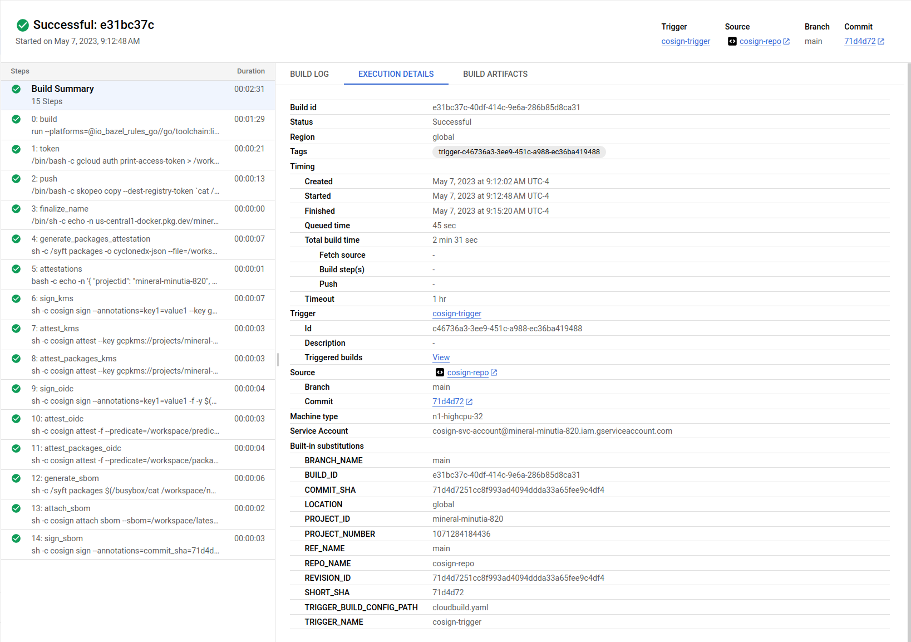

# Deterministic container hashes and container signing using Cosign, Bazel and Google Cloud Build

A simple tutorial that generates consistent container image hashes using `bazel` and then signs provenance records using [cosign](https://github.com/sigstore/cosign) (Container Signing, Verification and Storage in an OCI registry).

In this tutorial, we will:

1. generate a deterministic container image hash using  `bazel`
2. use `cosign` to create provenance records for this image
3. verify attestations and signatures using `KMS` and `OIDC` cross checked with a public transparency log.

We will use GCP-centric services here such as `Artifact Registry`, `Cloud BUild`, `Cloud Source Repository`.  

Both `KMS` and `OIDC` based signatures are used and for `OIDC`, an entry is submitted to a `transparency log` such that it can get verified by anyone at anytime.

>> **NOTE** Please be aware that if you run this tutorial, the GCP service_accounts _email_ you use to sign the artifacts within cloud build will be submitted to a public transparency log.  I used a disposable GCP project but even if i didn't, its just the email address and projectID in the cert, no big deal to me.  If it is to you, you can use the KMS examples and skip OIDC

>> this repo is not supported by google and employs as much as i know about it on 9/24/22 (with one weeks' experience with this..so take it with a grain of salt)

---

##### References:

* [SigStore](https://docs.sigstore.dev/)
* [cosign](https://github.com/sigstore/cosign)
* [Introducing sigstore: Easy Code Signing & Verification for Supply Chain Integrity](https://security.googleblog.com/2021/03/introducing-sigstore-easy-code-signing.html)
* [Best Practices for Supply Chain Security](https://dlorenc.medium.com/policy-and-attestations-89650fd6f4fa)
* [Building deterministic Docker images with Bazel](https://blog.bazel.build/2015/07/28/docker_build.html#building-deterministic-docker-images-with-bazel)
* [Deterministic builds with go + bazel + grpc + docker](https://github.com/salrashid123/go-grpc-bazel-docker)
* [bazel](https://bazel.build/)
* [in-toto attestation](https://docs.sigstore.dev/cosign/attestation/)
* [Notary V2 and Cosign](https://dlorenc.medium.com/notary-v2-and-cosign-b816658f044d)

### CloudBuild steps

First lets go over the `cloudbuild.yaml` steps:

#### Build image deterministically using bazel:

This is the `bazel` build that guarantees you the code will produce a specific image hash everytime:

* `myimage@sha256:83ab2ba6689713f2d68104cd208feadfebdd6bc881c455dcb55d2b45ac3a0753`



#### Push image to registry

This pushes the image to [google artifact registry](https://cloud.google.com/artifact-registry).  This will give the image hash we'd expect

You can optionally push to dockerhub if you want using [KMS based secrets](https://cloud.google.com/build/docs/securing-builds/use-encrypted-credentials#configuring_builds_to_use_encrypted_data) in cloud build 


#### Create attestations attributes

This step will issue a statement that includes attestation attributes users can inject into the pipeline the verifier can use. See [Verify Attestations](https://docs.sigstore.dev/cosign/verify/).

In this case, the attestation verification predicate includes some info from the build like the buildID and even the repo commithash.

Someone who wants to verify any [in-toto attestation](https://docs.sigstore.dev/cosign/attestation/) can use these values. THis repo just adds some basic stuff like the `projectID`,  `buildID` and `commitsha` (in our case, its `72a817a13794b342c7dbc57eb537f5f4177473a2`):


```json
{
  "_type": "https://in-toto.io/Statement/v0.1",
  "predicateType": "cosign.sigstore.dev/attestation/v1",
  "subject": [
    {
      "name": "us-central1-docker.pkg.dev/cosign-test-363613/repo1/myimage",
      "digest": {
        "sha256": "83ab2ba6689713f2d68104cd208feadfebdd6bc881c455dcb55d2b45ac3a0753"
      }
    }
  ],
  "predicate": {
    "Data": "{ 
      \"projectid\": \"cosign-test-363613\", 
      \"buildid\": \"39ca111c-1602-4c7d-827b-4a7e61dca44d\", 
      \"foo\":\"bar\", 
      \"commitsha\": \"72a817a13794b342c7dbc57eb537f5f4177473a2\" }",
    "Timestamp": "2022-09-25T13:16:32Z"
  }
}
```


#### Sign image using KMS based keys

This step uses the KMS key to `cosign` the image


#### Apply attestations using KMS

This issues attestation signature using some predicates we wrote to file during the build.

You can define any claims here..i just happen to use the commit hash for the source and some random stuff.


#### Sign image using OIDC tokens

This step will use the service accounts OIDC token sign using [Fulcio](https://docs.sigstore.dev/fulcio/oidc-in-fulcio)


#### Apply attestations using OIDC tokens

This will issue signed attestations using the OIDC token signing for fulcio


---


### Setup

The following steps will use Google Cloud services 

* Cloud Source Repository to hold the code and trigger builds (you can use github but thats out of scope here),
* Cloud Build to create the image to save to artifact registry.
* Artifact Registry to hold the containers images

You'll also need to install [cosign](https://docs.sigstore.dev/cosign/installation/) (duh), and [rekor-cli](https://docs.sigstore.dev/rekor/installation), `git`, `gcloud`, optionally `gcloud`, `docker`.

```bash
export GCLOUD_USER=`gcloud config get-value core/account`
export PROJECT_ID=`gcloud config get-value core/project`
export PROJECT_NUMBER=`gcloud projects describe $PROJECT_ID --format='value(projectNumber)'`
echo $PROJECT_ID

gcloud auth application-default login

# **Important**: edit app/BUILD.bazel
# replace the value of $PROJECT_ID with yours

# container_image(
#     name = "server",
#     base = "@distroless_base//image",
#     entrypoint = ["/server"],
#     files = [":main"],
#     repository = "us-central1-docker.pkg.dev/$PROJECT_ID/repo1/myimage:server"
# )

# enable services
gcloud services enable \
    artifactregistry.googleapis.com \
    cloudbuild.googleapis.com cloudkms.googleapis.com \
    iam.googleapis.com sourcerepo.googleapis.com

# create artifact registry
gcloud artifacts repositories create repo1 --repository-format=docker --location=us-central1

# create service account that cloud build will run as.
gcloud iam service-accounts create cosign

# allow 'self impersonation' for cloud build service account
gcloud iam service-accounts add-iam-policy-binding cosign@$PROJECT_ID.iam.gserviceaccount.com \
    --role roles/iam.serviceAccountTokenCreator \
    --member "serviceAccount:cosign@$PROJECT_ID.iam.gserviceaccount.com"

# allow cloud build to write logs
gcloud projects add-iam-policy-binding $PROJECT_ID \
  --member=serviceAccount:cosign@$PROJECT_ID.iam.gserviceaccount.com  \
  --role=roles/logging.logWriter

# allow cloud build write access to artifact registry
gcloud artifacts repositories add-iam-policy-binding repo1 \
    --location=us-central1  \
    --member=serviceAccount:cosign@$PROJECT_ID.iam.gserviceaccount.com \
    --role=roles/artifactregistry.writer

# allow cloud build access to list KMS keys
gcloud projects add-iam-policy-binding $PROJECT_ID \
  --member=serviceAccount:cosign@$PROJECT_ID.iam.gserviceaccount.com  \
  --role=roles/cloudkms.viewer


# create kms keyring and key
gcloud kms keyrings create cosignkr --location=global

gcloud kms keys create key1 --keyring=cosignkr \
 --location=global --purpose=asymmetric-signing \
 --default-algorithm=ec-sign-p256-sha256

gcloud kms keys list  --keyring=cosignkr --location=global

# allow cloud buildaccess to sign the key
gcloud kms keys add-iam-policy-binding key1 \
    --keyring=cosignkr --location=global \
    --member=serviceAccount:cosign@$PROJECT_ID.iam.gserviceaccount.com \
    --role=roles/cloudkms.signer

# allow current gcloud user to view the public key
gcloud kms keys add-iam-policy-binding key1 \
    --keyring=cosignkr --location=global \
    --member=serviceAccount:cosign@$PROJECT_ID.iam.gserviceaccount.com  \
    --role=roles/cloudkms.publicKeyViewer

# create a temp bucket for cloud build and allow cloud build permissions to use it
gsutil mb gs://$PROJECT_ID\_cloudbuild
gsutil iam ch serviceAccount:cosign@$PROJECT_ID.iam.gserviceaccount.com:objectAdmin gs://$PROJECT_ID\_cloudbuild
```

### Build image

```bash
# to build directly
# ce /app
# gcloud beta builds submit --config=cloudbuild.yaml --machine-type=n1-highcpu-32

# to build via commit (recommended)
gcloud source repos create cosign-repo

gcloud projects add-iam-policy-binding $PROJECT_ID \
  --member=serviceAccount:cosign@$PROJECT_ID.iam.gserviceaccount.com \
  --role=roles/source.reader

gcloud source repos clone cosign-repo
cd cosign-repo
cp -R ../app/* .
# remember to edit BUILD.bazel and replace the value with the actual project_ID value
# for repository = "us-central1-docker.pkg.dev/$PROJECT_ID/repo1/myimage"

git add -A
git commit -m "add"
git push 

# create a manual trigger
gcloud beta builds triggers create manual --region=global \
   --name=cosign-trigger --build-config=cloudbuild.yaml \
   --repo=https://source.developers.google.com/p/$PROJECT_ID/r/cosign-repo \
   --repo-type=CLOUD_SOURCE_REPOSITORIES --branch=main \
   --service-account=projects/$PROJECT_ID/serviceAccounts/cosign@$PROJECT_ID.iam.gserviceaccount.com 

# now trigger
gcloud alpha builds triggers run cosign-trigger
```


### Verify

We are now ready to verify the images locally and using `cosign`


#### KMS

For kms keys, verify by either downloading kms public key

```bash
cd ../
gcloud kms keys versions get-public-key 1  \
  --key=key1 --keyring=cosignkr \
  --location=global --output-file=kms_pub.pem


# verify using the local key 
cosign verify --key kms_pub.pem   \
   us-central1-docker.pkg.dev/$PROJECT_ID/repo1/myimage@sha256:83ab2ba6689713f2d68104cd208feadfebdd6bc881c455dcb55d2b45ac3a0753  | jq '.'

# or by api
cosign verify --key gcpkms://projects/$PROJECT_ID/locations/global/keyRings/cosignkr/cryptoKeys/key1/cryptoKeyVersions/1 \
      us-central1-docker.pkg.dev/$PROJECT_ID/repo1/myimage@sha256:83ab2ba6689713f2d68104cd208feadfebdd6bc881c455dcb55d2b45ac3a0753 | jq '.'
```

Note this gives 

```json
Verification for us-central1-docker.pkg.dev/cosign-test-363613/repo1/myimage@sha256:83ab2ba6689713f2d68104cd208feadfebdd6bc881c455dcb55d2b45ac3a0753 --
The following checks were performed on each of these signatures:
  - The cosign claims were validated
  - The signatures were verified against the specified public key
[
  {
    "critical": {
      "identity": {
        "docker-reference": "us-central1-docker.pkg.dev/cosign-test-363613/repo1/myimage"
      },
      "image": {
        "docker-manifest-digest": "sha256:83ab2ba6689713f2d68104cd208feadfebdd6bc881c455dcb55d2b45ac3a0753"
      },
      "type": "cosign container image signature"
    },
    "optional": {
      "key1": "value1"
    }
  }
]
```

### Transparency Log (rekor)


The OIDC flow also creates entries in the  transparency logs

TO verify,

```bash
COSIGN_EXPERIMENTAL=1  cosign verify  us-central1-docker.pkg.dev/$PROJECT_ID/repo1/myimage@sha256:83ab2ba6689713f2d68104cd208feadfebdd6bc881c455dcb55d2b45ac3a0753 | jq '.'
```

gives

```json
Verification for us-central1-docker.pkg.dev/cosign-test-363613/repo1/myimage@sha256:83ab2ba6689713f2d68104cd208feadfebdd6bc881c455dcb55d2b45ac3a0753 --
The following checks were performed on each of these signatures:
  - The cosign claims were validated
  - Existence of the claims in the transparency log was verified offline
  - Any certificates were verified against the Fulcio roots.
[
  {
    "critical": {
      "identity": {
        "docker-reference": "us-central1-docker.pkg.dev/cosign-test-363613/repo1/myimage"
      },
      "image": {
        "docker-manifest-digest": "sha256:83ab2ba6689713f2d68104cd208feadfebdd6bc881c455dcb55d2b45ac3a0753"
      },
      "type": "cosign container image signature"
    },
    "optional": {
      "Bundle": {
        "SignedEntryTimestamp": "MEUCIF29vuJZwdzLVyCkfUnlVJ+dgoKXhXsn+2UWLFFK9NJ2AiEAvCOXKfwTAaOAu6BrysoqTGu0zlOHsMSEZAzJ5R6jGn4=",
        "Payload": {
          "body": "eyJhcGlWZXJzaW9uIjoiMC4wLjEiLCJraW5kIjoiaGFzaGVkcmVrb3JkIiwic3BlYyI6eyJkYXRhIjp7Imhhc2giOnsiYWxnb3JpdGhtIjoic2hhMjU2IiwidmFsdWUiOiIxN2FkOTdkNWM0OTU0MmIxOTYxNTRjZmRkODlmYWRmZmUwZTA5YmFmZDRjM2ZkNmIzM2JkNDliYzQ3NWNiNGEzIn19LCJzaWduYXR1cmUiOnsiY29udGVudCI6Ik1FVUNJUUNFRHBtbERUbWJKOEJOOFU2VEIvaWNCM2tUUXVwekdJOUdjTHZwYjdXQjhBSWdLWTRNclBlamxOOW1ud0Z3bTAwOTZsTEowNHRjOXdwNnFjcHBXWXI3R2drPSIsInB1YmxpY0tleSI6eyJjb250ZW50IjoiTFMwdExTMUNSVWRKVGlCRFJWSlVTVVpKUTBGVVJTMHRMUzB0Q2sxSlNVTjJSRU5EUVd0TFowRjNTVUpCWjBsVlpsQnhNMGxXWXpSd09HMUlZbXN5UTBjNFFYZFFWbms1VGtOemQwTm5XVWxMYjFwSmVtb3dSVUYzVFhjS1RucEZWazFDVFVkQk1WVkZRMmhOVFdNeWJHNWpNMUoyWTIxVmRWcEhWakpOVWpSM1NFRlpSRlpSVVVSRmVGWjZZVmRrZW1SSE9YbGFVekZ3WW01U2JBcGpiVEZzV2tkc2FHUkhWWGRJYUdOT1RXcEpkMDlVU1RGTlZFMTRUbXBOTUZkb1kwNU5ha2wzVDFSSk1VMVVUWGxPYWswd1YycEJRVTFHYTNkRmQxbElDa3R2V2tsNmFqQkRRVkZaU1V0dldrbDZhakJFUVZGalJGRm5RVVY2U214TkwwdENSMHR0YTBwRlQwTXhSa3hLV0hCRFpqWkhlbkl6VkVwNGRtUktOVWNLVVdWaFFuZG5lVE5MYUVjeVYwdFhlaTlOUldOellWZFJhM1ZMVW5aNWRWbzVNR0p1UzNBdlVVYzJOVU5QVGpreWQwdFBRMEZYUlhkblowWmtUVUUwUndwQk1WVmtSSGRGUWk5M1VVVkJkMGxJWjBSQlZFSm5UbFpJVTFWRlJFUkJTMEpuWjNKQ1owVkdRbEZqUkVGNlFXUkNaMDVXU0ZFMFJVWm5VVlZVZW5Ka0NqYzBhVFkxWm14dFMzVnRTVVkxUkVaWVFWZFRSRVZaZDBoM1dVUldVakJxUWtKbmQwWnZRVlV6T1ZCd2VqRlphMFZhWWpWeFRtcHdTMFpYYVhocE5Ga0tXa1E0ZDFCM1dVUldVakJTUVZGSUwwSkVWWGROTkVWNFdUSTVlbUZYWkhWUlIwNTJZekpzYm1KcE1UQmFXRTR3VEZSTk1rMTZXWGhOZVRWd1dWY3dkUXBhTTA1c1kyNWFjRmt5Vm1oWk1rNTJaRmMxTUV4dFRuWmlWRUZ3UW1kdmNrSm5SVVZCV1U4dlRVRkZRa0pDZEc5a1NGSjNZM3B2ZGt3eVJtcFpNamt4Q21KdVVucE1iV1IyWWpKa2MxcFROV3BpTWpCM1oxbHJSME5wYzBkQlVWRkNNVzVyUTBKQlNVVmxkMUkxUVVoalFXUlJRVWxaU2t4M1MwWk1MMkZGV0ZJS01GZHpibWhLZUVaYWVHbHpSbW96UkU5T1NuUTFjbmRwUW1wYWRtTm5RVUZCV1U0d2VYUm9RVUZCUVVWQmQwSkhUVVZSUTBsQk1Ua3dPSEpFVW1WeVRBcHNaVllyUmpKUWIxUnFSakF5Y2xwWU16QjJZbVpwZGxOMVRYTXJRMVpDV2tGcFFWRkRiemw2VUhwWFowczNZakZSTkdjelFWZHBkMDh3VFUxSFRsZG5DakJMWVdONldVdFBSVUl5UWt0cVFVdENaMmR4YUd0cVQxQlJVVVJCZDA1dlFVUkNiRUZxUW1SclJrY3ZTbVZpWW5keVRtcFhOM0JNTmtKamFGZzJRbUVLVWxsaFptSTVVRGs0VEVSbVp6VkNNbVUyVFhaeldHZFFaRXBXWTNkNFJHb3dVVzV5YkZkWlEwMVJRMlUwVW5CdldtMXBNSGRLWmtKSFUzQnJOMUoxTlFwcU5qbFJPVzlVTlVsWk1FNVdVeTlHYUVSMlVUUlljVmhFYUU4d09FWkVZVzAwWVVwa1NucEdZMDVSUFFvdExTMHRMVVZPUkNCRFJWSlVTVVpKUTBGVVJTMHRMUzB0Q2c9PSJ9fX19",
          "integratedTime": 1664111795,
          "logIndex": 3942845,
          "logID": "c0d23d6ad406973f9559f3ba2d1ca01f84147d8ffc5b8445c224f98b9591801d"
        }
      },
      "Issuer": "https://accounts.google.com",
      "Subject": "cosign@cosign-test-363613.iam.gserviceaccount.com",
      "key1": "value1"
    }
  }
]
```

Note that this is what is in the transparency log itself (`logID`, `logIndex`, etc)


decoding the `payload` using [jwt.io](jwt.io) gives json

```json
{
  "apiVersion": "0.0.1",
  "kind": "hashedrekord",
  "spec": {
    "data": {
      "hash": {
        "algorithm": "sha256",
        "value": "17ad97d5c49542b196154cfdd89fadffe0e09bafd4c3fd6b33bd49bc475cb4a3"
      }
    },
    "signature": {
      "content": "MEUCIQCEDpmlDTmbJ8BN8U6TB/icB3kTQupzGI9GcLvpb7WB8AIgKY4MrPejlN9mnwFwm0096lLJ04tc9wp6qcppWYr7Ggk=",
      "publicKey": {
        "content": "LS0tLS1CRUdJTiBDRVJUSUZJQ0FURS0tLS0tCk1JSUN2RENDQWtLZ0F3SUJBZ0lVZlBxM0lWYzRwOG1IYmsyQ0c4QXdQVnk5TkNzd0NnWUlLb1pJemowRUF3TXcKTnpFVk1CTUdBMVVFQ2hNTWMybG5jM1J2Y21VdVpHVjJNUjR3SEFZRFZRUURFeFZ6YVdkemRHOXlaUzFwYm5SbApjbTFsWkdsaGRHVXdIaGNOTWpJd09USTFNVE14TmpNMFdoY05Nakl3T1RJMU1UTXlOak0wV2pBQU1Ga3dFd1lICktvWkl6ajBDQVFZSUtvWkl6ajBEQVFjRFFnQUV6SmxNL0tCR0tta0pFT0MxRkxKWHBDZjZHenIzVEp4dmRKNUcKUWVhQndneTNLaEcyV0tXei9NRWNzYVdRa3VLUnZ5dVo5MGJuS3AvUUc2NUNPTjkyd0tPQ0FXRXdnZ0ZkTUE0RwpBMVVkRHdFQi93UUVBd0lIZ0RBVEJnTlZIU1VFRERBS0JnZ3JCZ0VGQlFjREF6QWRCZ05WSFE0RUZnUVVUenJkCjc0aTY1ZmxtS3VtSUY1REZYQVdTREVZd0h3WURWUjBqQkJnd0ZvQVUzOVBwejFZa0VaYjVxTmpwS0ZXaXhpNFkKWkQ4d1B3WURWUjBSQVFIL0JEVXdNNEV4WTI5emFXZHVRR052YzJsbmJpMTBaWE4wTFRNMk16WXhNeTVwWVcwdQpaM05sY25acFkyVmhZMk52ZFc1MExtTnZiVEFwQmdvckJnRUVBWU8vTUFFQkJCdG9kSFJ3Y3pvdkwyRmpZMjkxCmJuUnpMbWR2YjJkc1pTNWpiMjB3Z1lrR0Npc0dBUVFCMW5rQ0JBSUVld1I1QUhjQWRRQUlZSkx3S0ZML2FFWFIKMFdzbmhKeEZaeGlzRmozRE9OSnQ1cndpQmpadmNnQUFBWU4weXRoQUFBQUVBd0JHTUVRQ0lBMTkwOHJEUmVyTApsZVYrRjJQb1RqRjAyclpYMzB2YmZpdlN1TXMrQ1ZCWkFpQVFDbzl6UHpXZ0s3YjFRNGczQVdpd08wTU1HTldnCjBLYWN6WUtPRUIyQktqQUtCZ2dxaGtqT1BRUURBd05vQURCbEFqQmRrRkcvSmViYndyTmpXN3BMNkJjaFg2QmEKUllhZmI5UDk4TERmZzVCMmU2TXZzWGdQZEpWY3d4RGowUW5ybFdZQ01RQ2U0UnBvWm1pMHdKZkJHU3BrN1J1NQpqNjlROW9UNUlZME5WUy9GaER2UTRYcVhEaE8wOEZEYW00YUpkSnpGY05RPQotLS0tLUVORCBDRVJUSUZJQ0FURS0tLS0tCg=="
      }
    }
  }
}
```

from there the base64encoded `publicKey` is what was issued during the [signing ceremony](https://docs.sigstore.dev/fulcio/certificate-issuing-overview). 

```
-----BEGIN CERTIFICATE-----
MIICvDCCAkKgAwIBAgIUfPq3IVc4p8mHbk2CG8AwPVy9NCswCgYIKoZIzj0EAwMw
NzEVMBMGA1UEChMMc2lnc3RvcmUuZGV2MR4wHAYDVQQDExVzaWdzdG9yZS1pbnRl
cm1lZGlhdGUwHhcNMjIwOTI1MTMxNjM0WhcNMjIwOTI1MTMyNjM0WjAAMFkwEwYH
KoZIzj0CAQYIKoZIzj0DAQcDQgAEzJlM/KBGKmkJEOC1FLJXpCf6Gzr3TJxvdJ5G
QeaBwgy3KhG2WKWz/MEcsaWQkuKRvyuZ90bnKp/QG65CON92wKOCAWEwggFdMA4G
A1UdDwEB/wQEAwIHgDATBgNVHSUEDDAKBggrBgEFBQcDAzAdBgNVHQ4EFgQUTzrd
74i65flmKumIF5DFXAWSDEYwHwYDVR0jBBgwFoAU39Ppz1YkEZb5qNjpKFWixi4Y
ZD8wPwYDVR0RAQH/BDUwM4ExY29zaWduQGNvc2lnbi10ZXN0LTM2MzYxMy5pYW0u
Z3NlcnZpY2VhY2NvdW50LmNvbTApBgorBgEEAYO/MAEBBBtodHRwczovL2FjY291
bnRzLmdvb2dsZS5jb20wgYkGCisGAQQB1nkCBAIEewR5AHcAdQAIYJLwKFL/aEXR
0WsnhJxFZxisFj3DONJt5rwiBjZvcgAAAYN0ythAAAAEAwBGMEQCIA1908rDRerL
leV+F2PoTjF02rZX30vbfivSuMs+CVBZAiAQCo9zPzWgK7b1Q4g3AWiwO0MMGNWg
0KaczYKOEB2BKjAKBggqhkjOPQQDAwNoADBlAjBdkFG/JebbwrNjW7pL6BchX6Ba
RYafb9P98LDfg5B2e6MvsXgPdJVcwxDj0QnrlWYCMQCe4RpoZmi0wJfBGSpk7Ru5
j69Q9oT5IY0NVS/FhDvQ4XqXDhO08FDam4aJdJzFcNQ=
-----END CERTIFICATE-----
```

which expanded is 

```bash
$  openssl x509 -in cosign.crt -noout -text

Certificate:
    Data:
        Version: 3 (0x2)
        Serial Number:
            7c:fa:b7:21:57:38:a7:c9:87:6e:4d:82:1b:c0:30:3d:5c:bd:34:2b
        Signature Algorithm: ecdsa-with-SHA384
        Issuer: O = sigstore.dev, CN = sigstore-intermediate
        Validity
            Not Before: Sep 25 13:16:34 2022 GMT
            Not After : Sep 25 13:26:34 2022 GMT
        Subject: 
        Subject Public Key Info:
            Public Key Algorithm: id-ecPublicKey
                Public-Key: (256 bit)
                pub:
                    04:cc:99:4c:fc:a0:46:2a:69:09:10:e0:b5:14:b2:
                    57:a4:27:fa:1b:3a:f7:4c:9c:6f:74:9e:46:41:e6:
                    81:c2:0c:b7:2a:11:b6:58:a5:b3:fc:c1:1c:b1:a5:
                    90:92:e2:91:bf:2b:99:f7:46:e7:2a:9f:d0:1b:ae:
                    42:38:df:76:c0
                ASN1 OID: prime256v1
                NIST CURVE: P-256
        X509v3 extensions:
            X509v3 Key Usage: critical
                Digital Signature
            X509v3 Extended Key Usage: 
                Code Signing
            X509v3 Subject Key Identifier: 
                4F:3A:DD:EF:88:BA:E5:F9:66:2A:E9:88:17:90:C5:5C:05:92:0C:46
            X509v3 Authority Key Identifier: 
                DF:D3:E9:CF:56:24:11:96:F9:A8:D8:E9:28:55:A2:C6:2E:18:64:3F
            X509v3 Subject Alternative Name: critical
                email:cosign@cosign-test-363613.iam.gserviceaccount.com  <<<<<<<<<<<<<<<<<<<<<<<<<<<<<<
            1.3.6.1.4.1.57264.1.1: 
                https://accounts.google.com
            CT Precertificate SCTs: 
                Signed Certificate Timestamp:
                    Version   : v1 (0x0)
                    Log ID    : 08:60:92:F0:28:52:FF:68:45:D1:D1:6B:27:84:9C:45:
                                67:18:AC:16:3D:C3:38:D2:6D:E6:BC:22:06:36:6F:72
                    Timestamp : Sep 25 13:16:34.240 2022 GMT
                    Extensions: none
                    Signature : ecdsa-with-SHA256
                                30:44:02:20:0D:7D:D3:CA:C3:45:EA:CB:95:E5:7E:17:
                                63:E8:4E:31:74:DA:B6:57:DF:4B:DB:7E:2B:D2:B8:CB:
                                3E:09:50:59:02:20:10:0A:8F:73:3F:35:A0:2B:B6:F5:
                                43:88:37:01:68:B0:3B:43:0C:18:D5:A0:D0:A6:9C:CD:
                                82:8E:10:1D:81:2A
    Signature Algorithm: ecdsa-with-SHA384

```

NOTE the OID `1.3.6.1.4.1.57264.1.1` is registered to [here](https://github.com/sigstore/fulcio/blob/main/docs/oid-info.md#directory) and denotes the OIDC Token's isuser

Now use `rekor-cli` to search for what we added to the transparency log using


* `sha` value from `hashedrekord`

```
$ rekor-cli search --rekor_server https://rekor.sigstore.dev  --sha 17ad97d5c49542b196154cfdd89fadffe0e09bafd4c3fd6b33bd49bc475cb4a3

Found matching entries (listed by UUID):
362f8ecba72f43260828aee929cb1264070fd33be9a61566f4f18ad2a0a980a3aa49ab80d587ca38
```

* the email for the build service account's `OIDC`

```bash
$ rekor-cli search --rekor_server https://rekor.sigstore.dev  --email cosign@$PROJECT_ID.iam.gserviceaccount.com

Found matching entries (listed by UUID):
362f8ecba72f432675be8c03972e25d552fcbe63b566948a3351978bcf8fbfb1db24f2929faeea33
362f8ecba72f43260828aee929cb1264070fd33be9a61566f4f18ad2a0a980a3aa49ab80d587ca38
```

note each `UUID` asserts something different:  the `signature` and another one for the `attestation`


For the `Signature`

```
rekor-cli get --rekor_server https://rekor.sigstore.dev  --uuid 362f8ecba72f43260828aee929cb1264070fd33be9a61566f4f18ad2a0a980a3aa49ab80d587ca38
```

outputs (note the `Index` value matches what we have in the "sign_oidc" build step)

```bash
LogID: c0d23d6ad406973f9559f3ba2d1ca01f84147d8ffc5b8445c224f98b9591801d
Index: 3942845
IntegratedTime: 2022-09-25T13:16:35Z
UUID: 0828aee929cb1264070fd33be9a61566f4f18ad2a0a980a3aa49ab80d587ca38
Body: {
  "HashedRekordObj": {
    "data": {
      "hash": {
        "algorithm": "sha256",
        "value": "17ad97d5c49542b196154cfdd89fadffe0e09bafd4c3fd6b33bd49bc475cb4a3"
      }
    },
    "signature": {
      "content": "MEUCIQCEDpmlDTmbJ8BN8U6TB/icB3kTQupzGI9GcLvpb7WB8AIgKY4MrPejlN9mnwFwm0096lLJ04tc9wp6qcppWYr7Ggk=",
      "publicKey": {
        "content": "LS0tLS1CRUdJTiBDRVJUSUZJQ0FURS0tLS0tCk1JSUN2RENDQWtLZ0F3SUJBZ0lVZlBxM0lWYzRwOG1IYmsyQ0c4QXdQVnk5TkNzd0NnWUlLb1pJemowRUF3TXcKTnpFVk1CTUdBMVVFQ2hNTWMybG5jM1J2Y21VdVpHVjJNUjR3SEFZRFZRUURFeFZ6YVdkemRHOXlaUzFwYm5SbApjbTFsWkdsaGRHVXdIaGNOTWpJd09USTFNVE14TmpNMFdoY05Nakl3T1RJMU1UTXlOak0wV2pBQU1Ga3dFd1lICktvWkl6ajBDQVFZSUtvWkl6ajBEQVFjRFFnQUV6SmxNL0tCR0tta0pFT0MxRkxKWHBDZjZHenIzVEp4dmRKNUcKUWVhQndneTNLaEcyV0tXei9NRWNzYVdRa3VLUnZ5dVo5MGJuS3AvUUc2NUNPTjkyd0tPQ0FXRXdnZ0ZkTUE0RwpBMVVkRHdFQi93UUVBd0lIZ0RBVEJnTlZIU1VFRERBS0JnZ3JCZ0VGQlFjREF6QWRCZ05WSFE0RUZnUVVUenJkCjc0aTY1ZmxtS3VtSUY1REZYQVdTREVZd0h3WURWUjBqQkJnd0ZvQVUzOVBwejFZa0VaYjVxTmpwS0ZXaXhpNFkKWkQ4d1B3WURWUjBSQVFIL0JEVXdNNEV4WTI5emFXZHVRR052YzJsbmJpMTBaWE4wTFRNMk16WXhNeTVwWVcwdQpaM05sY25acFkyVmhZMk52ZFc1MExtTnZiVEFwQmdvckJnRUVBWU8vTUFFQkJCdG9kSFJ3Y3pvdkwyRmpZMjkxCmJuUnpMbWR2YjJkc1pTNWpiMjB3Z1lrR0Npc0dBUVFCMW5rQ0JBSUVld1I1QUhjQWRRQUlZSkx3S0ZML2FFWFIKMFdzbmhKeEZaeGlzRmozRE9OSnQ1cndpQmpadmNnQUFBWU4weXRoQUFBQUVBd0JHTUVRQ0lBMTkwOHJEUmVyTApsZVYrRjJQb1RqRjAyclpYMzB2YmZpdlN1TXMrQ1ZCWkFpQVFDbzl6UHpXZ0s3YjFRNGczQVdpd08wTU1HTldnCjBLYWN6WUtPRUIyQktqQUtCZ2dxaGtqT1BRUURBd05vQURCbEFqQmRrRkcvSmViYndyTmpXN3BMNkJjaFg2QmEKUllhZmI5UDk4TERmZzVCMmU2TXZzWGdQZEpWY3d4RGowUW5ybFdZQ01RQ2U0UnBvWm1pMHdKZkJHU3BrN1J1NQpqNjlROW9UNUlZME5WUy9GaER2UTRYcVhEaE8wOEZEYW00YUpkSnpGY05RPQotLS0tLUVORCBDRVJUSUZJQ0FURS0tLS0tCg=="
      }
    }
  }
}
```

the certificate from the decoded publicKey outputs the cert issued by falcio

```
-----BEGIN CERTIFICATE-----
MIICvDCCAkKgAwIBAgIUfPq3IVc4p8mHbk2CG8AwPVy9NCswCgYIKoZIzj0EAwMw
NzEVMBMGA1UEChMMc2lnc3RvcmUuZGV2MR4wHAYDVQQDExVzaWdzdG9yZS1pbnRl
cm1lZGlhdGUwHhcNMjIwOTI1MTMxNjM0WhcNMjIwOTI1MTMyNjM0WjAAMFkwEwYH
KoZIzj0CAQYIKoZIzj0DAQcDQgAEzJlM/KBGKmkJEOC1FLJXpCf6Gzr3TJxvdJ5G
QeaBwgy3KhG2WKWz/MEcsaWQkuKRvyuZ90bnKp/QG65CON92wKOCAWEwggFdMA4G
A1UdDwEB/wQEAwIHgDATBgNVHSUEDDAKBggrBgEFBQcDAzAdBgNVHQ4EFgQUTzrd
74i65flmKumIF5DFXAWSDEYwHwYDVR0jBBgwFoAU39Ppz1YkEZb5qNjpKFWixi4Y
ZD8wPwYDVR0RAQH/BDUwM4ExY29zaWduQGNvc2lnbi10ZXN0LTM2MzYxMy5pYW0u
Z3NlcnZpY2VhY2NvdW50LmNvbTApBgorBgEEAYO/MAEBBBtodHRwczovL2FjY291
bnRzLmdvb2dsZS5jb20wgYkGCisGAQQB1nkCBAIEewR5AHcAdQAIYJLwKFL/aEXR
0WsnhJxFZxisFj3DONJt5rwiBjZvcgAAAYN0ythAAAAEAwBGMEQCIA1908rDRerL
leV+F2PoTjF02rZX30vbfivSuMs+CVBZAiAQCo9zPzWgK7b1Q4g3AWiwO0MMGNWg
0KaczYKOEB2BKjAKBggqhkjOPQQDAwNoADBlAjBdkFG/JebbwrNjW7pL6BchX6Ba
RYafb9P98LDfg5B2e6MvsXgPdJVcwxDj0QnrlWYCMQCe4RpoZmi0wJfBGSpk7Ru5
j69Q9oT5IY0NVS/FhDvQ4XqXDhO08FDam4aJdJzFcNQ=
-----END CERTIFICATE-----


Certificate:
    Data:
        Version: 3 (0x2)
        Serial Number:
            7c:fa:b7:21:57:38:a7:c9:87:6e:4d:82:1b:c0:30:3d:5c:bd:34:2b
        Signature Algorithm: ecdsa-with-SHA384
        Issuer: O = sigstore.dev, CN = sigstore-intermediate
        Validity
            Not Before: Sep 25 13:16:34 2022 GMT
            Not After : Sep 25 13:26:34 2022 GMT
        Subject: 
        Subject Public Key Info:
            Public Key Algorithm: id-ecPublicKey
                Public-Key: (256 bit)
                pub:
                    04:cc:99:4c:fc:a0:46:2a:69:09:10:e0:b5:14:b2:
                    57:a4:27:fa:1b:3a:f7:4c:9c:6f:74:9e:46:41:e6:
                    81:c2:0c:b7:2a:11:b6:58:a5:b3:fc:c1:1c:b1:a5:
                    90:92:e2:91:bf:2b:99:f7:46:e7:2a:9f:d0:1b:ae:
                    42:38:df:76:c0
                ASN1 OID: prime256v1
                NIST CURVE: P-256
        X509v3 extensions:
            X509v3 Key Usage: critical
                Digital Signature
            X509v3 Extended Key Usage: 
                Code Signing
            X509v3 Subject Key Identifier: 
                4F:3A:DD:EF:88:BA:E5:F9:66:2A:E9:88:17:90:C5:5C:05:92:0C:46
            X509v3 Authority Key Identifier: 
                DF:D3:E9:CF:56:24:11:96:F9:A8:D8:E9:28:55:A2:C6:2E:18:64:3F
            X509v3 Subject Alternative Name: critical
                email:cosign@cosign-test-363613.iam.gserviceaccount.com  <<<<<<<<<<<<<<<<<<<<<<<
            1.3.6.1.4.1.57264.1.1: 
                https://accounts.google.com
            CT Precertificate SCTs: 
                Signed Certificate Timestamp:
                    Version   : v1 (0x0)
                    Log ID    : 08:60:92:F0:28:52:FF:68:45:D1:D1:6B:27:84:9C:45:
                                67:18:AC:16:3D:C3:38:D2:6D:E6:BC:22:06:36:6F:72
                    Timestamp : Sep 25 13:16:34.240 2022 GMT
                    Extensions: none
                    Signature : ecdsa-with-SHA256
                                30:44:02:20:0D:7D:D3:CA:C3:45:EA:CB:95:E5:7E:17:
                                63:E8:4E:31:74:DA:B6:57:DF:4B:DB:7E:2B:D2:B8:CB:
                                3E:09:50:59:02:20:10:0A:8F:73:3F:35:A0:2B:B6:F5:
                                43:88:37:01:68:B0:3B:43:0C:18:D5:A0:D0:A6:9C:CD:
                                82:8E:10:1D:81:2A
    Signature Algorithm: ecdsa-with-SHA384

```


for the `Attestation`

```bash
rekor-cli get --rekor_server https://rekor.sigstore.dev  --uuid 362f8ecba72f432675be8c03972e25d552fcbe63b566948a3351978bcf8fbfb1db24f2929faeea33
```

gives (again, note the attestations and `Index` that matches the "attest_oidc" step)

```json
LogID: c0d23d6ad406973f9559f3ba2d1ca01f84147d8ffc5b8445c224f98b9591801d
Attestation: {"_type":"https://in-toto.io/Statement/v0.1","predicateType":"cosign.sigstore.dev/attestation/v1","subject":[{"name":"us-central1-docker.pkg.dev/cosign-test-363613/repo1/myimage","digest":{"sha256":"83ab2ba6689713f2d68104cd208feadfebdd6bc881c455dcb55d2b45ac3a0753"}}],"predicate":{"Data":"{ \"projectid\": \"cosign-test-363613\", \"buildid\": \"39ca111c-1602-4c7d-827b-4a7e61dca44d\", \"foo\":\"bar\", \"commitsha\": \"72a817a13794b342c7dbc57eb537f5f4177473a2\" }","Timestamp":"2022-09-25T13:16:38Z"}}
Index: 3942848
IntegratedTime: 2022-09-25T13:16:38Z
UUID: 75be8c03972e25d552fcbe63b566948a3351978bcf8fbfb1db24f2929faeea33
Body: {
  "IntotoObj": {
    "content": {
      "hash": {
        "algorithm": "sha256",
        "value": "617d9512a4e36386702758ce4a8c6d8d0bc774ae24a6744579a44552a2f63ea9"
      },
      "payloadHash": {
        "algorithm": "sha256",
        "value": "021610d2bb5989197c23746e253a63b7d909da91b873f4d5ff3cbae5f37744a9"
      }
    },
    "publicKey": "LS0tLS1CRUdJTiBDRVJUSUZJQ0FURS0tLS0tCk1JSUN2RENDQWtPZ0F3SUJBZ0lVQ1Jhc1AyZElweU9MbnN4QlpnK0pyZ3RkVlFjd0NnWUlLb1pJemowRUF3TXcKTnpFVk1CTUdBMVVFQ2hNTWMybG5jM1J2Y21VdVpHVjJNUjR3SEFZRFZRUURFeFZ6YVdkemRHOXlaUzFwYm5SbApjbTFsWkdsaGRHVXdIaGNOTWpJd09USTFNVE14TmpNM1doY05Nakl3T1RJMU1UTXlOak0zV2pBQU1Ga3dFd1lICktvWkl6ajBDQVFZSUtvWkl6ajBEQVFjRFFnQUVyTlhYN0phT1ZmeXh1REFsT3VsNDR6amxCT0RFTHgrQ0Y2NEIKdnA1L0xYTVM5TkRVNWVHbGZEaHcxZG10dUhlUy9IVXlJTEZXU2UvZFVCdjdGQWNOZHFPQ0FXSXdnZ0ZlTUE0RwpBMVVkRHdFQi93UUVBd0lIZ0RBVEJnTlZIU1VFRERBS0JnZ3JCZ0VGQlFjREF6QWRCZ05WSFE0RUZnUVVieHVsCmVvbVBhd1pvYm83Z2RyRkdBV2Fhakowd0h3WURWUjBqQkJnd0ZvQVUzOVBwejFZa0VaYjVxTmpwS0ZXaXhpNFkKWkQ4d1B3WURWUjBSQVFIL0JEVXdNNEV4WTI5emFXZHVRR052YzJsbmJpMTBaWE4wTFRNMk16WXhNeTVwWVcwdQpaM05sY25acFkyVmhZMk52ZFc1MExtTnZiVEFwQmdvckJnRUVBWU8vTUFFQkJCdG9kSFJ3Y3pvdkwyRmpZMjkxCmJuUnpMbWR2YjJkc1pTNWpiMjB3Z1lvR0Npc0dBUVFCMW5rQ0JBSUVmQVI2QUhnQWRnQUlZSkx3S0ZML2FFWFIKMFdzbmhKeEZaeGlzRmozRE9OSnQ1cndpQmpadmNnQUFBWU4weXVZd0FBQUVBd0JITUVVQ0lRRFBJOHhuYTY3OApZUWgxekZ5djBRYkcyOThGMDRjQmRGUnBPN0IxRTVMdXBRSWdBZGFsWEdEMmw1TGxZM1REUXg4ZXBvZE9UNEhrCkl0OEl2L0NqbTZSellXRXdDZ1lJS29aSXpqMEVBd01EWndBd1pBSXdKNVJ1aWo3dWt5TWxCZER2TTd0RUFYODEKTmpiVUdQdWMyKzNVLzM4ZllPZ1RWM1VtdVdnc0VSQ0lZbmRGakp0V0FqQlhBOUlsbzArb2RvTUgvekdSQzZQcAprZjRnaFdXTUV5WG5kaTJXL3pYZXVDS1pxYzVmcEV5eEQ3b3FObnlNKzdBPQotLS0tLUVORCBDRVJUSUZJQ0FURS0tLS0tCg=="
  }
}

```

the decoded public key gives

```bash
-----BEGIN CERTIFICATE-----
MIICvDCCAkOgAwIBAgIUCRasP2dIpyOLnsxBZg+JrgtdVQcwCgYIKoZIzj0EAwMw
NzEVMBMGA1UEChMMc2lnc3RvcmUuZGV2MR4wHAYDVQQDExVzaWdzdG9yZS1pbnRl
cm1lZGlhdGUwHhcNMjIwOTI1MTMxNjM3WhcNMjIwOTI1MTMyNjM3WjAAMFkwEwYH
KoZIzj0CAQYIKoZIzj0DAQcDQgAErNXX7JaOVfyxuDAlOul44zjlBODELx+CF64B
vp5/LXMS9NDU5eGlfDhw1dmtuHeS/HUyILFWSe/dUBv7FAcNdqOCAWIwggFeMA4G
A1UdDwEB/wQEAwIHgDATBgNVHSUEDDAKBggrBgEFBQcDAzAdBgNVHQ4EFgQUbxul
eomPawZobo7gdrFGAWaajJ0wHwYDVR0jBBgwFoAU39Ppz1YkEZb5qNjpKFWixi4Y
ZD8wPwYDVR0RAQH/BDUwM4ExY29zaWduQGNvc2lnbi10ZXN0LTM2MzYxMy5pYW0u
Z3NlcnZpY2VhY2NvdW50LmNvbTApBgorBgEEAYO/MAEBBBtodHRwczovL2FjY291
bnRzLmdvb2dsZS5jb20wgYoGCisGAQQB1nkCBAIEfAR6AHgAdgAIYJLwKFL/aEXR
0WsnhJxFZxisFj3DONJt5rwiBjZvcgAAAYN0yuYwAAAEAwBHMEUCIQDPI8xna678
YQh1zFyv0QbG298F04cBdFRpO7B1E5LupQIgAdalXGD2l5LlY3TDQx8epodOT4Hk
It8Iv/Cjm6RzYWEwCgYIKoZIzj0EAwMDZwAwZAIwJ5Ruij7ukyMlBdDvM7tEAX81
NjbUGPuc2+3U/38fYOgTV3UmuWgsERCIYndFjJtWAjBXA9Ilo0+odoMH/zGRC6Pp
kf4ghWWMEyXndi2W/zXeuCKZqc5fpEyxD7oqNnyM+7A=
-----END CERTIFICATE-----


Certificate:
    Data:
        Version: 3 (0x2)
        Serial Number:
            09:16:ac:3f:67:48:a7:23:8b:9e:cc:41:66:0f:89:ae:0b:5d:55:07
        Signature Algorithm: ecdsa-with-SHA384
        Issuer: O = sigstore.dev, CN = sigstore-intermediate
        Validity
            Not Before: Sep 25 13:16:37 2022 GMT
            Not After : Sep 25 13:26:37 2022 GMT
        Subject: 
        Subject Public Key Info:
            Public Key Algorithm: id-ecPublicKey
                Public-Key: (256 bit)
                pub:
                    04:ac:d5:d7:ec:96:8e:55:fc:b1:b8:30:25:3a:e9:
                    78:e3:38:e5:04:e0:c4:2f:1f:82:17:ae:01:be:9e:
                    7f:2d:73:12:f4:d0:d4:e5:e1:a5:7c:38:70:d5:d9:
                    ad:b8:77:92:fc:75:32:20:b1:56:49:ef:dd:50:1b:
                    fb:14:07:0d:76
                ASN1 OID: prime256v1
                NIST CURVE: P-256
        X509v3 extensions:
            X509v3 Key Usage: critical
                Digital Signature
            X509v3 Extended Key Usage: 
                Code Signing
            X509v3 Subject Key Identifier: 
                6F:1B:A5:7A:89:8F:6B:06:68:6E:8E:E0:76:B1:46:01:66:9A:8C:9D
            X509v3 Authority Key Identifier: 
                DF:D3:E9:CF:56:24:11:96:F9:A8:D8:E9:28:55:A2:C6:2E:18:64:3F
            X509v3 Subject Alternative Name: critical
                email:cosign@cosign-test-363613.iam.gserviceaccount.com   <<<<<<<<<<<<<<<<<<<<<<<<<
            1.3.6.1.4.1.57264.1.1: 
                https://accounts.google.com
            CT Precertificate SCTs: 
                Signed Certificate Timestamp:
                    Version   : v1 (0x0)
                    Log ID    : 08:60:92:F0:28:52:FF:68:45:D1:D1:6B:27:84:9C:45:
                                67:18:AC:16:3D:C3:38:D2:6D:E6:BC:22:06:36:6F:72
                    Timestamp : Sep 25 13:16:37.808 2022 GMT
                    Extensions: none
                    Signature : ecdsa-with-SHA256
                                30:45:02:21:00:CF:23:CC:67:6B:AE:FC:61:08:75:CC:
                                5C:AF:D1:06:C6:DB:DF:05:D3:87:01:74:54:69:3B:B0:
                                75:13:92:EE:A5:02:20:01:D6:A5:5C:60:F6:97:92:E5:
                                63:74:C3:43:1F:1E:A6:87:4E:4F:81:E4:22:DF:08:BF:
                                F0:A3:9B:A4:73:61:61
    Signature Algorithm: ecdsa-with-SHA384
```


(just note the timestamps on the two certs are like 2s apart (which was about when the build steps happened for each step;  also note the email SAN is the sam))


### Crane

You can also view the registry manifest for the signature using [crane](github.com/google/go-containerregistry/cmd/crane)

You'll see the two signatures (one for KMS, another larger one for the OIDC signature metadata)

```bash
# go install github.com/google/go-containerregistry/cmd/crane@latest

$ crane  manifest us-central1-docker.pkg.dev/$PROJECT_ID/repo1/myimage:sha256-83ab2ba6689713f2d68104cd208feadfebdd6bc881c455dcb55d2b45ac3a0753.sig | jq '.'


{
  "schemaVersion": 2,
  "mediaType": "application/vnd.oci.image.manifest.v1+json",
  "config": {
    "mediaType": "application/vnd.oci.image.config.v1+json",
    "size": 352,
    "digest": "sha256:aafa423103bf4d50c897aeda70b27e8977909bbda71ba0122da554f55f8dafe9"
  },
  "layers": [
    {
      "mediaType": "application/vnd.dev.cosign.simplesigning.v1+json",
      "size": 288,
      "digest": "sha256:17ad97d5c49542b196154cfdd89fadffe0e09bafd4c3fd6b33bd49bc475cb4a3",
      "annotations": {
        "dev.cosignproject.cosign/signature": "MEYCIQDbjUV6GxAfDNJzjievqrZoyvUyqV0IWGj0I0h7irCv2gIhAKte33dgOoB+SXJTfHOYMQEN3aQoMLLSO8eNjTd+39kV"
      }
    },
    {
      "mediaType": "application/vnd.dev.cosign.simplesigning.v1+json",
      "size": 288,
      "digest": "sha256:17ad97d5c49542b196154cfdd89fadffe0e09bafd4c3fd6b33bd49bc475cb4a3",
      "annotations": {
        "dev.cosignproject.cosign/signature": "MEUCIQCEDpmlDTmbJ8BN8U6TB/icB3kTQupzGI9GcLvpb7WB8AIgKY4MrPejlN9mnwFwm0096lLJ04tc9wp6qcppWYr7Ggk=",
        "dev.sigstore.cosign/bundle": "{\"SignedEntryTimestamp\":\"MEUCIF29vuJZwdzLVyCkfUnlVJ+dgoKXhXsn+2UWLFFK9NJ2AiEAvCOXKfwTAaOAu6BrysoqTGu0zlOHsMSEZAzJ5R6jGn4=\",\"Payload\":{\"body\":\"eyJhcGlWZXJzaW9uIjoiMC4wLjEiLCJraW5kIjoiaGFzaGVkcmVrb3JkIiwic3BlYyI6eyJkYXRhIjp7Imhhc2giOnsiYWxnb3JpdGhtIjoic2hhMjU2IiwidmFsdWUiOiIxN2FkOTdkNWM0OTU0MmIxOTYxNTRjZmRkODlmYWRmZmUwZTA5YmFmZDRjM2ZkNmIzM2JkNDliYzQ3NWNiNGEzIn19LCJzaWduYXR1cmUiOnsiY29udGVudCI6Ik1FVUNJUUNFRHBtbERUbWJKOEJOOFU2VEIvaWNCM2tUUXVwekdJOUdjTHZwYjdXQjhBSWdLWTRNclBlamxOOW1ud0Z3bTAwOTZsTEowNHRjOXdwNnFjcHBXWXI3R2drPSIsInB1YmxpY0tleSI6eyJjb250ZW50IjoiTFMwdExTMUNSVWRKVGlCRFJWSlVTVVpKUTBGVVJTMHRMUzB0Q2sxSlNVTjJSRU5EUVd0TFowRjNTVUpCWjBsVlpsQnhNMGxXWXpSd09HMUlZbXN5UTBjNFFYZFFWbms1VGtOemQwTm5XVWxMYjFwSmVtb3dSVUYzVFhjS1RucEZWazFDVFVkQk1WVkZRMmhOVFdNeWJHNWpNMUoyWTIxVmRWcEhWakpOVWpSM1NFRlpSRlpSVVVSRmVGWjZZVmRrZW1SSE9YbGFVekZ3WW01U2JBcGpiVEZzV2tkc2FHUkhWWGRJYUdOT1RXcEpkMDlVU1RGTlZFMTRUbXBOTUZkb1kwNU5ha2wzVDFSSk1VMVVUWGxPYWswd1YycEJRVTFHYTNkRmQxbElDa3R2V2tsNmFqQkRRVkZaU1V0dldrbDZhakJFUVZGalJGRm5RVVY2U214TkwwdENSMHR0YTBwRlQwTXhSa3hLV0hCRFpqWkhlbkl6VkVwNGRtUktOVWNLVVdWaFFuZG5lVE5MYUVjeVYwdFhlaTlOUldOellWZFJhM1ZMVW5aNWRWbzVNR0p1UzNBdlVVYzJOVU5QVGpreWQwdFBRMEZYUlhkblowWmtUVUUwUndwQk1WVmtSSGRGUWk5M1VVVkJkMGxJWjBSQlZFSm5UbFpJVTFWRlJFUkJTMEpuWjNKQ1owVkdRbEZqUkVGNlFXUkNaMDVXU0ZFMFJVWm5VVlZVZW5Ka0NqYzBhVFkxWm14dFMzVnRTVVkxUkVaWVFWZFRSRVZaZDBoM1dVUldVakJxUWtKbmQwWnZRVlV6T1ZCd2VqRlphMFZhWWpWeFRtcHdTMFpYYVhocE5Ga0tXa1E0ZDFCM1dVUldVakJTUVZGSUwwSkVWWGROTkVWNFdUSTVlbUZYWkhWUlIwNTJZekpzYm1KcE1UQmFXRTR3VEZSTk1rMTZXWGhOZVRWd1dWY3dkUXBhTTA1c1kyNWFjRmt5Vm1oWk1rNTJaRmMxTUV4dFRuWmlWRUZ3UW1kdmNrSm5SVVZCV1U4dlRVRkZRa0pDZEc5a1NGSjNZM3B2ZGt3eVJtcFpNamt4Q21KdVVucE1iV1IyWWpKa2MxcFROV3BpTWpCM1oxbHJSME5wYzBkQlVWRkNNVzVyUTBKQlNVVmxkMUkxUVVoalFXUlJRVWxaU2t4M1MwWk1MMkZGV0ZJS01GZHpibWhLZUVaYWVHbHpSbW96UkU5T1NuUTFjbmRwUW1wYWRtTm5RVUZCV1U0d2VYUm9RVUZCUVVWQmQwSkhUVVZSUTBsQk1Ua3dPSEpFVW1WeVRBcHNaVllyUmpKUWIxUnFSakF5Y2xwWU16QjJZbVpwZGxOMVRYTXJRMVpDV2tGcFFWRkRiemw2VUhwWFowczNZakZSTkdjelFWZHBkMDh3VFUxSFRsZG5DakJMWVdONldVdFBSVUl5UWt0cVFVdENaMmR4YUd0cVQxQlJVVVJCZDA1dlFVUkNiRUZxUW1SclJrY3ZTbVZpWW5keVRtcFhOM0JNTmtKamFGZzJRbUVLVWxsaFptSTVVRGs0VEVSbVp6VkNNbVUyVFhaeldHZFFaRXBXWTNkNFJHb3dVVzV5YkZkWlEwMVJRMlUwVW5CdldtMXBNSGRLWmtKSFUzQnJOMUoxTlFwcU5qbFJPVzlVTlVsWk1FNVdVeTlHYUVSMlVUUlljVmhFYUU4d09FWkVZVzAwWVVwa1NucEdZMDVSUFFvdExTMHRMVVZPUkNCRFJWSlVTVVpKUTBGVVJTMHRMUzB0Q2c9PSJ9fX19\",\"integratedTime\":1664111795,\"logIndex\":3942845,\"logID\":\"c0d23d6ad406973f9559f3ba2d1ca01f84147d8ffc5b8445c224f98b9591801d\"}}",
        "dev.sigstore.cosign/certificate": "-----BEGIN CERTIFICATE-----\nMIICvDCCAkKgAwIBAgIUfPq3IVc4p8mHbk2CG8AwPVy9NCswCgYIKoZIzj0EAwMw\nNzEVMBMGA1UEChMMc2lnc3RvcmUuZGV2MR4wHAYDVQQDExVzaWdzdG9yZS1pbnRl\ncm1lZGlhdGUwHhcNMjIwOTI1MTMxNjM0WhcNMjIwOTI1MTMyNjM0WjAAMFkwEwYH\nKoZIzj0CAQYIKoZIzj0DAQcDQgAEzJlM/KBGKmkJEOC1FLJXpCf6Gzr3TJxvdJ5G\nQeaBwgy3KhG2WKWz/MEcsaWQkuKRvyuZ90bnKp/QG65CON92wKOCAWEwggFdMA4G\nA1UdDwEB/wQEAwIHgDATBgNVHSUEDDAKBggrBgEFBQcDAzAdBgNVHQ4EFgQUTzrd\n74i65flmKumIF5DFXAWSDEYwHwYDVR0jBBgwFoAU39Ppz1YkEZb5qNjpKFWixi4Y\nZD8wPwYDVR0RAQH/BDUwM4ExY29zaWduQGNvc2lnbi10ZXN0LTM2MzYxMy5pYW0u\nZ3NlcnZpY2VhY2NvdW50LmNvbTApBgorBgEEAYO/MAEBBBtodHRwczovL2FjY291\nbnRzLmdvb2dsZS5jb20wgYkGCisGAQQB1nkCBAIEewR5AHcAdQAIYJLwKFL/aEXR\n0WsnhJxFZxisFj3DONJt5rwiBjZvcgAAAYN0ythAAAAEAwBGMEQCIA1908rDRerL\nleV+F2PoTjF02rZX30vbfivSuMs+CVBZAiAQCo9zPzWgK7b1Q4g3AWiwO0MMGNWg\n0KaczYKOEB2BKjAKBggqhkjOPQQDAwNoADBlAjBdkFG/JebbwrNjW7pL6BchX6Ba\nRYafb9P98LDfg5B2e6MvsXgPdJVcwxDj0QnrlWYCMQCe4RpoZmi0wJfBGSpk7Ru5\nj69Q9oT5IY0NVS/FhDvQ4XqXDhO08FDam4aJdJzFcNQ=\n-----END CERTIFICATE-----\n",
        "dev.sigstore.cosign/chain": "-----BEGIN CERTIFICATE-----\nMIICGjCCAaGgAwIBAgIUALnViVfnU0brJasmRkHrn/UnfaQwCgYIKoZIzj0EAwMw\nKjEVMBMGA1UEChMMc2lnc3RvcmUuZGV2MREwDwYDVQQDEwhzaWdzdG9yZTAeFw0y\nMjA0MTMyMDA2MTVaFw0zMTEwMDUxMzU2NThaMDcxFTATBgNVBAoTDHNpZ3N0b3Jl\nLmRldjEeMBwGA1UEAxMVc2lnc3RvcmUtaW50ZXJtZWRpYXRlMHYwEAYHKoZIzj0C\nAQYFK4EEACIDYgAE8RVS/ysH+NOvuDZyPIZtilgUF9NlarYpAd9HP1vBBH1U5CV7\n7LSS7s0ZiH4nE7Hv7ptS6LvvR/STk798LVgMzLlJ4HeIfF3tHSaexLcYpSASr1kS\n0N/RgBJz/9jWCiXno3sweTAOBgNVHQ8BAf8EBAMCAQYwEwYDVR0lBAwwCgYIKwYB\nBQUHAwMwEgYDVR0TAQH/BAgwBgEB/wIBADAdBgNVHQ4EFgQU39Ppz1YkEZb5qNjp\nKFWixi4YZD8wHwYDVR0jBBgwFoAUWMAeX5FFpWapesyQoZMi0CrFxfowCgYIKoZI\nzj0EAwMDZwAwZAIwPCsQK4DYiZYDPIaDi5HFKnfxXx6ASSVmERfsynYBiX2X6SJR\nnZU84/9DZdnFvvxmAjBOt6QpBlc4J/0DxvkTCqpclvziL6BCCPnjdlIB3Pu3BxsP\nmygUY7Ii2zbdCdliiow=\n-----END CERTIFICATE-----\n-----BEGIN CERTIFICATE-----\nMIIB9zCCAXygAwIBAgIUALZNAPFdxHPwjeDloDwyYChAO/4wCgYIKoZIzj0EAwMw\nKjEVMBMGA1UEChMMc2lnc3RvcmUuZGV2MREwDwYDVQQDEwhzaWdzdG9yZTAeFw0y\nMTEwMDcxMzU2NTlaFw0zMTEwMDUxMzU2NThaMCoxFTATBgNVBAoTDHNpZ3N0b3Jl\nLmRldjERMA8GA1UEAxMIc2lnc3RvcmUwdjAQBgcqhkjOPQIBBgUrgQQAIgNiAAT7\nXeFT4rb3PQGwS4IajtLk3/OlnpgangaBclYpsYBr5i+4ynB07ceb3LP0OIOZdxex\nX69c5iVuyJRQ+Hz05yi+UF3uBWAlHpiS5sh0+H2GHE7SXrk1EC5m1Tr19L9gg92j\nYzBhMA4GA1UdDwEB/wQEAwIBBjAPBgNVHRMBAf8EBTADAQH/MB0GA1UdDgQWBBRY\nwB5fkUWlZql6zJChkyLQKsXF+jAfBgNVHSMEGDAWgBRYwB5fkUWlZql6zJChkyLQ\nKsXF+jAKBggqhkjOPQQDAwNpADBmAjEAj1nHeXZp+13NWBNa+EDsDP8G1WWg1tCM\nWP/WHPqpaVo0jhsweNFZgSs0eE7wYI4qAjEA2WB9ot98sIkoF3vZYdd3/VtWB5b9\nTNMea7Ix/stJ5TfcLLeABLE4BNJOsQ4vnBHJ\n-----END CERTIFICATE-----"
      }
    }
  ]
}

```


##### signature manifest:


##### attestation manifest: 


### Verify Attestations using rego Policy

Since we added in attestations steps, you can verify them using a rego policy:

```rego
package signature

import data.signature.verified

default allow = false

allow {
    input.predicateType == "cosign.sigstore.dev/attestation/v1"

    predicates := json.unmarshal(input.predicate.Data)
    predicates.foo == "bar"
}
```

What that policy enforces is to check if a predicate called 'foo' with a value of 'bar' is included in a json Data attribute.  You can verify anything else but thats as much rego i know. FWIW, the build step also included the `commitsha` from the source repo too

```json
{ 
    "projectid": "$PROJECT_ID", 
    "buildid": "$BUILD_ID", 
    "foo": "bar",
    "commitsha": "foo"
}
```

For the KMS based signature:

```bash
#  cosign attest --key gcpkms://projects/$PROJECT_ID/locations/global/keyRings/cosignkr/cryptoKeys/key1/cryptoKeyVersions/1 --predicate predicate.json \
#     us-central1-docker.pkg.dev/$PROJECT_ID/repo1/myimage@sha256:83ab2ba6689713f2d68104cd208feadfebdd6bc881c455dcb55d2b45ac3a0753

cosign verify-attestation --key gcpkms://projects/$PROJECT_ID/locations/global/keyRings/cosignkr/cryptoKeys/key1/cryptoKeyVersions/1 --policy policy.rego    \
      us-central1-docker.pkg.dev/$PROJECT_ID/repo1/myimage@sha256:83ab2ba6689713f2d68104cd208feadfebdd6bc881c455dcb55d2b45ac3a0753  | jq '.'

Verification for us-central1-docker.pkg.dev/cosign-test-363613/repo1/myimage@sha256:83ab2ba6689713f2d68104cd208feadfebdd6bc881c455dcb55d2b45ac3a0753 --
The following checks were performed on each of these signatures:
  - The cosign claims were validated
  - The signatures were verified against the specified public key
{
  "payloadType": "application/vnd.in-toto+json",
  "payload": "eyJfdHlwZSI6Imh0dHBzOi8vaW4tdG90by5pby9TdGF0ZW1lbnQvdjAuMSIsInByZWRpY2F0ZVR5cGUiOiJjb3NpZ24uc2lnc3RvcmUuZGV2L2F0dGVzdGF0aW9uL3YxIiwic3ViamVjdCI6W3sibmFtZSI6InVzLWNlbnRyYWwxLWRvY2tlci5wa2cuZGV2L2Nvc2lnbi10ZXN0LTM2MzYxMy9yZXBvMS9teWltYWdlIiwiZGlnZXN0Ijp7InNoYTI1NiI6IjgzYWIyYmE2Njg5NzEzZjJkNjgxMDRjZDIwOGZlYWRmZWJkZDZiYzg4MWM0NTVkY2I1NWQyYjQ1YWMzYTA3NTMifX1dLCJwcmVkaWNhdGUiOnsiRGF0YSI6InsgXCJwcm9qZWN0aWRcIjogXCJjb3NpZ24tdGVzdC0zNjM2MTNcIiwgXCJidWlsZGlkXCI6IFwiMzljYTExMWMtMTYwMi00YzdkLTgyN2ItNGE3ZTYxZGNhNDRkXCIsIFwiZm9vXCI6XCJiYXJcIiwgXCJjb21taXRzaGFcIjogXCI3MmE4MTdhMTM3OTRiMzQyYzdkYmM1N2ViNTM3ZjVmNDE3NzQ3M2EyXCIgfSIsIlRpbWVzdGFtcCI6IjIwMjItMDktMjVUMTM6MTY6MzJaIn19",
  "signatures": [
    {
      "keyid": "",
      "sig": "MEQCIBVHte1IlSjsOJYdRdVUa7ORAtrg4Si+aNuXMApImtD/AiBkFR4SeW5xOB1nN37tbc8PdNwf+56K4wKFIWnqG5DlYA=="
    }
  ]
}
```

the decoded payload is

```json
{
  "_type": "https://in-toto.io/Statement/v0.1",
  "predicateType": "cosign.sigstore.dev/attestation/v1",
  "subject": [
    {
      "name": "us-central1-docker.pkg.dev/cosign-test-363613/repo1/myimage",
      "digest": {
        "sha256": "83ab2ba6689713f2d68104cd208feadfebdd6bc881c455dcb55d2b45ac3a0753"
      }
    }
  ],
  "predicate": {
    "Data": "{ 
      \"projectid\": \"cosign-test-363613\", 
      \"buildid\": \"39ca111c-1602-4c7d-827b-4a7e61dca44d\", 
      \"foo\":\"bar\", 
      \"commitsha\": \"72a817a13794b342c7dbc57eb537f5f4177473a2\" }",
    "Timestamp": "2022-09-25T13:16:32Z"
  }
}
```

Note the commit hash (`72a817a13794b342c7dbc57eb537f5f4177473a2`).  you can define a rego to validate that too

for the OIDC based signature,


```bash
COSIGN_EXPERIMENTAL=1 cosign verify-attestation  --policy policy.rego    \
        us-central1-docker.pkg.dev/$PROJECT_ID/repo1/myimage@sha256:83ab2ba6689713f2d68104cd208feadfebdd6bc881c455dcb55d2b45ac3a0753  | jq '.'


Verification for us-central1-docker.pkg.dev/cosign-test-363613/repo1/myimage@sha256:83ab2ba6689713f2d68104cd208feadfebdd6bc881c455dcb55d2b45ac3a0753 --
The following checks were performed on each of these signatures:
  - The cosign claims were validated
  - Existence of the claims in the transparency log was verified offline
  - Any certificates were verified against the Fulcio roots.
Certificate subject:  cosign@cosign-test-363613.iam.gserviceaccount.com
Certificate issuer URL:  https://accounts.google.com
{
  "payloadType": "application/vnd.in-toto+json",
  "payload": "eyJfdHlwZSI6Imh0dHBzOi8vaW4tdG90by5pby9TdGF0ZW1lbnQvdjAuMSIsInByZWRpY2F0ZVR5cGUiOiJjb3NpZ24uc2lnc3RvcmUuZGV2L2F0dGVzdGF0aW9uL3YxIiwic3ViamVjdCI6W3sibmFtZSI6InVzLWNlbnRyYWwxLWRvY2tlci5wa2cuZGV2L2Nvc2lnbi10ZXN0LTM2MzYxMy9yZXBvMS9teWltYWdlIiwiZGlnZXN0Ijp7InNoYTI1NiI6IjgzYWIyYmE2Njg5NzEzZjJkNjgxMDRjZDIwOGZlYWRmZWJkZDZiYzg4MWM0NTVkY2I1NWQyYjQ1YWMzYTA3NTMifX1dLCJwcmVkaWNhdGUiOnsiRGF0YSI6InsgXCJwcm9qZWN0aWRcIjogXCJjb3NpZ24tdGVzdC0zNjM2MTNcIiwgXCJidWlsZGlkXCI6IFwiMzljYTExMWMtMTYwMi00YzdkLTgyN2ItNGE3ZTYxZGNhNDRkXCIsIFwiZm9vXCI6XCJiYXJcIiwgXCJjb21taXRzaGFcIjogXCI3MmE4MTdhMTM3OTRiMzQyYzdkYmM1N2ViNTM3ZjVmNDE3NzQ3M2EyXCIgfSIsIlRpbWVzdGFtcCI6IjIwMjItMDktMjVUMTM6MTY6MzhaIn19",
  "signatures": [
    {
      "keyid": "",
      "sig": "MEYCIQCO3e1SvQnPYQBpvd6GSPvNDc9jXZiQAT8zx2/dmOSkcgIhAL1wwQWTftzkGCZ7KFvYqhctoFudVftDfbIP9wtxUKhj"
    }
  ]
}
```

---

thats as much as i know about this at the time of writing..

---


