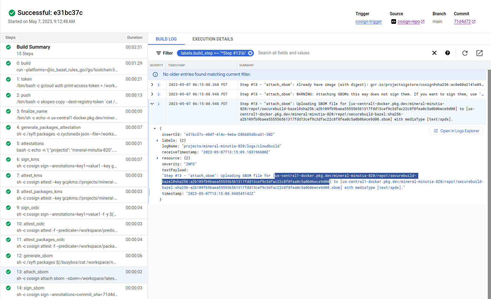

# Deterministic container hashes and container signing using Cosign, Bazel and Google Cloud Build

A simple tutorial that generates consistent container image hashes using `bazel` and then signs provenance records using [cosign](https://github.com/sigstore/cosign) (Container Signing, Verification and Storage in an OCI registry).

In this tutorial, we will:

1. generate a deterministic container image hash using  `bazel`
2. use `cosign` to create provenance records for this image
3. use `syft` to generate the container `sbom`
4. use cosign to sign the container sbom
5. verify attestations and signatures using `KMS` and `OIDC` cross checked with a public transparency log.
6. use `syft` to generate the application `sbom`
7. sign the application `sbom` with cosign

We will use GCP-centric services here such as `Artifact Registry`, `Cloud BUild`, `Cloud Source Repository`.  

Both `KMS` and `OIDC` based signatures are used and for `OIDC`, an entry is submitted to a `transparency log` such that it can get verified by anyone at anytime.

>> **NOTE** Please be aware that if you run this tutorial, the GCP service_accounts _email_ you use to sign the artifacts within cloud build will be submitted to a public transparency log.  I used a disposable GCP project but even if i didn't, its just the email address and projectID in the cert, no big deal to me.  If it is to you, you can use the KMS examples and skip OIDC

>> this repo is not supported by google and employs as much as i know about it on 9/24/22 (with one weeks' experience with this..so take it with a grain of salt)

---

##### References:

* [SigStore](https://docs.sigstore.dev/)
* [cosign](https://github.com/sigstore/cosign)
* [Deterministic container hashes and container signing using Cosign, Kaniko and Google Cloud Build](https://github.com/salrashid123/cosign_kaniko_cloud_build)
* [Introducing sigstore: Easy Code Signing & Verification for Supply Chain Integrity](https://security.googleblog.com/2021/03/introducing-sigstore-easy-code-signing.html)
* [Best Practices for Supply Chain Security](https://dlorenc.medium.com/policy-and-attestations-89650fd6f4fa)
* [Building deterministic Docker images with Bazel](https://blog.bazel.build/2015/07/28/docker_build.html#building-deterministic-docker-images-with-bazel)
* [Deterministic builds with go + bazel + grpc + docker](https://github.com/salrashid123/go-grpc-bazel-docker)
* [bazel](https://bazel.build/)
* [in-toto attestation](https://docs.sigstore.dev/cosign/attestation/)
* [Notary V2 and Cosign](https://dlorenc.medium.com/notary-v2-and-cosign-b816658f044d)

### CloudBuild steps

First lets go over the `cloudbuild.yaml` steps:

#### Build image deterministically using bazel:

This is the `bazel` build that guarantees you the code will produce a specific image hash everytime:

* `securebuild-bazel@sha256:5ce2d8cd8e366d76ce012edc346daeb15a5643c26b9b24a2b731e97a99c6de52`


#### Push image to registry

This pushes the image to [google artifact registry](https://cloud.google.com/artifact-registry).  This will give the image hash we'd expect

You can optionally push to dockerhub if you want using [KMS based secrets](https://cloud.google.com/build/docs/securing-builds/use-encrypted-credentials#configuring_builds_to_use_encrypted_data) in cloud build 


#### Create attestations attributes

This step will issue a statement that includes attestation attributes users can inject into the pipeline the verifier can use. See [Verify Attestations](https://docs.sigstore.dev/cosign/verify/).

There are two attestation: 1. container sbom genreated by `syft` and 2. a plain application attestation.

For 1, we used syft to generate the containers' `cyclonedx` attestation


For 2, the attestation verification predicate includes some info from the build like the buildID and even the repo commithash.

Someone who wants to verify any [in-toto attestation](https://docs.sigstore.dev/cosign/attestation/) can use these values. This repo just adds some basic stuff like the `projectID`,  `buildID` and `commitsha` (in our case, its `13a6c1ca8f8c30a8a500cc9a3af6549525aeec0b`):


```json
{ "projectid": "$PROJECT_ID", "buildid": "$BUILD_ID", "foo":"bar", "commitsha": "$COMMIT_SHA" }
```


against commit


#### Sign image using KMS based keys

This step uses the KMS key to `cosign` the image


#### Apply attestations using KMS

This issues attestation signature using some predicates we wrote to file during the build.

You can define any claims here..i just happen to use the commit hash for the source and some random stuff.


we also attested the syft container sbom we created earlier


#### Sign image using OIDC tokens

This step will use the service accounts OIDC token sign using [Fulcio](https://docs.sigstore.dev/fulcio/oidc-in-fulcio)


for the syft sbom:


#### Apply attestations using OIDC tokens

This will issue signed attestations using the OIDC token signing for fulcio


for the syft sbom:


#### Use Syft to generate image sbom

Generate the container image's sbom


>> **NOTE**  the images i used here will _not_ show the detailed go packages.  see [https://github.com/anchore/syft/issues/1725](https://github.com/anchore/syft/issues/1725)

Then attach (upload) it


#### Use Cosign to upload and sign the sbom

Finally sign it in the registry


---

### Setup

The following steps will use Google Cloud services 

* Cloud Source Repository to hold the code and trigger builds (you can use github but thats out of scope here),
* Cloud Build to create the image to save to artifact registry.
* Artifact Registry to hold the containers images

You'll also need to install [cosign](https://docs.sigstore.dev/cosign/installation/) (duh), and [rekor-cli](https://docs.sigstore.dev/rekor/installation), `git`, `gcloud`, optionally `gcloud`, `docker`.

```bash
export GCLOUD_USER=`gcloud config get-value core/account`
export PROJECT_ID=`gcloud config get-value core/project`
export PROJECT_NUMBER=`gcloud projects describe $PROJECT_ID --format='value(projectNumber)'`
echo $PROJECT_ID

# projectID i used was PROJECT_ID=cosign-test-bazel-1-384518

gcloud auth application-default login

# enable services
gcloud services enable \
    artifactregistry.googleapis.com \
    cloudbuild.googleapis.com cloudkms.googleapis.com \
    iam.googleapis.com sourcerepo.googleapis.com

# create artifact registry
gcloud artifacts repositories create repo1 --repository-format=docker --location=us-central1

# create service account that cloud build will run as.
gcloud iam service-accounts create cosign

# allow 'self impersonation' for cloud build service account
gcloud iam service-accounts add-iam-policy-binding cosign@$PROJECT_ID.iam.gserviceaccount.com \
    --role roles/iam.serviceAccountTokenCreator \
    --member "serviceAccount:cosign@$PROJECT_ID.iam.gserviceaccount.com"

# allow cloud build to write logs
gcloud projects add-iam-policy-binding $PROJECT_ID \
  --member=serviceAccount:cosign@$PROJECT_ID.iam.gserviceaccount.com  \
  --role=roles/logging.logWriter

# allow cloud build write access to artifact registry
gcloud artifacts repositories add-iam-policy-binding repo1 \
    --location=us-central1  \
    --member=serviceAccount:cosign@$PROJECT_ID.iam.gserviceaccount.com \
    --role=roles/artifactregistry.writer

# allow cloud build access to list KMS keys
gcloud projects add-iam-policy-binding $PROJECT_ID \
  --member=serviceAccount:cosign@$PROJECT_ID.iam.gserviceaccount.com  \
  --role=roles/cloudkms.viewer


# create kms keyring and key
gcloud kms keyrings create cosignkr --location=global

gcloud kms keys create key1 --keyring=cosignkr \
 --location=global --purpose=asymmetric-signing \
 --default-algorithm=ec-sign-p256-sha256

gcloud kms keys list  --keyring=cosignkr --location=global

# allow cloud buildaccess to sign the key
gcloud kms keys add-iam-policy-binding key1 \
    --keyring=cosignkr --location=global \
    --member=serviceAccount:cosign@$PROJECT_ID.iam.gserviceaccount.com \
    --role=roles/cloudkms.signer

# allow current gcloud user to view the public key
gcloud kms keys add-iam-policy-binding key1 \
    --keyring=cosignkr --location=global \
    --member=serviceAccount:cosign@$PROJECT_ID.iam.gserviceaccount.com  \
    --role=roles/cloudkms.publicKeyViewer

# create a temp bucket for cloud build and allow cloud build permissions to use it
gsutil mb gs://$PROJECT_ID\_cloudbuild
gsutil iam ch serviceAccount:cosign@$PROJECT_ID.iam.gserviceaccount.com:objectAdmin gs://$PROJECT_ID\_cloudbuild
```

### Build image

```bash
# to build directly
# cd /app
# gcloud beta builds submit --config=cloudbuild.yaml --machine-type=n1-highcpu-32

# to build via commit (recommended)
gcloud source repos create cosign-repo

gcloud projects add-iam-policy-binding $PROJECT_ID \
  --member=serviceAccount:cosign@$PROJECT_ID.iam.gserviceaccount.com \
  --role=roles/source.reader

gcloud source repos clone cosign-repo
cd cosign-repo
cp -R ../app/* .


# optionally create the application sbom and sign it with the same cosign keypair
# goreleaser release --snapshot  --rm-dist 
## for github
## git tag v1.0.0
## git push origin --tags
## goreleaser release --rm-dist


git add -A
git commit -m "add"
git push 

# create a manual trigger
gcloud beta builds triggers create manual --region=global \
   --name=cosign-trigger --build-config=cloudbuild.yaml \
   --repo=https://source.developers.google.com/p/$PROJECT_ID/r/cosign-repo \
   --repo-type=CLOUD_SOURCE_REPOSITORIES --branch=main \
   --service-account=projects/$PROJECT_ID/serviceAccounts/cosign@$PROJECT_ID.iam.gserviceaccount.com 

# now trigger
gcloud alpha builds triggers run cosign-trigger
```


### Verify

We are now ready to verify the images locally and using `cosign`


#### KMS

For kms keys, verify by either downloading kms public key

```bash
cd ../
gcloud kms keys versions get-public-key 1  \
  --key=key1 --keyring=cosignkr \
  --location=global --output-file=kms_pub.pem


# verify using the local key 
cosign verify --key kms_pub.pem   \
   us-central1-docker.pkg.dev/$PROJECT_ID/repo1/securebuild-bazel@sha256:5ce2d8cd8e366d76ce012edc346daeb15a5643c26b9b24a2b731e97a99c6de52  | jq '.'

# or by api
cosign verify --key gcpkms://projects/$PROJECT_ID/locations/global/keyRings/cosignkr/cryptoKeys/key1/cryptoKeyVersions/1 \
      us-central1-docker.pkg.dev/$PROJECT_ID/repo1/securebuild-bazel@sha256:5ce2d8cd8e366d76ce012edc346daeb15a5643c26b9b24a2b731e97a99c6de52 | jq '.'
```

Note this gives 

```text
Verification for us-central1-docker.pkg.dev/cosign-test-bazel-1-384518/repo1/securebuild-bazel@sha256:5ce2d8cd8e366d76ce012edc346daeb15a5643c26b9b24a2b731e97a99c6de52 --
The following checks were performed on each of these signatures:
  - The cosign claims were validated
  - The signatures were verified against the specified public key
[
  {
    "critical": {
      "identity": {
        "docker-reference": "us-central1-docker.pkg.dev/cosign-test-bazel-1-384518/repo1/securebuild-bazel"
      },
      "image": {
        "docker-manifest-digest": "sha256:5ce2d8cd8e366d76ce012edc346daeb15a5643c26b9b24a2b731e97a99c6de52"
      },
      "type": "cosign container image signature"
    },
    "optional": {
      "key1": "value1"
    }
  }
]
```

### Transparency Log (rekor)


The OIDC flow also creates entries in the  transparency logs

TO verify,

```bash
COSIGN_EXPERIMENTAL=1  cosign verify  us-central1-docker.pkg.dev/$PROJECT_ID/repo1/securebuild-bazel@sha256:5ce2d8cd8e366d76ce012edc346daeb15a5643c26b9b24a2b731e97a99c6de52 | jq '.'
```

gives

```text
Verification for us-central1-docker.pkg.dev/cosign-test-bazel-1-384518/repo1/securebuild-bazel@sha256:5ce2d8cd8e366d76ce012edc346daeb15a5643c26b9b24a2b731e97a99c6de52 --
The following checks were performed on each of these signatures:
  - The cosign claims were validated
  - Existence of the claims in the transparency log was verified offline
  - Any certificates were verified against the Fulcio roots.
[
  {
    "critical": {
      "identity": {
        "docker-reference": "us-central1-docker.pkg.dev/cosign-test-bazel-1-384518/repo1/securebuild-bazel"
      },
      "image": {
        "docker-manifest-digest": "sha256:5ce2d8cd8e366d76ce012edc346daeb15a5643c26b9b24a2b731e97a99c6de52"
      },
      "type": "cosign container image signature"
    },
    "optional": {
      "1.3.6.1.4.1.57264.1.1": "https://accounts.google.com",
      "Bundle": {
        "SignedEntryTimestamp": "MEUCIFTg2f6tkYD31MsbfmKS8gH7T2J4IVR14w7ViAYk3xBHAiEAgO2KdbJ1zx3r1lwdxvzmprDZEteq/pQZPRXJ1MWO76E=",
        "Payload": {
          "body": "eyJhcGlWZXJzaW9uIjoiMC4wLjEiLCJraW5kIjoiaGFzaGVkcmVrb3JkIiwic3BlYyI6eyJkYXRhIjp7Imhhc2giOnsiYWxnb3JpdGhtIjoic2hhMjU2IiwidmFsdWUiOiJiZjA4OGMwMjBjZjdjM2NhYTBjZmRhZTA1OTQyZTg2NGVmZWI0MTYxZmQ4YjM0MGYxMDg5Yzk2MDUzMjBiNGMwIn19LCJzaWduYXR1cmUiOnsiY29udGVudCI6Ik1FVUNJRy85RWNWOG82ZXVqbkFrR2tEWGk5T1k4aHJYOTJRckF5QmFIZzRXb2VHZ0FpRUE1K1AzWGpQa0pQYnVWNE1lSHBDOTlaaTJLWno3L1l3VUlGZFZUZ2lyY3RnPSIsInB1YmxpY0tleSI6eyJjb250ZW50IjoiTFMwdExTMUNSVWRKVGlCRFJWSlVTVVpKUTBGVVJTMHRMUzB0Q2sxSlNVTTRWRU5EUVc1bFowRjNTVUpCWjBsVlVURXZlbWxvVlhCTVJFWlNNVEkxYnpKUmFITkphamRZY0hSWmQwTm5XVWxMYjFwSmVtb3dSVUYzVFhjS1RucEZWazFDVFVkQk1WVkZRMmhOVFdNeWJHNWpNMUoyWTIxVmRWcEhWakpOVWpSM1NFRlpSRlpSVVVSRmVGWjZZVmRrZW1SSE9YbGFVekZ3WW01U2JBcGpiVEZzV2tkc2FHUkhWWGRJYUdOT1RXcE5kMDVFU1hsTlZHY3hUbFJSZUZkb1kwNU5hazEzVGtSSmVVMVVhM2RPVkZGNFYycEJRVTFHYTNkRmQxbElDa3R2V2tsNmFqQkRRVkZaU1V0dldrbDZhakJFUVZGalJGRm5RVVZIVWpsUmVrd3pUbUk0VUhWbGNUSnlSbXBYUm0xV0x6ZHRTWGRuVWtwTVJqWXZPQ3NLY3pob2RtbDFXVFJUUjIxQk1XeENhVEZNTVZaS1pqRTNjREU1VDNNNVpVcENRbFk1VkU1WFpWYzVlWGRNY1dscFFVdFBRMEZhV1hkblowZFRUVUUwUndwQk1WVmtSSGRGUWk5M1VVVkJkMGxJWjBSQlZFSm5UbFpJVTFWRlJFUkJTMEpuWjNKQ1owVkdRbEZqUkVGNlFXUkNaMDVXU0ZFMFJVWm5VVlZPTm1wUUNubFJPVVZOTjNCcmRsTmFXRUpDVld4YWRWQnBMMGRaZDBoM1dVUldVakJxUWtKbmQwWnZRVlV6T1ZCd2VqRlphMFZhWWpWeFRtcHdTMFpYYVhocE5Ga0tXa1E0ZDFKM1dVUldVakJTUVZGSUwwSkVNSGRQTkVVMVdUSTVlbUZYWkhWUlIwNTJZekpzYm1KcE1UQmFXRTR3VEZkS2FHVnRWbk5NVkVWMFRYcG5NQXBPVkVVMFRHMXNhR0pUTlc1ak1sWjVaRzFzYWxwWFJtcFpNamt4WW01UmRWa3lPWFJOUTJ0SFEybHpSMEZSVVVKbk56aDNRVkZGUlVjeWFEQmtTRUo2Q2s5cE9IWlpWMDVxWWpOV2RXUklUWFZhTWpsMldqSjRiRXh0VG5aaVZFRnlRbWR2Y2tKblJVVkJXVTh2VFVGRlNVSkNNRTFITW1nd1pFaENlazlwT0hZS1dWZE9hbUl6Vm5Wa1NFMTFXakk1ZGxveWVHeE1iVTUyWWxSRFFtbFJXVXRMZDFsQ1FrRklWMlZSU1VWQloxSTNRa2hyUVdSM1FqRkJUakE1VFVkeVJ3cDRlRVY1V1hoclpVaEtiRzVPZDB0cFUydzJORE5xZVhRdk5HVkxZMjlCZGt0bE5rOUJRVUZDYURad1UySmtUVUZCUVZGRVFVVlpkMUpCU1dkalJFbzRDbE41U21SWFUwSnFTVkZFUlRselNYQkZjRmRsZFhsUUx6QnFjMGx1UzNWTmExcHVVVTB3ZDBOSlJuaDJkbVpTYVRBdmNXY3JUWGMwT0ZaS09XWlpVbkFLZVhWRWN6RlJXSE41T1dnM01YbGhNa0pwVEc1TlFXOUhRME54UjFOTk5EbENRVTFFUVRKblFVMUhWVU5OUVdZeVVWQm1UVVJzUzAxcVNWZzNSRzV5Y2dwa1ZWSlhTbUZ2YldSUk5GQTNSREpsT0U5aGVrMUhPSGxtYjJkeVRtSlpUalYzTmpWVFptbExaMVl6WVc1UlNYaEJUalZSWm1ocU4xWk9jVW8xTDBabkNtcDZiWEpyV0hWSlZYSm9lazloTUdsYVZ6RjZOVWxxTm5Sa1VVMXNkbkZUU2t3NVNrVlhiRGxCVkZveU1reFdWVVIzUFQwS0xTMHRMUzFGVGtRZ1EwVlNWRWxHU1VOQlZFVXRMUzB0TFFvPSJ9fX19",
          "integratedTime": 1682189742,
          "logIndex": 18667247,
          "logID": "c0d23d6ad406973f9559f3ba2d1ca01f84147d8ffc5b8445c224f98b9591801d"
        }
      },
      "Issuer": "https://accounts.google.com",
      "Subject": "cosign@cosign-test-bazel-1-384518.iam.gserviceaccount.com",
      "key1": "value1"
    }
  }
]
```

Note that this is what is in the transparency log itself (`logID`, `logIndex`, etc)


decoding the `payload` using [jwt.io](jwt.io) gives json

```json
{
  "apiVersion": "0.0.1",
  "kind": "hashedrekord",
  "spec": {
    "data": {
      "hash": {
        "algorithm": "sha256",
        "value": "bf088c020cf7c3caa0cfdae05942e864efeb4161fd8b340f1089c9605320b4c0"
      }
    },
    "signature": {
      "content": "MEUCIG/9EcV8o6eujnAkGkDXi9OY8hrX92QrAyBaHg4WoeGgAiEA5+P3XjPkJPbuV4MeHpC99Zi2KZz7/YwUIFdVTgirctg=",
      "publicKey": {
        "content": "LS0tLS1CRUdJTiBDRVJUSUZJQ0FURS0tLS0tCk1JSUM4VENDQW5lZ0F3SUJBZ0lVUTEvemloVXBMREZSMTI1bzJRaHNJajdYcHRZd0NnWUlLb1pJemowRUF3TXcKTnpFVk1CTUdBMVVFQ2hNTWMybG5jM1J2Y21VdVpHVjJNUjR3SEFZRFZRUURFeFZ6YVdkemRHOXlaUzFwYm5SbApjbTFsWkdsaGRHVXdIaGNOTWpNd05ESXlNVGcxTlRReFdoY05Nak13TkRJeU1Ua3dOVFF4V2pBQU1Ga3dFd1lICktvWkl6ajBDQVFZSUtvWkl6ajBEQVFjRFFnQUVHUjlRekwzTmI4UHVlcTJyRmpXRm1WLzdtSXdnUkpMRjYvOCsKczhodml1WTRTR21BMWxCaTFMMVZKZjE3cDE5T3M5ZUpCQlY5VE5XZVc5eXdMcWlpQUtPQ0FaWXdnZ0dTTUE0RwpBMVVkRHdFQi93UUVBd0lIZ0RBVEJnTlZIU1VFRERBS0JnZ3JCZ0VGQlFjREF6QWRCZ05WSFE0RUZnUVVONmpQCnlROUVNN3BrdlNaWEJCVWxadVBpL0dZd0h3WURWUjBqQkJnd0ZvQVUzOVBwejFZa0VaYjVxTmpwS0ZXaXhpNFkKWkQ4d1J3WURWUjBSQVFIL0JEMHdPNEU1WTI5emFXZHVRR052YzJsbmJpMTBaWE4wTFdKaGVtVnNMVEV0TXpnMApOVEU0TG1saGJTNW5jMlZ5ZG1salpXRmpZMjkxYm5RdVkyOXRNQ2tHQ2lzR0FRUUJnNzh3QVFFRUcyaDBkSEJ6Ck9pOHZZV05qYjNWdWRITXVaMjl2WjJ4bExtTnZiVEFyQmdvckJnRUVBWU8vTUFFSUJCME1HMmgwZEhCek9pOHYKWVdOamIzVnVkSE11WjI5dloyeGxMbU52YlRDQmlRWUtLd1lCQkFIV2VRSUVBZ1I3QkhrQWR3QjFBTjA5TUdyRwp4eEV5WXhrZUhKbG5Od0tpU2w2NDNqeXQvNGVLY29BdktlNk9BQUFCaDZwU2JkTUFBQVFEQUVZd1JBSWdjREo4ClN5SmRXU0JqSVFERTlzSXBFcFdldXlQLzBqc0luS3VNa1puUU0wd0NJRnh2dmZSaTAvcWcrTXc0OFZKOWZZUnAKeXVEczFRWHN5OWg3MXlhMkJpTG5NQW9HQ0NxR1NNNDlCQU1EQTJnQU1HVUNNQWYyUVBmTURsS01qSVg3RG5ycgpkVVJXSmFvbWRRNFA3RDJlOE9hek1HOHlmb2dyTmJZTjV3NjVTZmlLZ1YzYW5RSXhBTjVRZmhqN1ZOcUo1L0ZnCmp6bXJrWHVJVXJoek9hMGlaVzF6NUlqNnRkUU1sdnFTSkw5SkVXbDlBVFoyMkxWVUR3PT0KLS0tLS1FTkQgQ0VSVElGSUNBVEUtLS0tLQo="
      }
    }
  }
}
```

from there the base64encoded `publicKey` is what was issued during the [signing ceremony](https://docs.sigstore.dev/fulcio/certificate-issuing-overview). 

```
-----BEGIN CERTIFICATE-----
MIIC8TCCAnegAwIBAgIUQ1/zihUpLDFR125o2QhsIj7XptYwCgYIKoZIzj0EAwMw
NzEVMBMGA1UEChMMc2lnc3RvcmUuZGV2MR4wHAYDVQQDExVzaWdzdG9yZS1pbnRl
cm1lZGlhdGUwHhcNMjMwNDIyMTg1NTQxWhcNMjMwNDIyMTkwNTQxWjAAMFkwEwYH
KoZIzj0CAQYIKoZIzj0DAQcDQgAEGR9QzL3Nb8Pueq2rFjWFmV/7mIwgRJLF6/8+
s8hviuY4SGmA1lBi1L1VJf17p19Os9eJBBV9TNWeW9ywLqiiAKOCAZYwggGSMA4G
A1UdDwEB/wQEAwIHgDATBgNVHSUEDDAKBggrBgEFBQcDAzAdBgNVHQ4EFgQUN6jP
yQ9EM7pkvSZXBBUlZuPi/GYwHwYDVR0jBBgwFoAU39Ppz1YkEZb5qNjpKFWixi4Y
ZD8wRwYDVR0RAQH/BD0wO4E5Y29zaWduQGNvc2lnbi10ZXN0LWJhemVsLTEtMzg0
NTE4LmlhbS5nc2VydmljZWFjY291bnQuY29tMCkGCisGAQQBg78wAQEEG2h0dHBz
Oi8vYWNjb3VudHMuZ29vZ2xlLmNvbTArBgorBgEEAYO/MAEIBB0MG2h0dHBzOi8v
YWNjb3VudHMuZ29vZ2xlLmNvbTCBiQYKKwYBBAHWeQIEAgR7BHkAdwB1AN09MGrG
xxEyYxkeHJlnNwKiSl643jyt/4eKcoAvKe6OAAABh6pSbdMAAAQDAEYwRAIgcDJ8
SyJdWSBjIQDE9sIpEpWeuyP/0jsInKuMkZnQM0wCIFxvvfRi0/qg+Mw48VJ9fYRp
yuDs1QXsy9h71ya2BiLnMAoGCCqGSM49BAMDA2gAMGUCMAf2QPfMDlKMjIX7Dnrr
dURWJaomdQ4P7D2e8OazMG8yfogrNbYN5w65SfiKgV3anQIxAN5Qfhj7VNqJ5/Fg
jzmrkXuIUrhzOa0iZW1z5Ij6tdQMlvqSJL9JEWl9ATZ22LVUDw==
-----END CERTIFICATE-----
```

which expanded is 

```bash
$  openssl x509 -in cosign.crt -noout -text

Certificate:
    Data:
        Version: 3 (0x2)
        Serial Number:
            43:5f:f3:8a:15:29:2c:31:51:d7:6e:68:d9:08:6c:22:3e:d7:a6:d6
        Signature Algorithm: ecdsa-with-SHA384
        Issuer: O = sigstore.dev, CN = sigstore-intermediate
        Validity
            Not Before: Apr 22 18:55:41 2023 GMT
            Not After : Apr 22 19:05:41 2023 GMT
        Subject: 
        Subject Public Key Info:
            Public Key Algorithm: id-ecPublicKey
                Public-Key: (256 bit)
                pub:
                    04:19:1f:50:cc:bd:cd:6f:c3:ee:7a:ad:ab:16:35:
                    85:99:5f:fb:98:8c:20:44:92:c5:eb:ff:3e:b3:c8:
                    6f:8a:e6:38:48:69:80:d6:50:62:d4:bd:55:25:fd:
                    7b:a7:5f:4e:b3:d7:89:04:15:7d:4c:d5:9e:5b:dc:
                    b0:2e:a8:a2:00
                ASN1 OID: prime256v1
                NIST CURVE: P-256
        X509v3 extensions:
            X509v3 Key Usage: critical
                Digital Signature
            X509v3 Extended Key Usage: 
                Code Signing
            X509v3 Subject Key Identifier: 
                37:A8:CF:C9:0F:44:33:BA:64:BD:26:57:04:15:25:66:E3:E2:FC:66
            X509v3 Authority Key Identifier: 
                DF:D3:E9:CF:56:24:11:96:F9:A8:D8:E9:28:55:A2:C6:2E:18:64:3F
            X509v3 Subject Alternative Name: critical
                email:cosign@cosign-test-bazel-1-384518.iam.gserviceaccount.com   <<<<<<<<<<<<<<<<<<<<
            1.3.6.1.4.1.57264.1.1: 
                https://accounts.google.com
            1.3.6.1.4.1.57264.1.8: 
                ..https://accounts.google.com
            CT Precertificate SCTs: 
                Signed Certificate Timestamp:
                    Version   : v1 (0x0)
                    Log ID    : DD:3D:30:6A:C6:C7:11:32:63:19:1E:1C:99:67:37:02:
                                A2:4A:5E:B8:DE:3C:AD:FF:87:8A:72:80:2F:29:EE:8E
                    Timestamp : Apr 22 18:55:41.523 2023 GMT
                    Extensions: none
                    Signature : ecdsa-with-SHA256
                                30:44:02:20:70:32:7C:4B:22:5D:59:20:63:21:00:C4:
                                F6:C2:29:12:95:9E:BB:23:FF:D2:3B:08:9C:AB:8C:91:
                                99:D0:33:4C:02:20:5C:6F:BD:F4:62:D3:FA:A0:F8:CC:
                                38:F1:52:7D:7D:84:69:CA:E0:EC:D5:05:EC:CB:D8:7B:
                                D7:26:B6:06:22:E7

```

NOTE the OID `1.3.6.1.4.1.57264.1.1` is registered to [here](https://github.com/sigstore/fulcio/blob/main/docs/oid-info.md#directory) and denotes the OIDC Token's issuer

Now use `rekor-cli` to search for what we added to the transparency log using


* `sha` value from `hashedrekord`

```bash
$ rekor-cli search --rekor_server https://rekor.sigstore.dev \
   --sha  bf088c020cf7c3caa0cfdae05942e864efeb4161fd8b340f1089c9605320b4c0

Found matching entries (listed by UUID):
24296fb24b8ad77afc9f6d6e59fe92ca1a88fb6b2fbef119e540160f82ac2fde603398301ba2b202
```

* the email for the build service account's `OIDC`

```bash
$ rekor-cli search --rekor_server https://rekor.sigstore.dev  --email cosign@$PROJECT_ID.iam.gserviceaccount.com

Found matching entries (listed by UUID):
24296fb24b8ad77a284f0da5d8d1db9fab177f71942c0a0401017aa32fbf761ed5a5239a5c21dcb8
24296fb24b8ad77afc9f6d6e59fe92ca1a88fb6b2fbef119e540160f82ac2fde603398301ba2b202
24296fb24b8ad77ad115144a889e371fb8cdb38d95aadcb130161d2a2a869326b206c4beed28e4e7
```

note each `UUID` asserts something different:  the `signature` and the others the two attestations we setup (predicates)

the json predicate:

```bash
$ rekor-cli get --rekor_server https://rekor.sigstore.dev  \
  --uuid 24296fb24b8ad77a284f0da5d8d1db9fab177f71942c0a0401017aa32fbf761ed5a5239a5c21dcb8

LogID: c0d23d6ad406973f9559f3ba2d1ca01f84147d8ffc5b8445c224f98b9591801d
Attestation: {"_type":"https://in-toto.io/Statement/v0.1","predicateType":"cosign.sigstore.dev/attestation/v1","subject":[{"name":"us-central1-docker.pkg.dev/cosign-test-bazel-1-384518/repo1/securebuild-bazel","digest":{"sha256":"5ce2d8cd8e366d76ce012edc346daeb15a5643c26b9b24a2b731e97a99c6de52"}}],"predicate":{"Data":"{ \"projectid\": \"cosign-test-bazel-1-384518\", \"buildid\": \"ffdd6dab-0e5b-48d7-84bd-2e29944068b6\", \"foo\":\"bar\", \"commitsha\": \"13a6c1ca8f8c30a8a500cc9a3af6549525aeec0b\", \"name_hash\": \"$(cat /workspace/name_hash.txt)\"}","Timestamp":"2023-04-22T18:55:44Z"}}
Index: 18667250
IntegratedTime: 2023-04-22T18:55:45Z
UUID: 24296fb24b8ad77a284f0da5d8d1db9fab177f71942c0a0401017aa32fbf761ed5a5239a5c21dcb8
Body: {
  "IntotoObj": {
    "content": {
      "hash": {
        "algorithm": "sha256",
        "value": "c7c302c627666d41ad543a6910053712c3babe79cf333f690e05c40cdd7e43d2"
      },
      "payloadHash": {
        "algorithm": "sha256",
        "value": "a5124d2d370095e812d60e00ec387c3395e29a0a09db80b4f860ad40ec228420"
      }
    },
    "publicKey": "LS0tLS1CRUdJTiBDRVJUSUZJQ0FURS0tLS0tCk1JSUM4RENDQW5lZ0F3SUJBZ0lVTGJtbTJYTmU2L1VTR2hodkszRUI3bWdHQng4d0NnWUlLb1pJemowRUF3TXcKTnpFVk1CTUdBMVVFQ2hNTWMybG5jM1J2Y21VdVpHVjJNUjR3SEFZRFZRUURFeFZ6YVdkemRHOXlaUzFwYm5SbApjbTFsWkdsaGRHVXdIaGNOTWpNd05ESXlNVGcxTlRRMFdoY05Nak13TkRJeU1Ua3dOVFEwV2pBQU1Ga3dFd1lICktvWkl6ajBDQVFZSUtvWkl6ajBEQVFjRFFnQUVoM2lySnRzSndQNDIxSmRXQU0yQWx0dkVWcEtZVmkyWTQ1YUQKc0RRa0Y4dDJ2V2Jsc2haSUprOElYNkhPL1daZ1hWVDR1UmNUQ0VuenZiS2NRb0xha0tPQ0FaWXdnZ0dTTUE0RwpBMVVkRHdFQi93UUVBd0lIZ0RBVEJnTlZIU1VFRERBS0JnZ3JCZ0VGQlFjREF6QWRCZ05WSFE0RUZnUVVKODlJCmxHZ2R4Nk11aGwzc0lIOTN5VTdtYUdvd0h3WURWUjBqQkJnd0ZvQVUzOVBwejFZa0VaYjVxTmpwS0ZXaXhpNFkKWkQ4d1J3WURWUjBSQVFIL0JEMHdPNEU1WTI5emFXZHVRR052YzJsbmJpMTBaWE4wTFdKaGVtVnNMVEV0TXpnMApOVEU0TG1saGJTNW5jMlZ5ZG1salpXRmpZMjkxYm5RdVkyOXRNQ2tHQ2lzR0FRUUJnNzh3QVFFRUcyaDBkSEJ6Ck9pOHZZV05qYjNWdWRITXVaMjl2WjJ4bExtTnZiVEFyQmdvckJnRUVBWU8vTUFFSUJCME1HMmgwZEhCek9pOHYKWVdOamIzVnVkSE11WjI5dloyeGxMbU52YlRDQmlRWUtLd1lCQkFIV2VRSUVBZ1I3QkhrQWR3QjFBTjA5TUdyRwp4eEV5WXhrZUhKbG5Od0tpU2w2NDNqeXQvNGVLY29BdktlNk9BQUFCaDZwU2VYWUFBQVFEQUVZd1JBSWdhZ3FVCjRoa0NTQVRyeVNLZkpucGM0MHg2c1diQWFzZUx2M2VKZWlqVlptOENJRUU1RTZjK0JrTkRER2M5Smtja1ZSa1QKdHNoaFM2NnBqdExWT2E0MjZzVjlNQW9HQ0NxR1NNNDlCQU1EQTJjQU1HUUNNQnljSkdHTDJFODZKaFBVWDhmVAprd2Z5RFg0WSs0b2xKRUhwaWUrS0s0ME9zUEl3ajNiaDAvK0d6RjRIYmNGdEJRSXdHZURrT1JzQStwcExONDFnCk9MVCtWMHBjbmt5SzkzSkpsQVRIOHVrejkxdzluRzFwN1pBc29sbDN0YjlmckZzQQotLS0tLUVORCBDRVJUSUZJQ0FURS0tLS0tCg=="
  }
}
```


```bash
$ rekor-cli get --rekor_server https://rekor.sigstore.dev    --uuid 24296fb24b8ad77afc9f6d6e59fe92ca1a88fb6b2fbef119e540160f82ac2fde603398301ba2b202

LogID: c0d23d6ad406973f9559f3ba2d1ca01f84147d8ffc5b8445c224f98b9591801d
Index: 18667247
IntegratedTime: 2023-04-22T18:55:42Z
UUID: 24296fb24b8ad77afc9f6d6e59fe92ca1a88fb6b2fbef119e540160f82ac2fde603398301ba2b202
Body: {
  "HashedRekordObj": {
    "data": {
      "hash": {
        "algorithm": "sha256",
        "value": "bf088c020cf7c3caa0cfdae05942e864efeb4161fd8b340f1089c9605320b4c0"
      }
    },
    "signature": {
      "content": "MEUCIG/9EcV8o6eujnAkGkDXi9OY8hrX92QrAyBaHg4WoeGgAiEA5+P3XjPkJPbuV4MeHpC99Zi2KZz7/YwUIFdVTgirctg=",
      "publicKey": {
        "content": "LS0tLS1CRUdJTiBDRVJUSUZJQ0FURS0tLS0tCk1JSUM4VENDQW5lZ0F3SUJBZ0lVUTEvemloVXBMREZSMTI1bzJRaHNJajdYcHRZd0NnWUlLb1pJemowRUF3TXcKTnpFVk1CTUdBMVVFQ2hNTWMybG5jM1J2Y21VdVpHVjJNUjR3SEFZRFZRUURFeFZ6YVdkemRHOXlaUzFwYm5SbApjbTFsWkdsaGRHVXdIaGNOTWpNd05ESXlNVGcxTlRReFdoY05Nak13TkRJeU1Ua3dOVFF4V2pBQU1Ga3dFd1lICktvWkl6ajBDQVFZSUtvWkl6ajBEQVFjRFFnQUVHUjlRekwzTmI4UHVlcTJyRmpXRm1WLzdtSXdnUkpMRjYvOCsKczhodml1WTRTR21BMWxCaTFMMVZKZjE3cDE5T3M5ZUpCQlY5VE5XZVc5eXdMcWlpQUtPQ0FaWXdnZ0dTTUE0RwpBMVVkRHdFQi93UUVBd0lIZ0RBVEJnTlZIU1VFRERBS0JnZ3JCZ0VGQlFjREF6QWRCZ05WSFE0RUZnUVVONmpQCnlROUVNN3BrdlNaWEJCVWxadVBpL0dZd0h3WURWUjBqQkJnd0ZvQVUzOVBwejFZa0VaYjVxTmpwS0ZXaXhpNFkKWkQ4d1J3WURWUjBSQVFIL0JEMHdPNEU1WTI5emFXZHVRR052YzJsbmJpMTBaWE4wTFdKaGVtVnNMVEV0TXpnMApOVEU0TG1saGJTNW5jMlZ5ZG1salpXRmpZMjkxYm5RdVkyOXRNQ2tHQ2lzR0FRUUJnNzh3QVFFRUcyaDBkSEJ6Ck9pOHZZV05qYjNWdWRITXVaMjl2WjJ4bExtTnZiVEFyQmdvckJnRUVBWU8vTUFFSUJCME1HMmgwZEhCek9pOHYKWVdOamIzVnVkSE11WjI5dloyeGxMbU52YlRDQmlRWUtLd1lCQkFIV2VRSUVBZ1I3QkhrQWR3QjFBTjA5TUdyRwp4eEV5WXhrZUhKbG5Od0tpU2w2NDNqeXQvNGVLY29BdktlNk9BQUFCaDZwU2JkTUFBQVFEQUVZd1JBSWdjREo4ClN5SmRXU0JqSVFERTlzSXBFcFdldXlQLzBqc0luS3VNa1puUU0wd0NJRnh2dmZSaTAvcWcrTXc0OFZKOWZZUnAKeXVEczFRWHN5OWg3MXlhMkJpTG5NQW9HQ0NxR1NNNDlCQU1EQTJnQU1HVUNNQWYyUVBmTURsS01qSVg3RG5ycgpkVVJXSmFvbWRRNFA3RDJlOE9hek1HOHlmb2dyTmJZTjV3NjVTZmlLZ1YzYW5RSXhBTjVRZmhqN1ZOcUo1L0ZnCmp6bXJrWHVJVXJoek9hMGlaVzF6NUlqNnRkUU1sdnFTSkw5SkVXbDlBVFoyMkxWVUR3PT0KLS0tLS1FTkQgQ0VSVElGSUNBVEUtLS0tLQo="
      }
    }
  }
}
```

the sbom attestation
```bash
$ rekor-cli get --rekor_server https://rekor.sigstore.dev    --uuid 24296fb24b8ad77ad115144a889e371fb8cdb38d95aadcb130161d2a2a869326b206c4beed28e4e7

LogID: c0d23d6ad406973f9559f3ba2d1ca01f84147d8ffc5b8445c224f98b9591801d
Attestation: {"_type":"https://in-toto.io/Statement/v0.1","predicateType":"https://cyclonedx.org/bom/v1.4","subject":[{"name":"us-central1-docker.pkg.dev/cosign-test-bazel-1-384518/repo1/securebuild-bazel","digest":{"sha256":"5ce2d8cd8e366d76ce012edc346daeb15a5643c26b9b24a2b731e97a99c6de52"}}],"predicate":{"bomFormat":"CycloneDX","components":[{"bom-ref":"pkg:deb/debian/base-files@10.3+deb10u9?arch=amd64\u0026distro=debian-10\u0026package-id=5aa6e4929bf16696","cpe":"cpe:2.3:a:base-files:base-files:10.3\\+deb10u9:*:*:*:*:*:*:*","licenses":[{"license":{"name":"GPL"}}],"name":"base-files","properties":[{"name":"syft:package:foundBy","value":"dpkgdb-cataloger"},{"name":"syft:package:metadataType","value":"DpkgMetadata"},{"name":"syft:package:type","value":"deb"},{"name":"syft:cpe23","value":"cpe:2.3:a:base-files:base_files:10.3\\+deb10u9:*:*:*:*:*:*:*"},{"name":"syft:cpe23","value":"cpe:2.3:a:base_files:base-files:10.3\\+deb10u9:*:*:*:*:*:*:*"},{"name":"syft:cpe23","value":"cpe:2.3:a:base_files:base_files:10.3\\+deb10u9:*:*:*:*:*:*:*"},{"name":"syft:cpe23","value":"cpe:2.3:a:base:base-files:10.3\\+deb10u9:*:*:*:*:*:*:*"},{"name":"syft:cpe23","value":"cpe:2.3:a:base:base_files:10.3\\+deb10u9:*:*:*:*:*:*:*"},{"name":"syft:location:0:layerID","value":"sha256:417cb9b79adeec55f58b890dc9831e252e3523d8de5fd28b4ee2abb151b7dc8b"},{"name":"syft:location:0:path","value":"/usr/share/doc/base-files/copyright"},{"name":"syft:location:1:layerID","value":"sha256:417cb9b79adeec55f58b890dc9831e252e3523d8de5fd28b4ee2abb151b7dc8b"},{"name":"syft:location:1:path","value":"/var/lib/dpkg/status.d/base"},{"name":"syft:metadata:installedSize","value":"340"}],"publisher":"Santiago Vila \u003csanvila@debian.org\u003e","purl":"pkg:deb/debian/base-files@10.3+deb10u9?arch=amd64\u0026distro=debian-10","type":"library","version":"10.3+deb10u9"},{"bom-ref":"pkg:deb/debian/libc6@2.28-10?arch=amd64\u0026upstream=glibc\u0026distro=debian-10\u0026package-id=74ac5ee7adfb6a2d","cpe":"cpe:2.3:a:libc6:libc6:2.28-10:*:*:*:*:*:*:*","licenses":[{"license":{"id":"GPL-2.0-only"}},{"license":{"id":"LGPL-2.1-only"}}],"name":"libc6","properties":[{"name":"syft:package:foundBy","value":"dpkgdb-cataloger"},{"name":"syft:package:metadataType","value":"DpkgMetadata"},{"name":"syft:package:type","value":"deb"},{"name":"syft:location:0:layerID","value":"sha256:5d09c2db1d761a6cd292a453815df5fecfa98058e4f2c0185976d1f28dfc09ec"},{"name":"syft:location:0:path","value":"/usr/share/doc/libc6/copyright"},{"name":"syft:location:1:layerID","value":"sha256:5d09c2db1d761a6cd292a453815df5fecfa98058e4f2c0185976d1f28dfc09ec"},{"name":"syft:location:1:path","value":"/var/lib/dpkg/status.d/libc6"},{"name":"syft:metadata:installedSize","value":"12337"},{"name":"syft:metadata:source","value":"glibc"}],"publisher":"GNU Libc Maintainers \u003cdebian-glibc@lists.debian.org\u003e","purl":"pkg:deb/debian/libc6@2.28-10?arch=amd64\u0026upstream=glibc\u0026distro=debian-10","type":"library","version":"2.28-10"},{"bom-ref":"pkg:deb/debian/libssl1.1@1.1.1d-0+deb10u6?arch=amd64\u0026upstream=openssl\u0026distro=debian-10\u0026package-id=ab8b40f4f3d74be0","cpe":"cpe:2.3:a:libssl1.1:libssl1.1:1.1.1d-0\\+deb10u6:*:*:*:*:*:*:*","name":"libssl1.1","properties":[{"name":"syft:package:foundBy","value":"dpkgdb-cataloger"},{"name":"syft:package:metadataType","value":"DpkgMetadata"},{"name":"syft:package:type","value":"deb"},{"name":"syft:location:0:layerID","value":"sha256:5d09c2db1d761a6cd292a453815df5fecfa98058e4f2c0185976d1f28dfc09ec"},{"name":"syft:location:0:path","value":"/usr/share/doc/libssl1.1/copyright"},{"name":"syft:location:1:layerID","value":"sha256:5d09c2db1d761a6cd292a453815df5fecfa98058e4f2c0185976d1f28dfc09ec"},{"name":"syft:location:1:path","value":"/var/lib/dpkg/status.d/libssl1"},{"name":"syft:metadata:installedSize","value":"4077"},{"name":"syft:metadata:source","value":"openssl"}],"publisher":"Debian OpenSSL Team \u003cpkg-openssl-devel@lists.alioth.debian.org\u003e","purl":"pkg:deb/debian/libssl1.1@1.1.1d-0+deb10u6?arch=amd64\u0026upstream=openssl\u0026distro=debian-10","type":"library","version":"1.1.1d-0+deb10u6"},{"bom-ref":"pkg:deb/debian/netbase@5.6?arch=all\u0026distro=debian-10\u0026package-id=b55e51dca4eba9a6","cpe":"cpe:2.3:a:netbase:netbase:5.6:*:*:*:*:*:*:*","licenses":[{"license":{"id":"GPL-2.0-only"}}],"name":"netbase","properties":[{"name":"syft:package:foundBy","value":"dpkgdb-cataloger"},{"name":"syft:package:metadataType","value":"DpkgMetadata"},{"name":"syft:package:type","value":"deb"},{"name":"syft:location:0:layerID","value":"sha256:417cb9b79adeec55f58b890dc9831e252e3523d8de5fd28b4ee2abb151b7dc8b"},{"name":"syft:location:0:path","value":"/usr/share/doc/netbase/copyright"},{"name":"syft:location:1:layerID","value":"sha256:417cb9b79adeec55f58b890dc9831e252e3523d8de5fd28b4ee2abb151b7dc8b"},{"name":"syft:location:1:path","value":"/var/lib/dpkg/status.d/netbase"},{"name":"syft:metadata:installedSize","value":"44"}],"publisher":"Marco d'Itri \u003cmd@linux.it\u003e","purl":"pkg:deb/debian/netbase@5.6?arch=all\u0026distro=debian-10","type":"library","version":"5.6"},{"bom-ref":"pkg:deb/debian/openssl@1.1.1d-0+deb10u6?arch=amd64\u0026distro=debian-10\u0026package-id=5baa662d4c747c2e","cpe":"cpe:2.3:a:openssl:openssl:1.1.1d-0\\+deb10u6:*:*:*:*:*:*:*","name":"openssl","properties":[{"name":"syft:package:foundBy","value":"dpkgdb-cataloger"},{"name":"syft:package:metadataType","value":"DpkgMetadata"},{"name":"syft:package:type","value":"deb"},{"name":"syft:location:0:layerID","value":"sha256:5d09c2db1d761a6cd292a453815df5fecfa98058e4f2c0185976d1f28dfc09ec"},{"name":"syft:location:0:path","value":"/usr/share/doc/openssl/copyright"},{"name":"syft:location:1:layerID","value":"sha256:5d09c2db1d761a6cd292a453815df5fecfa98058e4f2c0185976d1f28dfc09ec"},{"name":"syft:location:1:path","value":"/var/lib/dpkg/status.d/openssl"},{"name":"syft:metadata:installedSize","value":"1460"}],"publisher":"Debian OpenSSL Team \u003cpkg-openssl-devel@lists.alioth.debian.org\u003e","purl":"pkg:deb/debian/openssl@1.1.1d-0+deb10u6?arch=amd64\u0026distro=debian-10","type":"library","version":"1.1.1d-0+deb10u6"},{"bom-ref":"pkg:deb/debian/tzdata@2021a-0+deb10u1?arch=all\u0026distro=debian-10\u0026package-id=9e5b2198bbbd7fb0","cpe":"cpe:2.3:a:tzdata:tzdata:2021a-0\\+deb10u1:*:*:*:*:*:*:*","name":"tzdata","properties":[{"name":"syft:package:foundBy","value":"dpkgdb-cataloger"},{"name":"syft:package:metadataType","value":"DpkgMetadata"},{"name":"syft:package:type","value":"deb"},{"name":"syft:location:0:layerID","value":"sha256:417cb9b79adeec55f58b890dc9831e252e3523d8de5fd28b4ee2abb151b7dc8b"},{"name":"syft:location:0:path","value":"/usr/share/doc/tzdata/copyright"},{"name":"syft:location:1:layerID","value":"sha256:417cb9b79adeec55f58b890dc9831e252e3523d8de5fd28b4ee2abb151b7dc8b"},{"name":"syft:location:1:path","value":"/var/lib/dpkg/status.d/tzdata"},{"name":"syft:metadata:installedSize","value":"3040"}],"publisher":"GNU Libc Maintainers \u003cdebian-glibc@lists.debian.org\u003e","purl":"pkg:deb/debian/tzdata@2021a-0+deb10u1?arch=all\u0026distro=debian-10","type":"library","version":"2021a-0+deb10u1"},{"description":"Distroless","externalReferences":[{"type":"issue-tracker","url":"https://github.com/GoogleContainerTools/distroless/issues/new"},{"type":"website","url":"https://github.com/GoogleContainerTools/distroless"},{"comment":"support","type":"other","url":"https://github.com/GoogleContainerTools/distroless/blob/master/README.md"}],"name":"debian","properties":[{"name":"syft:distro:id","value":"debian"},{"name":"syft:distro:prettyName","value":"Distroless"},{"name":"syft:distro:versionID","value":"10"}],"swid":{"name":"debian","tagId":"debian","version":"10"},"type":"operating-system","version":"10"}],"metadata":{"component":{"bom-ref":"3e1aa3abe8f8e099","name":"us-central1-docker.pkg.dev/cosign-test-bazel-1-384518/repo1/securebuild-bazel@sha256:5ce2d8cd8e366d76ce012edc346daeb15a5643c26b9b24a2b731e97a99c6de52","type":"container","version":"sha256:a2b109fb9baea555556561317fdd13cef9c3dfac22c8f8fea0c5a0b06ece9d00"},"timestamp":"2023-04-22T18:55:36Z","tools":[{"name":"syft","vendor":"anchore","version":"0.78.0"}]},"serialNumber":"urn:uuid:14eee14f-5510-4570-a256-f0aaa6c38f1e","specVersion":"1.4","version":1}}
Index: 18667244
IntegratedTime: 2023-04-22T18:55:38Z
UUID: 24296fb24b8ad77ad115144a889e371fb8cdb38d95aadcb130161d2a2a869326b206c4beed28e4e7
Body: {
  "IntotoObj": {
    "content": {
      "hash": {
        "algorithm": "sha256",
        "value": "0f672b332142aa337cfcf44ecb15bdf9b085c5fe2a367237ac21af6dae7aecb7"
      },
      "payloadHash": {
        "algorithm": "sha256",
        "value": "f0404116dde150a187ef4a724c81d1717b5e3378c7b9927026cf33c03e2d520b"
      }
    },
    "publicKey": "LS0tLS1CRUdJTiBDRVJUSUZJQ0FURS0tLS0tCk1JSUM4ekNDQW5tZ0F3SUJBZ0lVSHc0eGRwL0FyZlVIcVA2SzAzY3VCWHlHOWg0d0NnWUlLb1pJemowRUF3TXcKTnpFVk1CTUdBMVVFQ2hNTWMybG5jM1J2Y21VdVpHVjJNUjR3SEFZRFZRUURFeFZ6YVdkemRHOXlaUzFwYm5SbApjbTFsWkdsaGRHVXdIaGNOTWpNd05ESXlNVGcxTlRNM1doY05Nak13TkRJeU1Ua3dOVE0zV2pBQU1Ga3dFd1lICktvWkl6ajBDQVFZSUtvWkl6ajBEQVFjRFFnQUVuU2ZPT3ZnYUgra01Ed0N3bTk4bUNFakFjTXdrcUxWWis1R1cKSm1BeDJ2NHg1bzRqL0FPUkM5VTluZzF1a203Sit2YkpxZVpsdmFWQ0E4TW1iREhoSWFPQ0FaZ3dnZ0dVTUE0RwpBMVVkRHdFQi93UUVBd0lIZ0RBVEJnTlZIU1VFRERBS0JnZ3JCZ0VGQlFjREF6QWRCZ05WSFE0RUZnUVVGWW8vCjJFdjVCSzExMk43UnZIL3piT29JMzJRd0h3WURWUjBqQkJnd0ZvQVUzOVBwejFZa0VaYjVxTmpwS0ZXaXhpNFkKWkQ4d1J3WURWUjBSQVFIL0JEMHdPNEU1WTI5emFXZHVRR052YzJsbmJpMTBaWE4wTFdKaGVtVnNMVEV0TXpnMApOVEU0TG1saGJTNW5jMlZ5ZG1salpXRmpZMjkxYm5RdVkyOXRNQ2tHQ2lzR0FRUUJnNzh3QVFFRUcyaDBkSEJ6Ck9pOHZZV05qYjNWdWRITXVaMjl2WjJ4bExtTnZiVEFyQmdvckJnRUVBWU8vTUFFSUJCME1HMmgwZEhCek9pOHYKWVdOamIzVnVkSE11WjI5dloyeGxMbU52YlRDQml3WUtLd1lCQkFIV2VRSUVBZ1I5QkhzQWVRQjNBTjA5TUdyRwp4eEV5WXhrZUhKbG5Od0tpU2w2NDNqeXQvNGVLY29BdktlNk9BQUFCaDZwU1hyTUFBQVFEQUVnd1JnSWhBSjlICmtlVEZDQzQrbjNRR0d5S0JLMVZxelovaExwZS9IWUMvQW82YXg3SzBBaUVBajVuU3pMdnZLUldVclluUk83eG8KMXhseEVneC9YaTQ0SmNCbTFEdXAxaEF3Q2dZSUtvWkl6ajBFQXdNRGFBQXdaUUl4QUlHREx6L3g2MTdCMWI0RgpJbEtHaDhNSmtzSmw4Z05rbVMrN1VEZ2tVWkp4QWRCeXpQTzJmZEhrZG9NQmtvaGRwQUl3VWJsdGpPUE9Fd3hOCjMwYXlEb2JLMkIzU3NxUTR0MHZXTjkxdUZIV2VVZWRpT05mYURNYnhRcHh5dGlOaktzNkkKLS0tLS1FTkQgQ0VSVElGSUNBVEUtLS0tLQo="
  }
}
```


(just note the timestamps on the two certs are like 2s apart (which was about when the build steps happened for each step;  also note the email SAN is the sam))


### Crane

You can also view the registry manifest for the signature using [crane](github.com/google/go-containerregistry/cmd/crane)

You'll see the two signatures (one for KMS, another larger one for the OIDC signature metadata)

```text
# go install github.com/google/go-containerregistry/cmd/crane@latest

$ crane  manifest us-central1-docker.pkg.dev/$PROJECT_ID/repo1/securebuild-bazel:sha256-5ce2d8cd8e366d76ce012edc346daeb15a5643c26b9b24a2b731e97a99c6de52.sig | jq '.'


{
  "schemaVersion": 2,
  "mediaType": "application/vnd.oci.image.manifest.v1+json",
  "config": {
    "mediaType": "application/vnd.oci.image.config.v1+json",
    "size": 352,
    "digest": "sha256:4e6617e34f64d23a33af71257e8d7470c897b81b4cf890d88b5d12dffee07eba"
  },
  "layers": [
    {
      "mediaType": "application/vnd.dev.cosign.simplesigning.v1+json",
      "size": 306,
      "digest": "sha256:bf088c020cf7c3caa0cfdae05942e864efeb4161fd8b340f1089c9605320b4c0",
      "annotations": {
        "dev.cosignproject.cosign/signature": "MEUCIAa9KBPqMtz35zVxLM/Ht29EX7LZRC4/SDQLL1s2hO7zAiEAg0jwksU67rg2OkA28i/v3kfQK9BgcxLexw6maRVxfx8="
      }
    },
    {
      "mediaType": "application/vnd.dev.cosign.simplesigning.v1+json",
      "size": 306,
      "digest": "sha256:bf088c020cf7c3caa0cfdae05942e864efeb4161fd8b340f1089c9605320b4c0",
      "annotations": {
        "dev.cosignproject.cosign/signature": "MEUCIG/9EcV8o6eujnAkGkDXi9OY8hrX92QrAyBaHg4WoeGgAiEA5+P3XjPkJPbuV4MeHpC99Zi2KZz7/YwUIFdVTgirctg=",
        "dev.sigstore.cosign/bundle": "{\"SignedEntryTimestamp\":\"MEUCIFTg2f6tkYD31MsbfmKS8gH7T2J4IVR14w7ViAYk3xBHAiEAgO2KdbJ1zx3r1lwdxvzmprDZEteq/pQZPRXJ1MWO76E=\",\"Payload\":{\"body\":\"eyJhcGlWZXJzaW9uIjoiMC4wLjEiLCJraW5kIjoiaGFzaGVkcmVrb3JkIiwic3BlYyI6eyJkYXRhIjp7Imhhc2giOnsiYWxnb3JpdGhtIjoic2hhMjU2IiwidmFsdWUiOiJiZjA4OGMwMjBjZjdjM2NhYTBjZmRhZTA1OTQyZTg2NGVmZWI0MTYxZmQ4YjM0MGYxMDg5Yzk2MDUzMjBiNGMwIn19LCJzaWduYXR1cmUiOnsiY29udGVudCI6Ik1FVUNJRy85RWNWOG82ZXVqbkFrR2tEWGk5T1k4aHJYOTJRckF5QmFIZzRXb2VHZ0FpRUE1K1AzWGpQa0pQYnVWNE1lSHBDOTlaaTJLWno3L1l3VUlGZFZUZ2lyY3RnPSIsInB1YmxpY0tleSI6eyJjb250ZW50IjoiTFMwdExTMUNSVWRKVGlCRFJWSlVTVVpKUTBGVVJTMHRMUzB0Q2sxSlNVTTRWRU5EUVc1bFowRjNTVUpCWjBsVlVURXZlbWxvVlhCTVJFWlNNVEkxYnpKUmFITkphamRZY0hSWmQwTm5XVWxMYjFwSmVtb3dSVUYzVFhjS1RucEZWazFDVFVkQk1WVkZRMmhOVFdNeWJHNWpNMUoyWTIxVmRWcEhWakpOVWpSM1NFRlpSRlpSVVVSRmVGWjZZVmRrZW1SSE9YbGFVekZ3WW01U2JBcGpiVEZzV2tkc2FHUkhWWGRJYUdOT1RXcE5kMDVFU1hsTlZHY3hUbFJSZUZkb1kwNU5hazEzVGtSSmVVMVVhM2RPVkZGNFYycEJRVTFHYTNkRmQxbElDa3R2V2tsNmFqQkRRVkZaU1V0dldrbDZhakJFUVZGalJGRm5RVVZIVWpsUmVrd3pUbUk0VUhWbGNUSnlSbXBYUm0xV0x6ZHRTWGRuVWtwTVJqWXZPQ3NLY3pob2RtbDFXVFJUUjIxQk1XeENhVEZNTVZaS1pqRTNjREU1VDNNNVpVcENRbFk1VkU1WFpWYzVlWGRNY1dscFFVdFBRMEZhV1hkblowZFRUVUUwUndwQk1WVmtSSGRGUWk5M1VVVkJkMGxJWjBSQlZFSm5UbFpJVTFWRlJFUkJTMEpuWjNKQ1owVkdRbEZqUkVGNlFXUkNaMDVXU0ZFMFJVWm5VVlZPTm1wUUNubFJPVVZOTjNCcmRsTmFXRUpDVld4YWRWQnBMMGRaZDBoM1dVUldVakJxUWtKbmQwWnZRVlV6T1ZCd2VqRlphMFZhWWpWeFRtcHdTMFpYYVhocE5Ga0tXa1E0ZDFKM1dVUldVakJTUVZGSUwwSkVNSGRQTkVVMVdUSTVlbUZYWkhWUlIwNTJZekpzYm1KcE1UQmFXRTR3VEZkS2FHVnRWbk5NVkVWMFRYcG5NQXBPVkVVMFRHMXNhR0pUTlc1ak1sWjVaRzFzYWxwWFJtcFpNamt4WW01UmRWa3lPWFJOUTJ0SFEybHpSMEZSVVVKbk56aDNRVkZGUlVjeWFEQmtTRUo2Q2s5cE9IWlpWMDVxWWpOV2RXUklUWFZhTWpsMldqSjRiRXh0VG5aaVZFRnlRbWR2Y2tKblJVVkJXVTh2VFVGRlNVSkNNRTFITW1nd1pFaENlazlwT0hZS1dWZE9hbUl6Vm5Wa1NFMTFXakk1ZGxveWVHeE1iVTUyWWxSRFFtbFJXVXRMZDFsQ1FrRklWMlZSU1VWQloxSTNRa2hyUVdSM1FqRkJUakE1VFVkeVJ3cDRlRVY1V1hoclpVaEtiRzVPZDB0cFUydzJORE5xZVhRdk5HVkxZMjlCZGt0bE5rOUJRVUZDYURad1UySmtUVUZCUVZGRVFVVlpkMUpCU1dkalJFbzRDbE41U21SWFUwSnFTVkZFUlRselNYQkZjRmRsZFhsUUx6QnFjMGx1UzNWTmExcHVVVTB3ZDBOSlJuaDJkbVpTYVRBdmNXY3JUWGMwT0ZaS09XWlpVbkFLZVhWRWN6RlJXSE41T1dnM01YbGhNa0pwVEc1TlFXOUhRME54UjFOTk5EbENRVTFFUVRKblFVMUhWVU5OUVdZeVVWQm1UVVJzUzAxcVNWZzNSRzV5Y2dwa1ZWSlhTbUZ2YldSUk5GQTNSREpsT0U5aGVrMUhPSGxtYjJkeVRtSlpUalYzTmpWVFptbExaMVl6WVc1UlNYaEJUalZSWm1ocU4xWk9jVW8xTDBabkNtcDZiWEpyV0hWSlZYSm9lazloTUdsYVZ6RjZOVWxxTm5Sa1VVMXNkbkZUU2t3NVNrVlhiRGxCVkZveU1reFdWVVIzUFQwS0xTMHRMUzFGVGtRZ1EwVlNWRWxHU1VOQlZFVXRMUzB0TFFvPSJ9fX19\",\"integratedTime\":1682189742,\"logIndex\":18667247,\"logID\":\"c0d23d6ad406973f9559f3ba2d1ca01f84147d8ffc5b8445c224f98b9591801d\"}}",
        "dev.sigstore.cosign/certificate": "-----BEGIN CERTIFICATE-----\nMIIC8TCCAnegAwIBAgIUQ1/zihUpLDFR125o2QhsIj7XptYwCgYIKoZIzj0EAwMw\nNzEVMBMGA1UEChMMc2lnc3RvcmUuZGV2MR4wHAYDVQQDExVzaWdzdG9yZS1pbnRl\ncm1lZGlhdGUwHhcNMjMwNDIyMTg1NTQxWhcNMjMwNDIyMTkwNTQxWjAAMFkwEwYH\nKoZIzj0CAQYIKoZIzj0DAQcDQgAEGR9QzL3Nb8Pueq2rFjWFmV/7mIwgRJLF6/8+\ns8hviuY4SGmA1lBi1L1VJf17p19Os9eJBBV9TNWeW9ywLqiiAKOCAZYwggGSMA4G\nA1UdDwEB/wQEAwIHgDATBgNVHSUEDDAKBggrBgEFBQcDAzAdBgNVHQ4EFgQUN6jP\nyQ9EM7pkvSZXBBUlZuPi/GYwHwYDVR0jBBgwFoAU39Ppz1YkEZb5qNjpKFWixi4Y\nZD8wRwYDVR0RAQH/BD0wO4E5Y29zaWduQGNvc2lnbi10ZXN0LWJhemVsLTEtMzg0\nNTE4LmlhbS5nc2VydmljZWFjY291bnQuY29tMCkGCisGAQQBg78wAQEEG2h0dHBz\nOi8vYWNjb3VudHMuZ29vZ2xlLmNvbTArBgorBgEEAYO/MAEIBB0MG2h0dHBzOi8v\nYWNjb3VudHMuZ29vZ2xlLmNvbTCBiQYKKwYBBAHWeQIEAgR7BHkAdwB1AN09MGrG\nxxEyYxkeHJlnNwKiSl643jyt/4eKcoAvKe6OAAABh6pSbdMAAAQDAEYwRAIgcDJ8\nSyJdWSBjIQDE9sIpEpWeuyP/0jsInKuMkZnQM0wCIFxvvfRi0/qg+Mw48VJ9fYRp\nyuDs1QXsy9h71ya2BiLnMAoGCCqGSM49BAMDA2gAMGUCMAf2QPfMDlKMjIX7Dnrr\ndURWJaomdQ4P7D2e8OazMG8yfogrNbYN5w65SfiKgV3anQIxAN5Qfhj7VNqJ5/Fg\njzmrkXuIUrhzOa0iZW1z5Ij6tdQMlvqSJL9JEWl9ATZ22LVUDw==\n-----END CERTIFICATE-----\n",
        "dev.sigstore.cosign/chain": "-----BEGIN CERTIFICATE-----\nMIICGjCCAaGgAwIBAgIUALnViVfnU0brJasmRkHrn/UnfaQwCgYIKoZIzj0EAwMw\nKjEVMBMGA1UEChMMc2lnc3RvcmUuZGV2MREwDwYDVQQDEwhzaWdzdG9yZTAeFw0y\nMjA0MTMyMDA2MTVaFw0zMTEwMDUxMzU2NThaMDcxFTATBgNVBAoTDHNpZ3N0b3Jl\nLmRldjEeMBwGA1UEAxMVc2lnc3RvcmUtaW50ZXJtZWRpYXRlMHYwEAYHKoZIzj0C\nAQYFK4EEACIDYgAE8RVS/ysH+NOvuDZyPIZtilgUF9NlarYpAd9HP1vBBH1U5CV7\n7LSS7s0ZiH4nE7Hv7ptS6LvvR/STk798LVgMzLlJ4HeIfF3tHSaexLcYpSASr1kS\n0N/RgBJz/9jWCiXno3sweTAOBgNVHQ8BAf8EBAMCAQYwEwYDVR0lBAwwCgYIKwYB\nBQUHAwMwEgYDVR0TAQH/BAgwBgEB/wIBADAdBgNVHQ4EFgQU39Ppz1YkEZb5qNjp\nKFWixi4YZD8wHwYDVR0jBBgwFoAUWMAeX5FFpWapesyQoZMi0CrFxfowCgYIKoZI\nzj0EAwMDZwAwZAIwPCsQK4DYiZYDPIaDi5HFKnfxXx6ASSVmERfsynYBiX2X6SJR\nnZU84/9DZdnFvvxmAjBOt6QpBlc4J/0DxvkTCqpclvziL6BCCPnjdlIB3Pu3BxsP\nmygUY7Ii2zbdCdliiow=\n-----END CERTIFICATE-----\n-----BEGIN CERTIFICATE-----\nMIIB9zCCAXygAwIBAgIUALZNAPFdxHPwjeDloDwyYChAO/4wCgYIKoZIzj0EAwMw\nKjEVMBMGA1UEChMMc2lnc3RvcmUuZGV2MREwDwYDVQQDEwhzaWdzdG9yZTAeFw0y\nMTEwMDcxMzU2NTlaFw0zMTEwMDUxMzU2NThaMCoxFTATBgNVBAoTDHNpZ3N0b3Jl\nLmRldjERMA8GA1UEAxMIc2lnc3RvcmUwdjAQBgcqhkjOPQIBBgUrgQQAIgNiAAT7\nXeFT4rb3PQGwS4IajtLk3/OlnpgangaBclYpsYBr5i+4ynB07ceb3LP0OIOZdxex\nX69c5iVuyJRQ+Hz05yi+UF3uBWAlHpiS5sh0+H2GHE7SXrk1EC5m1Tr19L9gg92j\nYzBhMA4GA1UdDwEB/wQEAwIBBjAPBgNVHRMBAf8EBTADAQH/MB0GA1UdDgQWBBRY\nwB5fkUWlZql6zJChkyLQKsXF+jAfBgNVHSMEGDAWgBRYwB5fkUWlZql6zJChkyLQ\nKsXF+jAKBggqhkjOPQQDAwNpADBmAjEAj1nHeXZp+13NWBNa+EDsDP8G1WWg1tCM\nWP/WHPqpaVo0jhsweNFZgSs0eE7wYI4qAjEA2WB9ot98sIkoF3vZYdd3/VtWB5b9\nTNMea7Ix/stJ5TfcLLeABLE4BNJOsQ4vnBHJ\n-----END CERTIFICATE-----"
      }
    }
  ]
}
sr
```


##### signature manifest:


##### attestation manifest: 


### Verify Attestations using rego Policy

Since we added in attestations steps, you can verify them using a rego policy:

```rego
package signature

import data.signature.verified

default allow = false

allow {
    input.predicateType == "cosign.sigstore.dev/attestation/v1"

    predicates := json.unmarshal(input.predicate.Data)
    predicates.foo == "bar"
}
```

What that policy enforces is to check if a predicate called 'foo' with a value of 'bar' is included in a json Data attribute.  You can verify anything else but thats as much rego i know. FWIW, the build step also included the `commitsha` from the source repo too

```json
{ 
    "projectid": "$PROJECT_ID", 
    "buildid": "$BUILD_ID", 
    "foo": "bar",
    "commitsha": "foo"
}
```

For the KMS based signature:

```text
#  cosign attest --key gcpkms://projects/$PROJECT_ID/locations/global/keyRings/cosignkr/cryptoKeys/key1/cryptoKeyVersions/1 --predicate predicate.json \
#     us-central1-docker.pkg.dev/$PROJECT_ID/repo1/securebuild-bazel@sha256:5ce2d8cd8e366d76ce012edc346daeb15a5643c26b9b24a2b731e97a99c6de52

cosign verify-attestation \
  --key gcpkms://projects/$PROJECT_ID/locations/global/keyRings/cosignkr/cryptoKeys/key1/cryptoKeyVersions/1 \
    --policy policy.rego    \
      us-central1-docker.pkg.dev/$PROJECT_ID/repo1/securebuild-bazel@sha256:5ce2d8cd8e366d76ce012edc346daeb15a5643c26b9b24a2b731e97a99c6de52  | jq '.'

will be validating against Rego policies: [policy.rego]

Verification for us-central1-docker.pkg.dev/cosign-test-bazel-1-384518/repo1/securebuild-bazel@sha256:5ce2d8cd8e366d76ce012edc346daeb15a5643c26b9b24a2b731e97a99c6de52 --
The following checks were performed on each of these signatures:
  - The cosign claims were validated
  - The signatures were verified against the specified public key
{
  "payloadType": "application/vnd.in-toto+json",
  "payload": "eyJfdHlwZSI6Imh0dHBzOi8vaW4tdG90by5pby9TdGF0ZW1lbnQvdjAuMSIsInByZWRpY2F0ZVR5cGUiOiJjb3NpZ24uc2lnc3RvcmUuZGV2L2F0dGVzdGF0aW9uL3YxIiwic3ViamVjdCI6W3sibmFtZSI6InVzLWNlbnRyYWwxLWRvY2tlci5wa2cuZGV2L2Nvc2lnbi10ZXN0LWJhemVsLTEtMzg0NTE4L3JlcG8xL3NlY3VyZWJ1aWxkLWJhemVsIiwiZGlnZXN0Ijp7InNoYTI1NiI6IjVjZTJkOGNkOGUzNjZkNzZjZTAxMmVkYzM0NmRhZWIxNWE1NjQzYzI2YjliMjRhMmI3MzFlOTdhOTljNmRlNTIifX1dLCJwcmVkaWNhdGUiOnsiRGF0YSI6InsgXCJwcm9qZWN0aWRcIjogXCJjb3NpZ24tdGVzdC1iYXplbC0xLTM4NDUxOFwiLCBcImJ1aWxkaWRcIjogXCJmZmRkNmRhYi0wZTViLTQ4ZDctODRiZC0yZTI5OTQ0MDY4YjZcIiwgXCJmb29cIjpcImJhclwiLCBcImNvbW1pdHNoYVwiOiBcIjEzYTZjMWNhOGY4YzMwYThhNTAwY2M5YTNhZjY1NDk1MjVhZWVjMGJcIiwgXCJuYW1lX2hhc2hcIjogXCIkKGNhdCAvd29ya3NwYWNlL25hbWVfaGFzaC50eHQpXCJ9IiwiVGltZXN0YW1wIjoiMjAyMy0wNC0yMlQxODo1NTozOFoifX0=",
  "signatures": [
    {
      "keyid": "",
      "sig": "MEUCIGgoo2jbTRt7qZAoOzd7QBGAD/tgvGBGZuK0hSsRa0BeAiEA6YT2nkAwaXKFhet8fT5Jlup5q9+IHQFoJ3dXjgNxAn0="
    }
  ]
}
```

the decoded payload is

```json
{
  "_type": "https://in-toto.io/Statement/v0.1",
  "predicateType": "cosign.sigstore.dev/attestation/v1",
  "subject": [
    {
      "name": "us-central1-docker.pkg.dev/cosign-test-bazel-1-384518/repo1/securebuild-bazel",
      "digest": {
        "sha256": "5ce2d8cd8e366d76ce012edc346daeb15a5643c26b9b24a2b731e97a99c6de52"
      }
    }
  ],
  "predicate": {
    "Data": "{ \"projectid\": \"cosign-test-bazel-1-384518\", \"buildid\": \"ffdd6dab-0e5b-48d7-84bd-2e29944068b6\", \"foo\":\"bar\", \"commitsha\": \"13a6c1ca8f8c30a8a500cc9a3af6549525aeec0b\", \"name_hash\": \"$(cat /workspace/name_hash.txt)\"}",
    "Timestamp": "2023-04-22T18:55:38Z"
  }
}
```
(yes, i know the bug with the `name_hash` there...)

Note the commit hash (`13a6c1ca8f8c30a8a500cc9a3af6549525aeec0b`).  you can define a rego to validate that too

for the OIDC based signature,


```bash
COSIGN_EXPERIMENTAL=1 cosign verify-attestation  --policy policy.rego    \
        us-central1-docker.pkg.dev/$PROJECT_ID/repo1/securebuild-bazel@sha256:5ce2d8cd8e366d76ce012edc346daeb15a5643c26b9b24a2b731e97a99c6de52  | jq '.'


Verification for us-central1-docker.pkg.dev/cosign-test-bazel-1-384518/repo1/securebuild-bazel@sha256:5ce2d8cd8e366d76ce012edc346daeb15a5643c26b9b24a2b731e97a99c6de52 --
The following checks were performed on each of these signatures:
  - The cosign claims were validated
  - Existence of the claims in the transparency log was verified offline
  - Any certificates were verified against the Fulcio roots.
Certificate subject:  cosign@cosign-test-bazel-1-384518.iam.gserviceaccount.com
Certificate issuer URL:  https://accounts.google.com
{
  "payloadType": "application/vnd.in-toto+json",
  "payload": "eyJfdHlwZSI6Imh0dHBzOi8vaW4tdG90by5pby9TdGF0ZW1lbnQvdjAuMSIsInByZWRpY2F0ZVR5cGUiOiJjb3NpZ24uc2lnc3RvcmUuZGV2L2F0dGVzdGF0aW9uL3YxIiwic3ViamVjdCI6W3sibmFtZSI6InVzLWNlbnRyYWwxLWRvY2tlci5wa2cuZGV2L2Nvc2lnbi10ZXN0LWJhemVsLTEtMzg0NTE4L3JlcG8xL3NlY3VyZWJ1aWxkLWJhemVsIiwiZGlnZXN0Ijp7InNoYTI1NiI6IjVjZTJkOGNkOGUzNjZkNzZjZTAxMmVkYzM0NmRhZWIxNWE1NjQzYzI2YjliMjRhMmI3MzFlOTdhOTljNmRlNTIifX1dLCJwcmVkaWNhdGUiOnsiRGF0YSI6InsgXCJwcm9qZWN0aWRcIjogXCJjb3NpZ24tdGVzdC1iYXplbC0xLTM4NDUxOFwiLCBcImJ1aWxkaWRcIjogXCJmZmRkNmRhYi0wZTViLTQ4ZDctODRiZC0yZTI5OTQ0MDY4YjZcIiwgXCJmb29cIjpcImJhclwiLCBcImNvbW1pdHNoYVwiOiBcIjEzYTZjMWNhOGY4YzMwYThhNTAwY2M5YTNhZjY1NDk1MjVhZWVjMGJcIiwgXCJuYW1lX2hhc2hcIjogXCIkKGNhdCAvd29ya3NwYWNlL25hbWVfaGFzaC50eHQpXCJ9IiwiVGltZXN0YW1wIjoiMjAyMy0wNC0yMlQxODo1NTo0NFoifX0=",
  "signatures": [
    {
      "keyid": "",
      "sig": "MEQCIGqmT7rCVnHkcntrwtYipJ60w0br3toJPGmQJrtCdCzqAiB8Nd8Jk8WMwExrov5Qc8nsIPcZMlRfd4SFoqYrz+JKNQ=="
    }
  ]
}

```

### Verify with dockerhub image

I've also uploaded this sample to dockerhub so you can verify without container registry:

```bash

# using my dockerhub image
cosign verify --key kms_pub.pem   \
    docker.io/salrashid123/securebuild-bazel:server@sha256:5ce2d8cd8e366d76ce012edc346daeb15a5643c26b9b24a2b731e97a99c6de52  | jq '.'

COSIGN_EXPERIMENTAL=1 cosign verify-attestation  --key kms_pub.pem --policy policy.rego    \
       docker.io/salrashid123/securebuild-bazel:server-bazel@sha256:5ce2d8cd8e366d76ce012edc346daeb15a5643c26b9b24a2b731e97a99c6de52  | jq '.'
```

### Cosign and Rekor APIs

You can use the cosign and Rekor APIs as well.

The `client/main.go` sample application iterates over the signatures and attestations for the image hash in this repo.  


By default, it will scan the dockerhub registry but you can alter it to use your GCP Artifiact Registry.  


```bash
cd client/
go run main.go 

```


### Sign without upload to registry


The following will sign an image with a key and verify with the signatuere provided inline (`--signature`)

```bash
export IMAGE=docker.io/salrashid123/securebuild-bazel:server
export IMAGE_DIGEST=$IMAGE@sha256:5ce2d8cd8e366d76ce012edc346daeb15a5643c26b9b24a2b731e97a99c6de52

gcloud kms keys versions get-public-key 1  \
   --key=key1 --keyring=cosignkr  \
    --location=global --output-file=/tmp/kms_pub.pem


### sign
$ cosign sign \
  --key gcpkms://projects/$PROJECT_ID/locations/global/keyRings/cosignkr/cryptoKeys/key1/cryptoKeyVersions/1 \
  --upload=false $IMAGE_DIGEST --no-tlog-upload=true --output-signature sig.txt

$ cat sig.txt 
MEUCIQC8DxvtD88nqrJxQjKjfQRb3zPpT1JPBsDvQGKVdTl/zAIgTD1uPeV7XAXqQ/NDLEAWJmv6pkocyv3e4KAoc9I/HqY=

cosign verify  --key /tmp/kms_pub.pem $IMAGE_DIGEST --signature sig.txt | jq '.'

## if you want it added to the registry, the *owner* of that registry must attach the signature
cosign attach signature --signature `cat sig.txt` $IMAGE_DIGEST

### attest

cosign attest \
  --key gcpkms://projects/$PROJECT_ID/locations/global/keyRings/cosignkr/cryptoKeys/key1/cryptoKeyVersions/1 \
  -f --no-tlog-upload=true --no-upload=true \
  --predicate=predicate.json  $IMAGE_DIGEST --output-file=/tmp/attest.txt


cat /tmp/attest.txt  | jq '.'
```

### Sign offline and attach

The following will allow two different signer to create signatures using their own keys and then the repo owner can `attach` the signatures to the registry.  

```bash
export IMAGE=us-central1-docker.pkg.dev/$PROJECT_ID/repo1/securebuild-bazel:server
export IMAGE_DIGEST=us-central1-docker.pkg.dev/$PROJECT_ID/repo1/securebuild-bazel@sha256:5ce2d8cd8e366d76ce012edc346daeb15a5643c26b9b24a2b731e97a99c6de52

### Create a signer
cosign generate-key-pair

mv cosign.key c1.key
mv cosign.pub c1.pub

cosign sign \
  --key c1.key \
  --upload=false $IMAGE_DIGEST --no-tlog-upload=true --output-signature sig.txt

cosign verify  --key c1.pub $IMAGE_DIGEST --signature sig.txt | jq '.'

$ cosign tree us-central1-docker.pkg.dev/$PROJECT_ID/repo1/securebuild-bazel@sha256:5ce2d8cd8e366d76ce012edc346daeb15a5643c26b9b24a2b731e97a99c6de52

# attach as repo owner
cosign attach signature --signature `cat sig.txt` $IMAGE_DIGEST

$ cosign tree us-central1-docker.pkg.dev/$PROJECT_ID/repo1/securebuild-bazel@sha256:5ce2d8cd8e366d76ce012edc346daeb15a5643c26b9b24a2b731e97a99c6de52


### Create a new signer
cosign generate-key-pair
mv cosign.key c2.key
mv cosign.pub c2.pub

cosign sign \
  --key c2.key \
  --upload=false $IMAGE_DIGEST --no-tlog-upload=true --output-signature sig.txt

cosign verify  --key c2.pub $IMAGE --signature sig.txt | jq '.'

# attach as repo owner
cosign attach signature --signature `cat sig.txt` $IMAGE_DIGEST
```


### Verify the image `sbom`

```bash
cosign verify --key kms_pub.pem --attachment=sbom \
         us-central1-docker.pkg.dev/$PROJECT_ID/repo1/securebuild-bazel@sha256:5ce2d8cd8e366d76ce012edc346daeb15a5643c26b9b24a2b731e97a99c6de52  | jq '.'

Verification for us-central1-docker.pkg.dev/cosign-test-384419/repo1/securebuild-bazel:sha256-5ce2d8cd8e366d76ce012edc346daeb15a5643c26b9b24a2b731e97a99c6de52.sbom --
The following checks were performed on each of these signatures:
  - The cosign claims were validated
  - The signatures were verified against the specified public key
[
  {
    "critical": {
      "identity": {
        "docker-reference": "us-central1-docker.pkg.dev/cosign-test-384419/repo1/securebuild"
      },
      "image": {
        "docker-manifest-digest": "sha256:860e8a616399b339c27205f0ef9c9d58fd4b42dba01a8df1addb04c72dec9037"
      },
      "type": "cosign container image signature"
    },
    "optional": {
      "commit_sha": "f83df525d9bdf62d0239032d6ef44e5994ce6c35"
    }
  }
]
```

---

